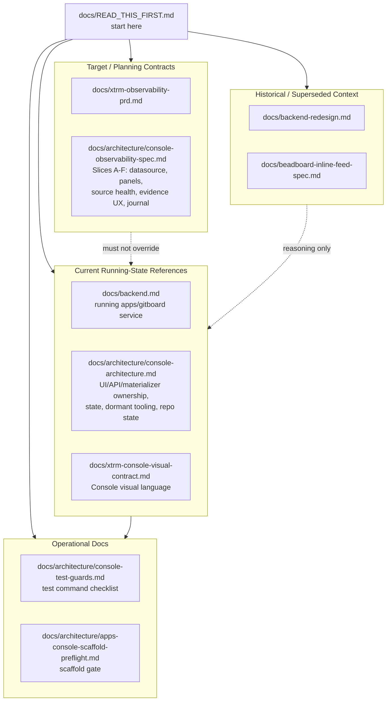

# Console Documentation: Read This First

Status: current documentation entrypoint.

Use this file before implementing Console, materializer, telemetry, Beads, or
Gitboard cleanup work. The documentation set contains current contracts,
bridge-era contracts, planning specs, and historical design records. They are
all useful, but they do not all have the same authority.

## Documentation Map

## Trust Order

When documents conflict, use this order:

1. Current source code and tests for the running service.
2. `docs/backend.md` for current backend behavior.
3. `docs/architecture/console-architecture.md` for ownership between UI, API
   routes, materializer, GitHub, future Substrate, plus the canonical
   Prometheus label discipline, current state inventory, and dormant tooling
   classification.
4. Upstream specialists telemetry docs in
   `/home/dawid/dev/specialists/docs/telemetry/*` for forensic envelopes,
   event catalog, Prometheus projection, redaction, and AgentOps semantics.
5. `/home/dawid/second-mind/1-projects/xtrm/substrate/substrate_design_it.md`
   for future Substrate direction.
6. Planning specs (`docs/architecture/console-observability-spec.md`) and
   historical specs only when they do not conflict with the current
   references above.

## Current Canonical Docs

`docs/backend.md` is the current backend reference for the running
`apps/gitboard` service. It describes the native Bun service, Hono API,
materializer, `xtrm.sqlite`, legacy `gitboard.sqlite` fold-in, GitHub adapter,
Beads/Substrate bridge, specialists feed, WebSocket channels, and deployment
posture.

`docs/architecture/console-architecture.md` is the architectural single source
of truth. It covers UI/API/materializer/state ownership, the materializer
contract, the Specialists and Beads/Substrate boundaries, the
feed/Prometheus boundary including the canonical forbidden-label list, the
current repository surface inventory, and the dormant tooling classification.
Use it when deciding whether a change belongs in dashboard UI, API projection,
materializer writes, GitHub polling, source scanning, or future Substrate.

`docs/xtrm-console-visual-contract.md` is the visual language contract for
Console. It is not proof that the visual migration is complete; it defines how
new Console UI should look when implemented.

## Operational Docs

- `docs/architecture/console-test-guards.md` is the test command checklist
  for cleanup, scaffold, and Console readiness work. Use it as the closure
  rule for any implementation child that touches materializer, API, telemetry
  cardinality, Beads dependency rendering, or deployment behavior.
- `docs/architecture/apps-console-scaffold-preflight.md` is the gate for the
  first `apps/console` scaffold slice; it remains a focused scaffold-specific
  document.

Keep these docs accurate while they are still referenced by open work, but do
not let them define native Substrate or the final Console product
architecture.

## Planning And Target Contracts

Planning specs define intended product contracts. They may describe panels,
datasources, evidence flows, or operations workflows that are not fully
implemented yet.

- `docs/xtrm-observability-prd.md` owns the Console product surface for
  observability, not the infra pipeline or specialists runtime semantics.
- `docs/architecture/console-observability-spec.md` is the consolidated
  Console observability spec. It covers the OpenSpec planning topology and
  Slices A–F: datasource and evidence contract (A), dashboard schema/renderer
  contract (B, open), AgentOps panels (C), source health and Dolt evidence
  (D), operator evidence UX (E), and DevOps journal/recommendation promotion
  (F).

Planning docs must not invent telemetry labels, event schemas, token
semantics, or Substrate state ownership. Those come from upstream specialists
telemetry docs and Substrate design docs.

## Historical Docs

Historical docs are retained because they explain decisions, not because they
are current contracts.

`docs/backend-redesign.md` is explicitly historical and partially superseded by
the implemented post-bridge architecture. Use it for reasoning, migration
history, and why the materializer exists.

`docs/beadboard-inline-feed-spec.md` is a stale Beadboard-era design draft. It
contains useful feed-first product thinking, but it predates `/beadboard`
retirement and the current Console module model. Do not treat it as current
implementation guidance unless a new bead explicitly extracts and updates its
still-valid ideas into Console docs.

## Materializer Rule Of Thumb

The materializer writes bridge read models. APIs read those models and project
DTOs. UI reads APIs. GitHub is a durable external adapter. Beads/Specialists
materialization is temporary until native Substrate and specialists runtime
state expose their own stable APIs.

Future Substrate should not be copied into another SQLite projection. Console
should read native Substrate through its daemon/API and keep only a
last-successful cache or UI-local read cache where needed.

## Cleanup Tracking

Residual documentation and legacy cleanup is tracked by `forge-tx7j`
(`Post-benk legacy residue cleanup follow-up`). Link follow-up cleanup beads
there when:

- a document still reads as current but is historical;
- a Beadboard/Gitboard-era reference conflicts with Console module language;
- a bridge-era doc needs to be retired after native Substrate or Console work
  lands;
- a point bug still affects materializer/API parity.

Do not reopen broad Gitboard-to-Console visual migration under `forge-tx7j`.
That migration needs dedicated implementation beads with rollback paths.
