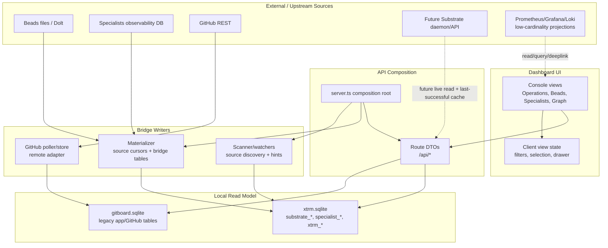
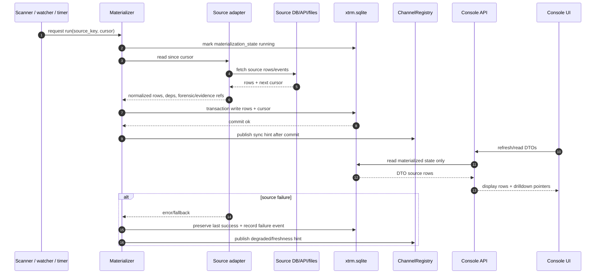

# Console Architecture

Status: current bridge-era architecture reference. Single source of truth for
UI/API/materializer/state ownership, telemetry materialization, current
repository state, and dormant tooling.

This document consolidates the post-bridge boundary contract, telemetry
materialization contract, repository readiness inventory, and dormant tooling
classification into one architectural reference. It replaces the previous
split across `console-app-materializer-api-boundaries.md`,
`console-telemetry-materialization.md`,
`post-bridge-console-readiness-inventory.md`, and
`post-bridge-dormant-tooling-classification.md`.

Authoritative upstream contracts:

- `/home/dawid/dev/specialists/docs/telemetry/forensic-event-contract.md`
- `/home/dawid/dev/specialists/docs/telemetry/agentops-event-catalog.md`
- `/home/dawid/dev/specialists/docs/telemetry/prometheus-projection-contract.md`
- `/home/dawid/dev/specialists/docs/telemetry/prometheus-infra-console-handoff.md`
- `/home/dawid/dev/specialists/docs/design/roadmap/specialists-roadmap.md`
- `/home/dawid/second-mind/1-projects/xtrm/substrate/substrate_design_it.md`

## 1. System Map

The diagram is intentionally asymmetric: APIs and UI read; materializer,
pollers, and scanners write. When native Substrate arrives, it should enter as a
live source/API boundary, not as another materializer input copied into
`substrate_*` bridge tables.

Prometheus/Grafana/Loki remain aggregate/deeplink sources, not materialization
inputs. Future Substrate is read live; Console keeps a last-successful cache,
not a second SQLite projection.

## 2. Boundary Ownership

| Layer | Owns | May read | May write | Must not do |
|---|---|---|---|---|
| Dashboard UI in `apps/gitboard/src/dashboard` | Display state, navigation, drilldown affordances, stale-while-revalidate behavior | Public API DTOs under `/api/*` | Client-only view state and telemetry events | Read `.specialists`, Beads files, Dolt, GitHub, or SQLite directly |
| API composition in `apps/gitboard/src/api/server.ts` | Route mounting, realtime wiring, source scanners, materializer lifecycle | `xtrm.sqlite` through route DAOs and helper modules | Admin-gated invalidation, route-local caches, runtime logs | Put source ingestion logic inside route handlers |
| API routes | DTO projection, auth/admin gating, cursor/pagination, source health | Materialized state tables and low-cardinality summaries | Response-local cache, admin refresh state | Advance materializer cursors, mutate bridge tables, or invent source truth |
| Materializer in `apps/gitboard/src/core/materializer` | Source cursors, idempotent writes, bridge table updates, forensic events, websocket hints after commit | Source adapters and existing materialization cursor state | `substrate_*`, `specialist_*`, `xtrm_forensic_events`, `xtrm_evidence_refs`, `materialization_state` | Serve UI DTOs, own Console taxonomy, or write Prometheus labels |
| GitHub poller/store | Durable local adapter for remote GitHub state | GitHub REST and GitHub state tables | `github_*` tables and poll state | Pretend to be temporary Substrate bridge state |
| Future Substrate daemon/API | Native issue/runtime state ownership | Its own state store and API | Its own state store | Be copied into another SQLite projection by Console |

## 3. Composition Root

`apps/gitboard/src/api/server.ts` is the only current runtime composition root.
It creates the `ChannelRegistry`, `Materializer`, `UnifiedScanner`, Beads
trigger watcher, observability watcher, parity harnesses, and terminal bridge.
It mounts the read APIs:

- `/api/github`
- `/api/substrate`
- `/api/specialists`
- `/api/console/observability`
- `/api/console/graph`
- `/api/feed`
- `/api/sources`
- `/api/console/shell`
- `/api/console/terminal`
- `/api/internal/*`

This composition is allowed to wire sources together, but source-specific
ingestion must remain in adapters, pollers, scanners, or materializer sources.
Route handlers should stay read/projector surfaces except for explicitly
admin-gated invalidation or terminal/session actions.

## 4. State Ownership

`xtrm.sqlite` is a bridge read model. Tables named `substrate_*` are legacy
bridge/projection tables for Beads/Substrate-shaped reads, not the future native
Substrate schema.

Current ownership:

- `substrate_issues`, `substrate_dependencies`, `substrate_issue_edges`:
  written by Beads materialization; read by `/api/substrate`,
  `/api/console/graph`, `/api/feed`, and dashboard Beads/Console surfaces.
- `specialist_jobs`, `specialist_job_events`, `xtrm_forensic_events`,
  `xtrm_evidence_refs`, `substrate_job_link`: written by observability
  materialization; read by `/api/specialists`, `/api/feed`, graph joins, and
  specialists drilldowns.
- `materialization_state`: written by `Materializer`; read by route source
  health only.
- `github_*`: written by GitHub adapter/poller/store; read by `/api/github` and
  `/api/feed`.
- `sources`: written by scanner/discovery paths; read by source, substrate, and
  graph routes.

Canonical telemetry rows use generic xtrm tables:

- `xtrm_forensic_events` stores `xtrm.forensic.v1` envelopes from any emitter.
- `xtrm_evidence_refs` stores evidence references such as diff, commit, PR,
  verdict, test, report, RCA, and dashboard.
- `specialist_jobs` carries current specialist run state plus materialized job
  metrics needed by Console: turns, tools, model, and token split.

High-cardinality identifiers remain in `correlation_json`, `body_json`,
`links_json`, `trace_json`, or evidence refs. They are never Prometheus labels.

No UI component should bypass these APIs to read source stores directly. No API
route should advance materializer cursor state as part of a user read. No
materializer adapter should format display DTOs for a single route.

## 5. Materializer Contract

Every source adapter must be additive and idempotent:

- write state and cursor in one transaction;
- emit WebSocket hints only after commit;
- preserve last successful state on source failure;
- record failures and fallbacks as forensic `materializer.*` events;
- keep source-specific high-cardinality fields out of metric labels.

### 5.1 Materializer Run Sequence

Run ordering matters: cursors advance only inside the same transaction as row
writes, and websocket hints are emitted only after commit. This is what keeps
the UI from rendering a future cursor with stale or half-written rows.

## 6. Specialists Boundary

The primary specialists path is:

1. Specialists writes upstream observability state, including
   `specialist_forensic_events` and `specialist_job_metrics` when available.
2. `createObservabilityAdapter` materializes job rows, token metrics, forensic
   envelopes, and evidence refs into `xtrm.sqlite`.
3. `/api/specialists` reads materialized state for job lists, chain detail, and
   `/jobs/:job_id/feed-events`.
4. Dashboard specialists views render API DTOs and compact forensic summaries.

Specialists observability uses this priority order:

1. Read `specialist_forensic_events` when available and preserve the full
   envelope.
2. Read `specialist_job_metrics` for model, turns, tools, and token split.
3. Fall back to legacy `specialist_events` only when the forensic table is
   absent, wrapping legacy JSON in an `xtrm.forensic.v1`-compatible envelope.

`GITBOARD_SPECIALISTS_LIVE_FALLBACK=1` and the default observability attach
fallback are compatibility paths. They may keep the UI useful before the first
successful materialization, but they must not become the primary integration
path and should not be expanded for new Console features. New specialists data
needed by Console should be added to upstream telemetry, materialized into
bridge state, and projected by the API.

`/api/specialists/jobs/:job_id/feed-events` is canonical-envelope-first. It may
sanitize the envelope shape for transport, but it must preserve upstream
semantics: `schema_version`, `t_unix_ms`, `seq`, `severity`, `event_family`,
`event_name`, `resource`, `correlation`, `body`, `redaction`, `trace`, `links`,
and `diagnostics` where present.

## 7. Beads And Future Substrate Boundary

Before native Substrate lands, Beads remains the Specialists orchestration
graph. Console must therefore materialize enough of Beads to show real runtime
structure, not just a flat list of issues and dependency chips. The bridge must
preserve:

- hierarchy: organizational epic to chain molecule to root issue to step beads;
- issue class and role signals such as `issue_type=molecule`, `kind:step`,
  gate/reviewer/advisor labels, and formula/template provenance;
- all typed relationships used by the Specialists roadmap, including blocking,
  parent-child, validates, discovered-from, related, and supersedes edges;
- raw labels, metadata, and descriptions needed to reconstruct molecule and
  step semantics;
- contract text embedded in descriptions, including `<change-contract>` and
  `<step-contract>` XML blocks;
- Beads memory references and recall context when they become part of a visible
  chain or specialist run.

Do not collapse this graph into a generic dependency list. A typed edge is a
semantic runtime fact, and Console drill-downs should be able to answer whether
a bead is an organizational epic, a chain molecule, a root change bead, a
review gate, a test step, or a discovered follow-up.

`sp epic` and chain views should be treated as decorated readers over the Beads
children/dependency graph plus Specialists observability joins. Console should
not model a separate epic state machine. This matches the pre-Substrate roadmap
and keeps the migration path clean: the same hierarchy and edge vocabulary can
move from Beads rows to Substrate state rows later.

`/api/substrate` is currently a bridge API over those projected rows. It should
be treated as "Substrate-shaped Beads bridge", not as the native Substrate
daemon contract. When native Substrate arrives, Console should prefer live
Substrate daemon/API reads plus a last-successful cache. It should not add a new
SQLite-to-SQLite projection of native Substrate state.

The current `substrate_*` bridge tables are allowed to project this Beads graph
for Console, but they must remain conceptually legacy projections.

## 8. Feed And Prometheus Boundary

`/api/feed` is a cursor-paginated display rollup over materialized Specialists,
Beads/Substrate, GitHub, and materializer rows. It is not a forensic firehose
and should not expose raw `body`, `correlation`, `trace`, `links`, or full
envelope blobs. Rows carry display fields plus drilldown pointers into
forensic/evidence, Beads/Substrate, GitHub, or materializer state.

Feed rows are ordered by `(t_unix_ms, seq)` and carry display-ready rollup
fields plus drilldown pointers back to state rows:

- `source`: `specialists`, `beads`, `github`, or `materializer`;
- `kind`: source-specific rollup kind such as `job_completed`,
  `issue_updated`, `pull_request`, or `malformed_source_row`;
- `repo_slug`, `title`, `summary`, `severity`, `status`, `redaction_status`;
- `drilldown`: pointers such as `job_id`, `issue_id`, `github_event_id`,
  `forensic_event_ids`, and `evidence_ids`.

The route must read materialized state only. It must tolerate malformed source
rows by emitting a redacted `materializer/malformed_source_row` rollup instead
of breaking the page. It must not include full forensic `body`, `correlation`,
`trace`, `links`, or `envelope` blobs in feed rows; detailed drilldown fetches
those from forensic/evidence state.

Executable contract fixture:
`apps/gitboard/tests/fixtures/api-feed-rollup-contract.json`, validated by
`apps/gitboard/tests/api/feed-rollup-contract.test.ts`.

### 8.1 Prometheus Label Discipline

Prometheus is a low-cardinality operational projection only. Drill-down from a
metric symptom into a concrete run, issue, file, diff, or PR goes through
forensic/evidence state, not through Prometheus label cardinality.

**Forbidden as Prometheus labels (single source of truth for this repo; do not
duplicate in other docs):**

- `job_id`, `bead_id`, `issue_id`, `chain_id`, `container_id`,
  `participant_id`, `session_id`, `conversation_id`
- `trace_id`, `span_id`, `tool_call_id`, `mcp_session_id`,
  `jsonrpc_request_id`, `eval_id`, `policy_decision_id`
- raw path, raw command, raw URL, raw error text, raw diff, prompt text,
  user/email, token, credential material

These identifiers belong in forensic/evidence `correlation` and `body`, never
in metric labels. See
`/home/dawid/dev/specialists/docs/telemetry/prometheus-projection-contract.md`
for the upstream authoritative list, which Console consumes verbatim.

Executable guardrail:
`apps/gitboard/tests/fixtures/operations-prometheus-metrics.json`, validated
by `apps/gitboard/tests/server/observability/prometheus-cardinality.test.ts`.

## 9. Current Repository State

### 9.1 Operating Posture

- Running service: `apps/gitboard`, native Bun process, built dashboard bundle,
  systemd user service, Tailscale-only bind.
- Live deployment contract: `HOST=<tailnet-ip>`, `PORT=3030`,
  `XDG_PROJECTS_DIR=<repo-root-parent>`, `DOLT_HOST=127.0.0.1`,
  `LOG_DIR=~/.xtrm/logs`.
- Runtime entrypoint: `apps/gitboard/src/index.ts`.
- API composition: `apps/gitboard/src/api/server.ts`.
- Current state store: `xtrm.sqlite` in `GITBOARD_DATA_DIR`, with
  `gitboard.sqlite` folded in by `foldGitboardSQLite` when present.
- Current UI shell: Gitboard-hosted Console surface under `/gitboard`, with
  `/api/console/*` APIs and dashboard pages in
  `apps/gitboard/src/dashboard/pages/console`.

### 9.2 Surface Classification

| Surface | Classification | Evidence | Cleanup posture |
|---|---|---|---|
| `apps/gitboard` | Running | `package.json` has `dev`, `start`, `build:dashboard`; `src/index.ts` starts Bun server and GitHub poller | Keep as production/reference app until `apps/console` scaffold proves parity |
| Native systemd deploy | Running | `docs/deployment.md` documents `gitboard.service` with `HOST` and `PORT=3030` | Keep; this is the primary deploy path |
| Tailscale `:3030` URL | Running | `README.md` and `docs/deployment.md` describe tailnet access; `docs/backend.md` is current architecture reference | Keep; use for live verification |
| GitHub poller/store | Running adapter | `src/index.ts` starts `GithubPoller` unless `SKIP_GITHUB_POLLER=1`; `src/api/routes/github.ts` mounted | Keep; durable external adapter, not temporary Beads bridge |
| Materializer core | Running bridge | `src/api/server.ts` creates `Materializer`, registers observability adapters, and starts trigger watchers | Keep; temporary bridge for Beads/specialists, durable shape only where upstream is external |
| Beads bridge tables/API | Running bridge | `/api/substrate`, `/api/feed`, `/api/console/graph`, `substrate_*` tables and materializer adapters | Keep but document as bridge/projection legacy until Substrate native state arrives |
| Specialists observability materialization | Running bridge | `observability-adapter.ts`, `/api/specialists`, `/api/specialists/jobs/:job_id/feed-events` | Keep; primary Console read path for specialist feed/metrics/evidence |
| `packages/core` | Shared package | Workspace package with `tsc` build and UI utilities | Keep; validate before scaffold copies more code |
| `packages/ui` | Shared package | Workspace package with React components/styles and Console token memories | Keep; future Console scaffold should reuse, not fork |
| `packages/api-client` | Shared package | Workspace package with API client build/test scripts | Keep; review usage during scaffold |
| `packages/html-preview` | Supported auxiliary tooling | Has CLI package, README, tests, and tailnet document-preview workflow | Keep supported as workspace operator tooling; see Dormant Tooling below |
| Dockerfile / Compose | Dormant reproduction path | README and `docs/deployment.md` mark Docker experimental/not primary; envs now align with `GITBOARD_DATA_DIR` and `XDG_PROJECTS_DIR` | Keep dormant local reproduction tooling; see Dormant Tooling below |
| `/beadboard` route/docs | Retired legacy surface | Smoke coverage expects `/beadboard` to return 404; docs still cite removed `apps/beadboard` paths | Keep retired unless a deliberate compatibility bead reopens it |
| `/api/beads` route file | Legacy unmounted code | `src/api/routes/beads.ts` exists, but `src/api/server.ts` does not mount `/api/beads`; `forge-benk.10` updated the old cache test to assert retirement and `/api/substrate` as the supported read surface | Do not treat as running bridge; keep retired unless a deliberate compatibility bead reopens it |
| `apps/console` | Future migration target | `forge-9xet.2` exists; scaffold tracked under that bead | Initial scaffold lives under `apps/console`; runtime/deploy stay with `apps/gitboard` |
| Tracked runtime artifacts | Cleanup candidate | `git ls-files` may show `apps/gitboard/data/*.sqlite` or `apps/gitboard/logs/*.jsonl` tracked despite ignore rules | Remove in dedicated cleanup beads with rollback-safe validation |

### 9.3 Runtime Entrypoints

- `apps/gitboard/src/index.ts`
  - Creates `GITBOARD_DATA_DIR` defaulting to `~/.agent-forge`.
  - Opens `gitboard.sqlite` for folding and `xtrm.sqlite` as current app state.
  - Starts `startServer(xtrmDb, { port })`.
  - Starts GitHub discovery/backfill/poller unless `SKIP_GITHUB_POLLER=1`.
- `apps/gitboard/src/api/server.ts`
  - Mounts `/health`.
  - Mounts the API routes listed in Section 3.
  - Creates `Materializer`, `UnifiedScanner`, Beads trigger watcher,
    observability watcher, and optional parity harnesses.
  - Serves production dashboard assets under `/gitboard` and redirects `/` to
    `/gitboard`.
  - Does not mount the legacy `beadsRoutes` router; `/api/beads/*` should stay
    retired unless a follow-up explicitly reinstates compatibility.

## 10. Dormant Tooling

Primary runtime remains the native Bun `apps/gitboard` service under systemd on
the Tailscale host. The tooling below must not be copied into `apps/console`
as a runtime requirement unless a future scaffold task explicitly opts in.

| Tool | Status | Owner | Keep/Refresh/Remove | Validation path | Console scaffold rule |
|---|---|---|---|---|---|
| `packages/html-preview` | Supported auxiliary tooling | Operator docs/design-preview workflow | Keep supported | `bun run --filter @xtrm/html-preview lint`; `bun run --filter @xtrm/html-preview test` | Do not copy into `apps/console`; keep as workspace package callable by operators |
| `Dockerfile` | Dormant local reproduction path | Ops cleanup | Keep dormant | `docker compose config`; optional `docker build .` before claiming support | Do not treat as production deploy; native systemd remains the scaffold baseline |
| `docker-compose.yml` | Dormant local reproduction path | Ops cleanup | Keep dormant | `docker compose config`; optional `docker compose build` before claiming support | Do not copy Compose assumptions into Console env defaults |

`packages/html-preview` stays because it is a useful private tailnet document
viewer for local repository HTML, Markdown, and text files. It is not part of
the running Gitboard/Console service, but it is a supported operator tool with
its own package scripts and tests.

Docker and Compose stay in the tree as explicit local-reproduction tooling.
They remain secondary to the native systemd/Tailscale deploy path and
intentionally use `PORT=3000`, `GITBOARD_DATA_DIR=/data`, and
`XDG_PROJECTS_DIR=/projects`. Compose treats `.env` as optional so
`docker compose config` remains a cheap classification guard on machines
without local secrets.

## 11. Drift And Cleanup Candidates

1. Port defaults were inconsistent. Resolved by `forge-benk.6`.
   - Native code, live docs, and systemd use `3030`.
   - Dockerfile and `docker-compose.yml` intentionally keep `3000` as a
     local-reproduction override.

2. Environment variable names were inconsistent. Resolved by `forge-benk.6`.
   - Runtime code uses `GITBOARD_DATA_DIR` for `gitboard.sqlite` and
     `xtrm.sqlite`.
   - Docker/Compose now use `GITBOARD_DATA_DIR=/data` and
     `XDG_PROJECTS_DIR=/projects`.
   - The standalone `github-poller.ts` path fallback now uses
     `GITBOARD_DATA_DIR/gitboard.sqlite`.

3. Tracked runtime artifacts should be removed carefully.
   - Any `apps/gitboard/data/*.sqlite` or `apps/gitboard/logs/*.jsonl` files
     present in `git ls-files` despite ignore rules are historical residue.
   - `.gitignore` already ignores broad `data/`, `logs/`, `*.db`, and `*.log`.

4. Docker is still present but not the winning deploy path.
   - It exposes `3000`, uses `GITBOARD_DATA_DIR=/data`, and sets
     `XDG_PROJECTS_DIR=/projects`.
   - Treat as dormant local reproduction unless it is refreshed in a dedicated
     ops cleanup.

5. Historical design context: `docs/backend-redesign.md` records the reasoning
   behind the materializer bridge. It is explicitly marked historical in
   `docs/READ_THIS_FIRST.md`. Treat current-state language inside it as
   superseded by Sections 1-9 of this document and by `docs/backend.md`.

## 12. Enforcement

Test guards for changes that touch the boundary live in
`docs/architecture/console-test-guards.md`. That document defines the exact
command checklist; this document defines the ownership reason for those
guards.

## 13. Follow-Up Ownership

- `forge-benk.6`: normalized runtime environment names and port defaults
  without changing these ownership boundaries. Closed.
- `forge-benk.7`: refreshed stale backend docs so they describe this boundary
  instead of the retired Beadboard split. Closed.
- `forge-benk.8`: removed tracked runtime artifacts without touching bridge
  schema or source ownership.
- `forge-benk.10`: retired legacy `/api/beads` cache coverage; project reads
  stay on `/api/substrate/*`.
- `forge-szc0`: keep telemetry schema/docs aligned with upstream Specialists
  contracts; this boundary should remain stable while field-level schema docs
  evolve.
- `forge-tx7j`: post-benk legacy residue cleanup; link follow-up cleanup beads
  there when a Bridge-era doc needs retirement.
