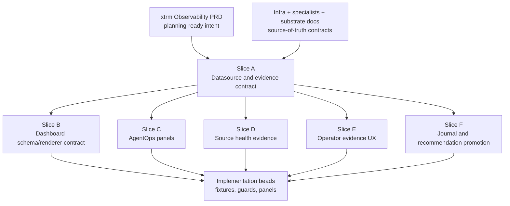
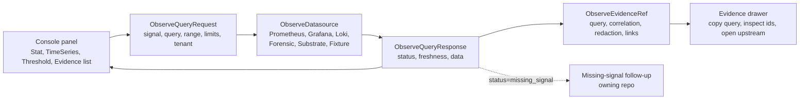
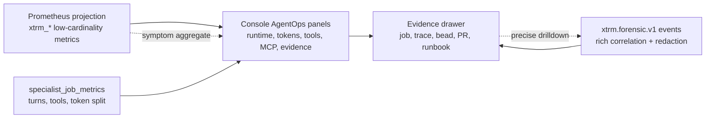
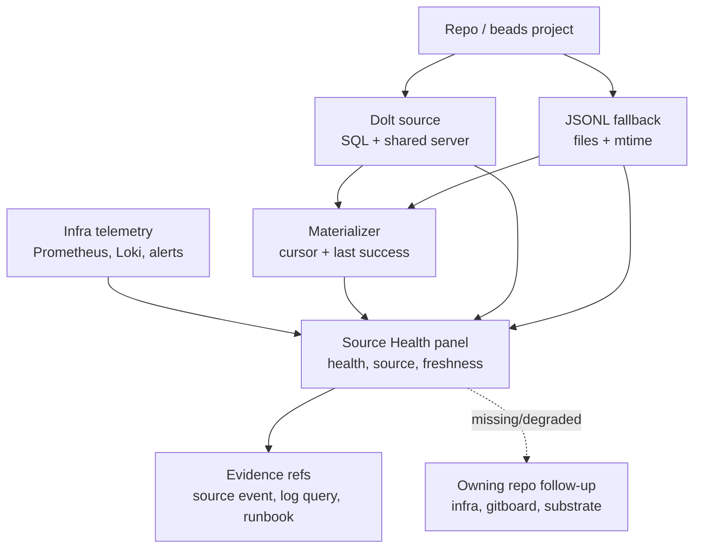
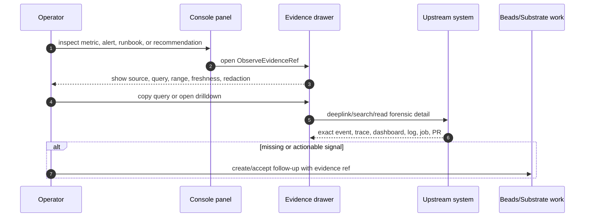
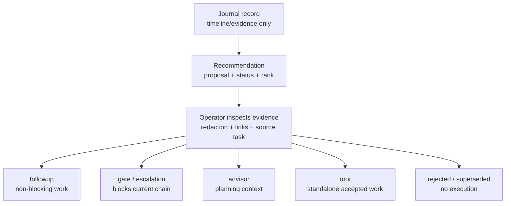

# Console Observability Spec

Status: planning output covering the full `forge-ow7c` track, pre-implementation.

This document consolidates the Console observability OpenSpec plan and all six
capability slices (A–F) into one specification. It replaces the previous split
across `xtrm-observability-openspec-plan.md`,
`xtrm-observability-datasource-contract.md`, `xtrm-agentops-panel-spec.md`,
`xtrm-source-health-evidence-spec.md`, `xtrm-operations-evidence-ux-spec.md`,
and `xtrm-devops-journal-recommendation-spec.md`.

The architectural boundary (UI/API/materializer ownership, state ownership,
Prometheus label discipline) lives in
`docs/architecture/console-architecture.md`. This spec defines what Console
asks upstream systems for, how it renders the answers, and how it lets the
operator move from aggregate symptom to durable proof.

## Table Of Contents

- §1 Inputs and decisions
- §2 Planning topology
- §A Datasource and evidence contract (`forge-ow7c.3`)
- §B Dashboard spec renderer contract (open)
- §C AgentOps panels (`forge-ow7c.4`)
- §D Source health and Dolt evidence (`forge-ow7c.5`)
- §E Operator evidence UX (`forge-ow7c.6`)
- §F Journal and recommendation promotion (`forge-ow7c.7`)
- §3 Cross-repo dependencies
- §4 Test plan and deferred implementation beads

## 1. Inputs and Decisions

### 1.1 Inputs Read

- `docs/xtrm-observability-prd.md`
- `docs/xtrm-console-visual-contract.md`
- `docs/backend-redesign.md`
- `docs/deployment.md`
- `docs/architecture/console-architecture.md`
- `/home/dawid/projects/mercury/infra/MONITORING.md`
- `/home/dawid/projects/mercury/infra/docs/AGENT_MONITORING.md`
- `/home/dawid/dev/specialists/docs/observability-metrics.md`
- `/home/dawid/dev/specialists/docs/telemetry/*`
- `/home/dawid/dev/specialists/docs/design/substrate/devops-platform-engineering-prd.md`
- `/home/dawid/dev/specialists/docs/design/substrate/substrate.md`
- `/home/dawid/second-mind/1-projects/xtrm/research/*observability*`
- `/home/dawid/second-mind/1-projects/xtrm/research/*telemetry*`
- `/home/dawid/second-mind/1-projects/xtrm/archive/devops-specialists*.md`

External refresh sources checked on 2026-06-06:

- Grafana MCP read-only / tool gating docs.
- OpenTelemetry GenAI and MCP semantic conventions.
- Prometheus metric naming guidance.
- AWS DevOps Agent Task, Recommendation, and JournalRecord APIs.
- AWS AgentCore observability docs.

### 1.2 Planning Decisions

1. **Query proxy**: default to server-side proxy for managed/self use.
   Browser-direct is not a Phase 0 path because it leaks credential shape into
   the frontend. A future self-hosted mode may opt into direct datasource
   bindings behind an explicit deployment flag.

2. **Dashboard JSON versioning**: use strict `schema_version` plus migration
   functions. Specs must remain exportable and replayable; additive-only is too
   weak once agent-authored dashboards exist.

3. **Variables**: start smaller than Grafana. Phase 0 supports named variables,
   datasource-backed option queries, global range, and explicit interpolation.
   Defer Grafana-compatible magic variables such as `__interval` until the
   datasource contract needs them.

4. **Heatmap**: defer renderer choice to a spike before Phase 1. Phase 0 ships
   TimeSeries, Stat, and Threshold.

5. **Agent dashboard authoring**: operator approval required. Agents may emit
   draft dashboard specs, panel inserts, selected time ranges, or references to
   existing dashboards. Persistent writes require schema validation, datasource
   safety checks, and an explicit operator accept action.

6. **Tenancy**: single process with tenant-scoped datasource bindings for now.
   Preserve schema fields for tenant id and deployment environment so a later
   customer mode can split process boundaries without rewriting dashboard
   specs.

7. **Logs/traces**: model them in the datasource interface from day one.
   Rendering can lag behind metrics, but the contract must already represent
   log evidence, trace/span lookup, evals, alerts, journals, and recommendations
   so Phase 0 does not hard-code a Prometheus-only worldview.

8. **Product name**: internal surface is `Console Operations`. Avoid public
   naming work in this tranche.

## 2. Planning Topology



Safety shape: contract first, then schema and panel families, then
implementation. Any future implementation bead should be traceable back to one
of these slices rather than reopening the whole PRD.

---

## Slice A — Datasource And Evidence Contract

Owner bead: `forge-ow7c.3`.

Console consumes telemetry; it does not own telemetry production. This slice
defines the boundary between Console panels/evidence surfaces and upstream
systems such as Prometheus, Grafana, Loki, specialists forensic state, future
OpenTelemetry traces, AWS/CloudWatch evidence, and substrate-native records.

### A.1 Ownership

- `mercury/infra` owns Prometheus, Grafana, Loki, Alertmanager, exporters,
  scrape targets, alert rules, Terraform/IaC, and future infra query MCP.
- `specialists` owns AgentOps runtime events, `xtrm.forensic.v1`, Prometheus
  projections, MCP/tool semantics, token usage, evals, and policy/identity
  evidence.
- Console owns datasource descriptors, query proxy/client contracts, dashboard
  JSON, panel rendering, drilldowns, and operator approval UX.

If a signal is missing, Console records a missing-signal evidence item and
routes work to the owning repo. It must not patch local fake metrics into
existence.

### A.2 Query And Evidence Flow



Every response carries freshness and evidence metadata so aggregate symptoms
can drill down to forensic rows, Grafana panels, traces, jobs, beads, runbooks,
or GitHub objects.

### A.3 Signals

The datasource layer is multi-signal from day one.

```ts
export type ObserveSignalKind =
  | "metric"
  | "log"
  | "trace"
  | "eval"
  | "alert"
  | "dashboard"
  | "journal"
  | "recommendation"
  | "runbook"
  | "forensic_event";
```

Phase 0 may render only metrics and evidence metadata, but the contract must
already carry all signal kinds so dashboards and agent-authored panels do not
become Prometheus-only.

### A.4 Datasource Descriptor

```ts
export interface ObserveTenantContext {
  tenantId: string;
  deploymentEnvironment: "local" | "staging" | "production" | string;
  repo?: string;
  serviceNamespace?: string;
  serviceName?: string;
}

export interface ObserveDatasourceDescriptor {
  id: string;
  kind:
    | "prometheus"
    | "grafana"
    | "loki"
    | "otel_trace"
    | "specialists_forensic"
    | "aws_agentcore"
    | "substrate"
    | "static_fixture";
  title: string;
  tenant: ObserveTenantContext;
  authMode: "server_proxy" | "internal_socket" | "none";
  capabilities: ObserveSignalKind[];
  writePolicy: "read_only" | "draft_requires_approval";
  freshness: ObserveFreshness;
  links?: ObserveLink[];
}
```

Rules:

- `authMode="server_proxy"` is the default for networked backends. Browser code
  never receives raw Prometheus/Grafana/AWS credentials.
- `writePolicy="read_only"` is required for query backends. Agent-authored
  dashboard specs are drafts until the operator accepts them.
- `substrate` means future live substrate daemon/API reads. Do not copy
  substrate-native state into a second SQLite projection.
- `static_fixture` exists for tests, previews, and design fixtures.

### A.5 Query Request

```ts
export interface ObserveQueryRequest {
  datasourceId: string;
  signalKind: ObserveSignalKind;
  query: ObserveQuery;
  range: ObserveTimeRange;
  tenant: ObserveTenantContext;
  limits: ObserveQueryLimits;
  evidenceContext?: ObserveEvidenceContext;
}

export type ObserveQuery =
  | { kind: "promql"; expr: string }
  | { kind: "logql"; expr: string }
  | { kind: "grafana_panel"; dashboardUid: string; panelId: string; vars?: Record<string, string | string[]> }
  | { kind: "trace_lookup"; traceId: string; spanId?: string }
  | { kind: "forensic_events"; jobId?: string; beadId?: string; cursor?: string }
  | { kind: "eval_lookup"; evalId?: string; jobId?: string }
  | { kind: "recommendation_lookup"; recommendationId?: string; taskId?: string }
  | { kind: "journal_lookup"; taskId?: string; cursor?: string }
  | { kind: "runbook_lookup"; ref: string };

export interface ObserveTimeRange {
  fromUnixMs: number;
  toUnixMs: number;
  stepMs?: number;
}

export interface ObserveQueryLimits {
  maxSeries?: number;
  maxRows?: number;
  maxBytes?: number;
  timeoutMs?: number;
}
```

Rules:

- Every request has an explicit time range except direct id lookups.
- Query limits are mandatory at the server boundary.
- Raw shell commands, raw URLs as query language, and arbitrary file paths are
  not datasource queries.
- PromQL/LogQL strings pass through to owning backends; Console does not parse
  or reinterpret their language beyond validation/syntax highlighting.

### A.6 Query Response

```ts
export interface ObserveQueryResponse {
  datasourceId: string;
  signalKind: ObserveSignalKind;
  status: "ok" | "partial" | "missing_signal" | "error";
  range: ObserveTimeRange;
  freshness: ObserveFreshness;
  data: ObserveResultData;
  evidence: ObserveEvidenceRef[];
  diagnostics?: ObserveDiagnostics;
}

export type ObserveResultData =
  | { kind: "metric_matrix"; series: ObserveMetricSeries[] }
  | { kind: "metric_vector"; samples: ObserveMetricSample[] }
  | { kind: "logs"; rows: ObserveLogRow[] }
  | { kind: "trace"; trace: ObserveTraceSummary }
  | { kind: "eval"; evals: ObserveEvalSummary[] }
  | { kind: "alerts"; alerts: ObserveAlertSummary[] }
  | { kind: "dashboard_ref"; dashboard: ObserveDashboardRef }
  | { kind: "journal"; records: ObserveJournalRecord[] }
  | { kind: "recommendations"; records: ObserveRecommendationRecord[] }
  | { kind: "forensic_events"; events: unknown[] };
```

`partial` is valid when one backend returns enough evidence to render a useful
panel but some linked drilldown is unavailable. `missing_signal` means Console
knows which owning repo must add a signal.

### A.7 Evidence References

```ts
export interface ObserveEvidenceRef {
  id: string;
  kind:
    | "prometheus_query"
    | "grafana_dashboard"
    | "grafana_panel"
    | "loki_query"
    | "trace_span"
    | "specialist_forensic_event"
    | "specialist_job"
    | "eval_result"
    | "alert"
    | "journal_record"
    | "recommendation"
    | "runbook"
    | "bead"
    | "github";
  source: string;
  title: string;
  timeRange?: ObserveTimeRange;
  queryText?: string;
  correlation?: Record<string, string>;
  redaction?: { status: "clean" | "redacted" | "unknown"; fields?: string[] };
  links?: ObserveLink[];
}
```

High-cardinality identifiers (`job_id`, `bead_id`, `trace_id`, `span_id`,
`tool_call_id`, `mcp_session_id`, `jsonrpc_request_id`, `recommendationId`,
`journalRecordId`) belong in `correlation` and evidence refs. They must not
become Prometheus labels. Authoritative forbidden-label list lives in
`docs/architecture/console-architecture.md` §8.1.

### A.8 Label Allowlist

Console treats the specialists Prometheus projection contract as authoritative
for labels. Allowed labels include bounded identity and state fields such as:

- `service_namespace`, `service_name`, `service_component`
- `deployment_environment`, `repo`
- `participant_kind`, `participant_role`, `state`, `result`
- `model_provider`, allowlisted `model`
- normalized `tool_name`, `mcp_server`, `mcp_method`
- normalized `error_type`, `direction`
- `policy_kind`, `eval_kind`, `chain_template`, `gate_kind`

### A.9 Freshness And Cache

```ts
export interface ObserveFreshness {
  observedAtUnixMs?: number;
  sourceUpdatedAtUnixMs?: number;
  cachedAtUnixMs?: number;
  cacheStatus: "live" | "last_successful" | "stale" | "fixture" | "unknown";
  maxAgeMs?: number;
}
```

Rules:

- Panels must show when they are using `last_successful` or `stale` data.
- Substrate-native reads may use a small last-successful cache to survive
  daemon restarts. That cache is not a materializer.
- Fixture responses must remain visibly marked as `fixture`.

### A.10 Safety And Auth

- Networked datasource requests go through a server-side proxy.
- Grafana/MCP posture is read-only by default, equivalent to disable-write plus
  tool/category allowlists.
- Agent-authored dashboard/panel specs are drafts until accepted by an
  operator.
- Writes to Grafana dashboards, alert rules, incidents, or annotations are out
  of scope for Console Phase 0/1.
- Request/response payload visibility is opt-in, redacted, and trace-linked.
- Missing upstream data becomes follow-up work in the owning repo, not a local
  workaround.

### A.11 Fixture Requirements

The first fixture pack should include:

- Prometheus metric matrix and vector rows.
- Grafana dashboard/panel/deeplink evidence refs.
- Loki/log evidence rows with labels.
- OTel trace/span summary with linked MCP tool call.
- Specialists `xtrm.forensic.v1` event envelope.
- Eval result summary.
- AWS-style task/recommendation/journal records.
- Missing-signal example routed to `mercury/infra`.
- Forbidden-label rejection fixture.

### A.12 Acceptance

- Fixture contract can represent Prometheus query results, Grafana deeplinks,
  Loki log evidence, OTel trace/span refs, specialist eval results, and
  AWS-style recommendation/journal records.
- Missing signal paths produce owning-repo follow-up notes, not local fake
  metrics.

---

## Slice B — Dashboard Spec Renderer Contract

Owner bead: TBD. Create a new child under `forge-ow7c` when implementation
starts. This slice is named in the planning topology but not yet expanded
because it depends on Slice A landing in code.

Output (expected when expanded):

- JSON dashboard schema with `schema_version`, `tenant`, `datasource`,
  variables, panels, layout, refresh policy, and evidence refs.
- Fixture datasource and snapshot fixtures for tests/previews.
- No live Prometheus dependency in unit tests.

Acceptance:

- Schema validator rejects unknown panel types, unsafe unbounded queries,
  missing datasource ids, and agent-authored writes without approval state.
- Migration test proves `schema_version` can upgrade one fixture.

---

## Slice C — AgentOps Panels

Owner bead: `forge-ow7c.4`.

This slice defines Console Operations panels for specialists/AgentOps
telemetry. Every panel either names an upstream `xtrm_*` metric or explicitly
marks the signal as future/missing. Console must not duplicate metric
definitions.

### C.1 Panel Data Map



The panels start from aggregate metrics or job metric rows, then drill down
into forensic/evidence state for exact IDs and payloads. This prevents
dashboards from grouping by high-cardinality runtime identifiers.

### C.2 Runtime State

Purpose: answer whether specialist work is flowing or stuck.

- **Active jobs by state**:
  `sum by (repo, participant_role, state) (xtrm_job_state)` → stacked
  stat/table; drilldown to specialist job list filtered by bounded labels and
  time range.
- **Queue depth**:
  `sum by (repo, participant_role) (xtrm_job_queue_depth)` → stat plus
  threshold; alert candidate: queue above policy for N minutes.
- **Wait duration**: histogram quantile over `xtrm_job_wait_seconds_bucket` →
  time series p50/p95/p99; drilldown forensic events for waiting/resumed jobs.
- **Job duration**: histogram quantile over `xtrm_job_duration_seconds_bucket`
  → time series and distribution; drilldown result/evidence refs for slow
  terminal jobs.

Acceptance: no panel labels by `job_id`, `bead_id`, `chain_id`,
`participant_id`, or raw path. Missing wait histogram renders `missing_signal`
with owner `specialists`.

### C.3 Turns, Context, And Tokens

Purpose: show model pressure and budget proxies without pretending USD is
authoritative.

- **Turns completed**:
  `sum by (repo, participant_role, result) (rate(xtrm_turns_total[5m]))` →
  rate time series.
- **Context usage**:
  `max by (repo, participant_role) (xtrm_context_usage_ratio)` → threshold
  table.
- **Token split**:
  `sum by (repo, participant_role, model_provider, model, direction) (rate(xtrm_llm_tokens_total{direction!="total"}[5m]))`
  → stacked time series by direction.
- **Token fallback**:
  `sum by (repo, participant_role, model_provider, model) (rate(xtrm_llm_tokens_total{direction="total"}[5m]))`
  → separate fallback-only stat.

Rules:

- Never add split directions and `direction="total"` in the same total.
- USD is not displayed as a metric unless backed by direct billing or
  versioned pricing provenance. Until then, panel copy says token usage, not
  cost.
- `model` is allowed only through upstream allowlist/normalization.

### C.4 Tool Calls

Purpose: make tool latency/failure visible without exposing raw commands,
arguments, or file paths.

- **Tool call rate**:
  `sum by (repo, participant_role, tool_name, result) (rate(xtrm_tool_calls_total[5m]))`
  → table sorted by error rate.
- **Tool duration**: histogram quantile over
  `xtrm_tool_call_duration_seconds_bucket` → p95 time series by normalized
  `tool_name`.
- **Tool errors**:
  `sum by (repo, participant_role, tool_name, error_type) (rate(xtrm_tool_errors_total[5m]))`
  → threshold table.

Drilldown: evidence kind `specialist_forensic_event`; correlation may include
`tool_call_id` but only inside evidence metadata; body/result payloads stay
redacted unless the upstream event says clean.

### C.5 MCP Operations

Purpose: prepare the Console for real MCP telemetry while being honest about
current bridge status.

- **MCP operations**:
  `sum by (repo, mcp_server, mcp_method, result) (rate(xtrm_mcp_operations_total[5m]))`
  — shipped for supplied forensic events.
- **MCP operation duration**: histogram quantile over
  `xtrm_mcp_operation_duration_seconds_bucket` — shipped via
  `mcp.latency.observed`.
- **MCP sessions**:
  `sum by (repo, mcp_server, state) (xtrm_mcp_sessions)` — future until session
  emitter exists.
- **MCP session duration**: histogram quantile over
  `xtrm_mcp_session_duration_seconds_bucket` — future until session emitter
  exists.

Rules:

- Show future panels as missing-signal contracts, not empty charts.
- Never label by `mcp_session_id`, `jsonrpc_request_id`, `trace_id`,
  `tool_call_id`, raw args, result text, URL, or token.

### C.6 Result And Evidence

Purpose: connect runtime aggregates to durable proof.

- **Results persisted**:
  `sum by (repo, participant_role, target, result) (rate(xtrm_results_persisted_total[5m]))`
  → table.
- **Evidence refs**:
  `sum by (repo, evidence_kind, result) (rate(xtrm_evidence_refs_total[5m]))`
  → stat/table.
- **Gate verdicts**:
  `sum by (repo, participant_role, gate_kind, verdict) (rate(xtrm_gate_verdicts_total[5m]))`
  → stacked stat and recent verdict list.

Drilldown: evidence refs open Bead Inspector, chain detail, GitHub PR/commit,
report, or forensic event depending on `evidence_kind`.

### C.7 Worktree And Process Health

Purpose: surface operational debt that breaks specialist throughput.

- **Worktrees by state**: `sum by (repo, state) (xtrm_worktrees)`.
- **Worktree age**: `max by (repo, state) (xtrm_worktree_age_seconds)`.
- **Processes by kind/state**:
  `sum by (repo, process_kind, state) (xtrm_processes)`.
- **Orphan process detections**:
  `sum by (repo, process_kind, result) (rate(xtrm_process_orphans_total[15m]))`.
- **Process restarts**:
  `sum by (repo, process_kind, reason) (rate(xtrm_process_restarts_total[15m]))`.

Rules: `process_kind` is bounded (`specialist`, `dolt`, `gitnexus`, `lsp`,
`pi`, or upstream-defined equivalent); worktree paths are never labels.

### C.8 Eval, Identity, Policy

- **Eval runs**:
  `sum by (repo, eval_kind, result) (rate(xtrm_eval_runs_total[15m]))` —
  future/partial until eval emitters are live.
- **Eval score**: `max by (repo, eval_kind) (xtrm_eval_score)` —
  future/partial.
- **Identity operations**:
  `sum by (repo, credential_kind, result) (rate(xtrm_identity_operations_total[15m]))`
  — supplied-forensic-events.
- **Policy decisions**:
  `sum by (repo, policy_kind, action_kind, result) (rate(xtrm_policy_decisions_total[15m]))`
  — supplied-forensic-events.
- **Policy mismatches**:
  `sum by (repo, policy_kind, severity) (rate(xtrm_policy_mismatches_total[15m]))`
  — supplied-forensic-events.

Rules: identity/policy panels are audit signals, not an authorization source
of truth. Secret values, request payloads, and provider error bodies never
render unless upstream redaction marks them clean and the operator explicitly
opens detail.

### C.9 Dashboard Packs

Initial internal packs:

1. **Specialist Runtime**: Runtime State + Turns/Context/Tokens + Tool Calls +
   Results/Evidence.
2. **AgentOps Governance**: Gate Verdicts + Eval + Identity/Policy +
   Evidence refs.
3. **Specialist Infrastructure**: Worktree/process health + MCP Operations +
   Queue/Wait.

Every pack must expose: datasource id, time range, query text, evidence refs,
freshness/cache status, missing-signal owner.

### C.10 Acceptance

- Panels consume upstream `xtrm_*` metric names.
- Panels mark missing future signals instead of silently showing empty charts.
- No panel query uses forbidden labels.
- Token totals do not mix split directions with `direction="total"`.
- USD is deferred/non-authoritative.
- Drilldowns use `ObserveEvidenceRef` from the datasource contract (Slice A).
- Existing Console Operations and Bead Inspector routes remain
  regression-tested when these panels are later implemented.

---

## Slice D — Source Health And Dolt Evidence

Owner bead: `forge-ow7c.5`.

This slice moves Beads/Dolt/source-health UI from bespoke status chips toward
the shared observability datasource/evidence model. It does not remove
existing fallback behavior; it defines the target contract for future
implementation.

### D.1 Health Evidence Map



The panel separates three questions that current chips can blur together:
whether the source is healthy, whether the fallback/cache is fresh, and
whether the materializer is keeping the read model current.

### D.2 Current Bridge Reality

Gitboard/Console currently derives source health from local app paths:

- project scanner reads `.beads/config.yaml`, shared-server port files, and
  metadata to detect Dolt config;
- `graph-dao` and materializer paths attempt Dolt reads and fall back to JSONL;
- `beads-change-watcher` emits `beads:source_health` and Dolt issue events;
- repo tree source badges show `dolt`, `jsonl`, `error`, or `unknown`;
- deployment docs keep Dolt local to the host and route through configured
  host and port.

This stays valid in bridge era because it protects the user-facing Beads feed.
The change is that these local probes become evidence sources, not the
long-term source of observability truth.

### D.3 Target Surfaces

#### D.3.1 Source Health Summary

Purpose: quick operator signal for each repo.

Fields:

- repo id/slug
- current source: `dolt`, `jsonl`, `sqlite`, `substrate`, `missing`, `unknown`
- health: `healthy`, `degraded`, `stale`, `unreachable`, `error`
- freshness: observed time, source update time, cache status
- fallback reason
- evidence refs

Evidence refs:

- current local source-health event
- Prometheus target state when available
- Loki/log query for recent Dolt/source errors
- materializer run/failure event
- future substrate daemon/API health

#### D.3.2 Dolt Evidence Panel

Purpose: show Dolt as an upstream data source, not only as a green/red chip.

Signals: Dolt SQL reachable/unreachable; shared server port/config present;
query success/failure count; query latency if emitted; fallback-to-JSONL count;
last successful snapshot/read; connection pressure or breaker state when
emitted.

Bridge sources: app log events such as `graph.source.timing`;
`beads:source_health`; materializer `beads-snapshot` logs; local deployment
config.

Infra-owned future sources: Prometheus scrape target for a Dolt/exporter or
probe; Loki container/application logs; alert rule for repeated
unreachable/fallback; dashboard deeplink in Grafana.

#### D.3.3 JSONL Fallback Panel

Purpose: make fallback visible without treating fallback as failure when it is
expected.

Signals: fallback active/inactive; JSONL mtime age; Dolt missing config vs
Dolt unreachable vs Dolt query failed; issue count from fallback snapshot;
stale fallback age threshold.

Rules: JSONL fallback is `degraded` when Dolt was expected; JSONL fallback may
be `healthy` only for repos explicitly configured as non-Dolt; UI must show
data freshness, not just source label.

#### D.3.4 Materializer Freshness Panel

Purpose: connect source health to state.db freshness.

Signals: last materializer run time; rows written; source cursor; fallback
used; schema mismatch/failure; state.db freshness per repo/project.

Rules: materializer freshness is not Dolt health; a healthy Dolt source with a
stale materializer is an app/materializer issue; an unhealthy Dolt source with
a fresh last-successful cache is degraded but still renderable.

### D.4 Metric / Evidence Mapping

| Panel signal | Preferred metric/evidence | Owner |
|---|---|---|
| Prometheus target up | `up{job=...}` or target-health datasource response | `mercury/infra` |
| Dolt query/fallback count | future `xtrm_source_reads_total{source,result}` or forensic source event | `gitboard` bridge, later substrate/infra |
| Dolt query duration | future `xtrm_source_read_duration_seconds` | `gitboard` bridge if needed |
| Materializer run/failure | `xtrm_forensic_events` / materializer forensic events | `gitboard` materializer |
| Worktree/process health | `xtrm_processes`, `xtrm_process_orphans_total` | `specialists` / core |
| Logs | Loki labels `service`, `stack`, `container`, plus bounded time range | `mercury/infra` |
| Alerts | Grafana/Alertmanager evidence refs | `mercury/infra` |
| Substrate daemon | future substrate live health API | `substrate` |

### D.5 Guardrails

- Do not treat container/host metrics as app-health truth. CPU/memory/process
  up is infra evidence; app health requires service-level RED/SLI or
  source-read success.
- Do not add raw repo paths, database names from user input, port numbers, raw
  error text, or URLs as Prometheus labels.
- Preserve current source-health chips until datasource-backed evidence
  reaches parity.
- Every degraded/unknown state needs an evidence ref and a suggested owning
  repo.
- The Console UI must preserve upstream names exactly for metrics, alerts,
  datasource ids, and dashboard titles.

### D.6 Implementation Follow-Ups

Create these after the datasource contract and fixture datasource exist:

- Source Health evidence fixture pack with Dolt healthy, Dolt unreachable,
  JSONL fallback, stale fallback, materializer stale, and future substrate
  live cases.
- Source Health summary adapter that converts current `SourceHealth` objects
  to `ObserveEvidenceRef` and `ObserveQueryResponse` fixtures.
- Regression tests that existing repo-tree source badges remain correct while
  evidence panels are added.
- Missing-signal routing tests for infra-owned Prometheus/Loki/Dolt exporter
  gaps.

### D.7 Acceptance

- Current Beads feed/source fallback behavior remains stable.
- Source health panel can distinguish source health, fallback freshness, and
  materializer freshness.
- Every source state has at least one evidence ref or a missing-signal owner.
- Future substrate state is read live via substrate API/daemon and cached
  last-successful; it is not copied into a new SQLite materialization.

---

## Slice E — Operator Evidence UX

Owner bead: `forge-ow7c.6`.

This slice defines how Console Operations presents telemetry evidence without
replacing Grafana, Prometheus, Loki, specialists forensic state, or substrate.
It does not define final visual design.

### E.1 Evidence Interaction Flow



Evidence is an interaction contract, not only a data type. The operator should
always be able to move from an aggregate panel to the exact upstream proof,
then optionally create work with that proof attached.

### E.2 Core Rule

Console renders context and decisions. Upstream systems remain source of
truth. The operator must always be able to see: source system, exact upstream
name, query or lookup used, time range, freshness/cache status, redaction
status, drilldown/deeplink, owning repo for missing signals.

No decorative renames for metric names, labels, alert names, datasource ids,
dashboard titles, trace/span ids, job ids, or recommendation ids.

### E.3 Evidence Drawer

The evidence drawer is polymorphic by `ObserveEvidenceRef.kind`.

Required header fields:

- evidence title, kind, source, datasource id, time range, freshness/cache
  status, redaction status.

Required body sections:

- query or lookup text, copyable;
- correlation ids, copyable but never used as labels;
- upstream links/deeplinks;
- related bead/job/chain/repo links;
- missing-signal owner and suggested follow-up when applicable.

Supported evidence kinds: `prometheus_query`, `grafana_dashboard`,
`grafana_panel`, `loki_query`, `trace_span`, `specialist_forensic_event`,
`specialist_job`, `eval_result`, `alert`, `journal_record`, `recommendation`,
`runbook`, `bead`, `github`.

### E.4 Alert Evidence

Alert rows should show: upstream alert name exactly; state/severity;
datasource/source; firing window; bounded labels; linked panel/query; runbook
ref; current approval/escalation state when attached to agent action.

Actions: open evidence drawer; open upstream Grafana/Alertmanager deeplink;
open related bead/job if known; create follow-up only through a separate
accepted action.

Non-goals: no alert rule editing in Phase 0/1; no alert threshold ownership in
Console; no raw label explosion in row UI.

### E.5 Runbook Links

Runbook refs may point to: infra docs, service skills, second-mind design
notes, repository docs, future substrate issue/evidence refs.

Rules: runbook title preserves upstream/doc title; Console may render summary
metadata, but the owning doc remains authoritative; missing runbook is a
missing-signal evidence item, not a silent empty state.

### E.6 Agent-Authored Panels

An agent may propose: existing dashboard ref + time range/variables; draft
dashboard JSON spec; single panel insert; query explanation with evidence
refs.

States: `draft`, `validating`, `needs_operator_approval`, `accepted`,
`rejected`, `superseded`.

Validation before approval: schema version valid; datasource id exists; query
has bounded range/limits; no forbidden labels; write target is local Console
draft state only; evidence refs are present for generated claims.

Operator actions: preview; accept as transient panel; accept as dashboard
draft; reject with reason; create follow-up bead.

Persistent writes require explicit operator approval. Agent output never
writes Grafana dashboards, alert rules, incidents, or annotations in this
tranche.

### E.7 Panel Drilldown

Every panel supports: copy query; open evidence drawer; open upstream deeplink
when available; inspect freshness/cache status; inspect missing signal owner;
open related Bead Inspector when an evidence ref includes bead/job context.

Panel errors are local to the panel. One datasource failure must not blank the
Operations page or sibling panels.

### E.8 Regression Expectations

Future implementation must preserve: existing Console Operations route; Bead
Inspector drawer/back stack; chain-to-Bead Inspector opening; source health
badges until parity replacement is proven; no visual redesign or app rename in
this tranche.

### E.9 Acceptance

- Every alert/runbook/panel evidence item preserves upstream names.
- Evidence drawer can render every `ObserveEvidenceRef.kind`.
- Agent-authored panels require validation and operator approval.
- Missing signals show owner and suggested next action.
- Grafana is linked/deep-linked, not recreated as the authority.

---

## Slice F — Journal And Recommendation Promotion

Owner bead: `forge-ow7c.7`.

This slice defines how Console Operations should render DevOps Agent-style
journals and recommendations while preserving substrate class semantics.

### F.1 Promotion Flow



Journals remain evidence. Recommendations become work only through explicit
promotion, and the chosen target class is determined by runtime effect rather
than by the wording of the recommendation.

### F.2 Source Model

AWS DevOps Agent provides useful shape, not authority: tasks/investigations
have lifecycle state; journals preserve investigation records; recommendations
have status, rank/priority, content, and task linkage; mitigation/customer
approval state is first-class.

For xtrm, these are evidence and proposal objects. They do not automatically
become issue graph nodes.

### F.3 Journal UX

Journals are timeline/evidence.

Display fields: task/investigation id; source system; timestamp; summary/title;
related evidence refs; trace/span/job/bead correlation when available;
redaction status.

Rules:

- Journal entries are not issues by default.
- Journal entries may link to existing beads/jobs/chains.
- Journal entries may support "create recommendation/follow-up" only through
  an explicit operator action.
- Journal body is redacted/truncated by default when upstream marks it
  redacted.

### F.4 Recommendation UX

Recommendations are proposals with state.

Display fields: recommendation id; title; source task/investigation;
priority/rank; status (`proposed`, `accepted`, `rejected`, `closed`,
`completed`, `update_in_progress`, or upstream equivalent); approval state;
evidence refs; proposed promotion target; owning repo/system.

Operator actions: inspect evidence; accept as non-blocking follow-up; escalate
as current-chain gate/blocker; accept as standalone root work; mark as advisor
context for planned work; reject with reason; supersede with linked
recommendation or bead.

### F.5 Substrate Class Mapping

Promotion target depends on runtime effect, not recommendation wording.

| Recommendation effect | Substrate/beads target | Blocking? | Example |
|---|---|---|---|
| Non-blocking operational improvement | `class: followup` / bd task related by discovered-from | no | Add dashboard for slow queue drain. |
| Current-chain safety condition | `class: gate` or escalation evidence | yes | Deployment must not proceed until backup freshness verified. |
| Pre-work guidance | `class: advisor` context | no by itself | Consider canary before changing exporter retention. |
| Accepted standalone change | `class: root`, type chosen by work kind | separate root | Implement Loki scrape config. |
| Duplicate/obsolete advice | superseded/rejected state | no | Same fix already tracked. |

Rules:

- The UI must show the chosen target and why it blocks or does not block.
- Recommendation acceptance does not execute remediation.
- Gate/escalation promotion requires evidence and an explicit operator or
  policy approval state.
- Root/follow-up creation must preserve source recommendation id in evidence,
  not as a Prometheus label.

### F.6 Console Surfaces

#### F.6.1 Recommendation List

Dense table grouped by: status; priority/rank; owning repo; target class;
freshness.

#### F.6.2 Recommendation Detail

Detail drawer sections: summary/content; evidence refs; source task/journal
records; proposed target class; approval history; linked bead/job/PR/runbook;
promotion actions.

#### F.6.3 Journal Timeline

Timeline attached to: incident/task; bead/job; source-health event; Operations
panel drilldown.

The journal timeline remains read surface unless the operator explicitly
creates work from it.

### F.7 Acceptance

- Journals render as evidence/timeline, not issue nodes.
- Recommendations expose status/rank/approval/evidence.
- Promotion target is explicit: followup, gate, advisor, or root.
- Blocking effect is visible before creation.
- Every created bead/follow-up preserves source recommendation/journal
  evidence.
- No source ids become Prometheus labels.

---

## 3. Cross-Repo Dependencies

- `mercury/infra`: owns Prometheus, Grafana, Loki, Alertmanager, exporters,
  alert rules, scrape targets, Terraform/IaC, and future query MCP.
- `specialists`: owns specialist runtime telemetry, forensic events,
  Prometheus projection, MCP/tool semantics, eval semantics, and
  policy/identity evidence.
- `gitboard`/Console: owns product surface, datasource client contracts,
  panel rendering, dashboard JSON, evidence drilldowns, and operator approval
  UX.
- Substrate future: read live via daemon/API and stitch in the reader with a
  last-successful cache. Do not materialize substrate-native state into
  another SQLite projection.

## 4. Test Plan And Deferred Implementation Beads

Test plan:

- Contract fixture tests for every signal type.
- Schema validation tests for dashboard specs and panel inserts.
- Safety tests for bounded ranges/results and forbidden labels.
- Approval-state tests for agent-authored dashboard writes.
- Regression tests proving existing Console Bead Inspector and Operations
  routes still render after observability shell additions.
- Build/typecheck gates for `apps/console`; `apps/gitboard` remains reference
  until Console is the deployed service.

Deferred implementation beads (create only when Slice A finishes the
contract):

- `forge-ow7c.8`: implement Console datasource contract and static fixture
  datasource.
- `forge-ow7c.9`: add contract fixtures and safety guards for every
  `ObserveSignalKind`, range, result limits, auth mode, forbidden labels, and
  missing-signal routing.
- `forge-ow7c.10`: define dashboard schema validator, migration fixture, and
  agent-authored approval-state tests.
- `forge-ow7c.11`: implement first Phase 0 panels against static fixtures,
  not live Prometheus.
- Slice B owner bead (TBD): expand the dashboard schema/renderer contract.
