# Agent Forge — Comprehensive Mermaid Diagrams

**Version**: 1.2.0  
**Date**: 2026-02-27  
**Scope**: All system processes, flows, and architectures from the PRD

---

## Table of Contents

1. [Overall System Architecture (4-Layer)](#1-overall-system-architecture-4-layer)
2. [High-Level Data Flow & Integration](#2-high-level-data-flow--integration)
3. [Agent Registry & Profile Lifecycle](#3-agent-registry--profile-lifecycle)
4. [Session Lifecycle State Machine](#4-session-lifecycle-state-machine)
5. [Session Store — Entity Relationship Diagram](#5-session-store--entity-relationship-diagram)
6. [State Reconciliation Loop (3 Phases)](#6-state-reconciliation-loop-3-phases)
7. [Communication Protocol — Channel Architecture](#7-communication-protocol--channel-architecture)
8. [Send Protocol Flow](#8-send-protocol-flow)
9. [Wait-for-Ready Detection Flow](#9-wait-for-ready-detection-flow)
10. [AF_STATUS Block Protocol Flow](#10-afstatus-block-protocol-flow)
11. [Read Protocol Flow](#11-read-protocol-flow)
12. [Protocol Engine — Collaborative Protocol](#12-protocol-engine--collaborative-protocol)
13. [Protocol Engine — Adversarial Protocol](#13-protocol-engine--adversarial-protocol)
14. [Protocol Engine — Troubleshoot Protocol](#14-protocol-engine--troubleshoot-protocol)
15. [Protocol Engine — Handshake Protocol](#15-protocol-engine--handshake-protocol)
16. [Routing Engine Decision Flow](#16-routing-engine-decision-flow)
17. [CLI Command Structure](#17-cli-command-structure)
18. [TUI Dashboard Component Architecture](#18-tui-dashboard-component-architecture)
19. [Specialist System — Brain + Body Architecture](#19-specialist-system--brain--body-architecture)
20. [Specialist Spawn Flow](#20-specialist-spawn-flow)
21. [Specialist Discovery — 3-Scope Resolution](#21-specialist-discovery--3-scope-resolution)
22. [Staleness Detection Flow](#22-staleness-detection-flow)
23. [Knowledge Layer Hierarchy](#23-knowledge-layer-hierarchy)
24. [Versioning Roadmap Timeline](#24-versioning-roadmap-timeline)
25. [Project File Structure](#25-project-file-structure)
26. [Boss/Worker Orchestration Model](#26-bossworker-orchestration-model)

---

## 1. Overall System Architecture (4-Layer)

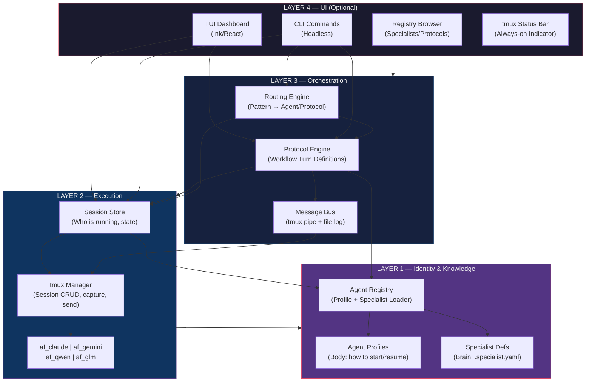
```mermaid
graph TB
    subgraph L4["LAYER 4 — UI (Optional)"]
        TUI["TUI Dashboard\n(Ink/React)"]
        CLI["CLI Commands\n(Headless)"]
        REG["Registry Browser\n(Specialists/Protocols)"]
        TMUXBAR["tmux Status Bar\n(Always-on Indicator)"]
    end

    subgraph L3["LAYER 3 — Orchestration"]
        PE["Protocol Engine\n(Workflow Turn Definitions)"]
        RE["Routing Engine\n(Pattern → Agent/Protocol)"]
        MB["Message Bus\n(tmux pipe + file log)"]
    end

    subgraph L2["LAYER 2 — Execution"]
        SS["Session Store\n(Who is running, state)"]
        TM["tmux Manager\n(Session CRUD, capture, send)"]
        AGENTS["af_claude | af_gemini\naf_qwen | af_glm"]
    end

    subgraph L1["LAYER 1 — Identity & Knowledge"]
        AP["Agent Profiles\n(Body: how to start/resume)"]
        SD["Specialist Defs\n(Brain: .specialist.yaml)"]
        AR["Agent Registry\n(Profile + Specialist Loader)"]
    end

    L4 --> L3
    L3 --> L2
    L2 --> L1

    TUI --> PE
    TUI --> SS
    CLI --> PE
    CLI --> RE
    CLI --> SS

    PE --> MB
    PE --> SS
    RE --> PE
    RE --> SS

    SS --> TM
    MB --> TM
    TM --> AGENTS

    AR --> AP
    AR --> SD
    SS --> AR
    PE --> AR

    style L4 fill:#1a1a2e,stroke:#e94560,color:#eee
    style L3 fill:#16213e,stroke:#0f3460,color:#eee
    style L2 fill:#0f3460,stroke:#533483,color:#eee
    style L1 fill:#533483,stroke:#e94560,color:#eee
```

---

## 2. High-Level Data Flow & Integration

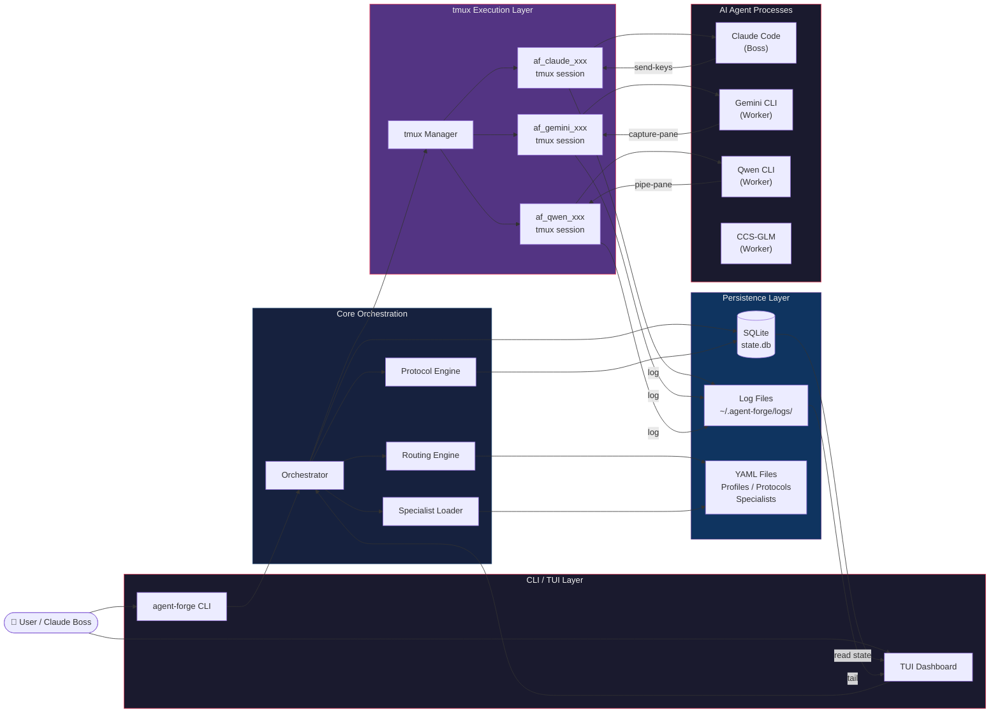
```mermaid
flowchart LR
    USER(["👤 User / Claude Boss"])

    subgraph CLI_LAYER["CLI / TUI Layer"]
        CMD["agent-forge CLI"]
        TUIAPP["TUI Dashboard"]
    end

    subgraph CORE["Core Orchestration"]
        ORCH["Orchestrator"]
        PROTO["Protocol Engine"]
        ROUTER["Routing Engine"]
        SPECLOAD["Specialist Loader"]
    end

    subgraph STORE["Persistence Layer"]
        SQLITE[("SQLite\nstate.db")]
        LOGS["Log Files\n~/.agent-forge/logs/"]
        YAML["YAML Files\nProfiles / Protocols\nSpecialists"]
    end

    subgraph TMUX_LAYER["tmux Execution Layer"]
        TMUXMGR["tmux Manager"]
        SESS1["af_claude_xxx\ntmux session"]
        SESS2["af_gemini_xxx\ntmux session"]
        SESS3["af_qwen_xxx\ntmux session"]
    end

    subgraph AGENTS_LAYER["AI Agent Processes"]
        CLAUDE["Claude Code\n(Boss)"]
        GEMINI["Gemini CLI\n(Worker)"]
        QWEN["Qwen CLI\n(Worker)"]
        GLM["CCS-GLM\n(Worker)"]
    end

    USER --> CMD
    USER --> TUIAPP
    CMD --> ORCH
    TUIAPP --> ORCH

    ORCH --> PROTO
    ORCH --> ROUTER
    ORCH --> SPECLOAD
    ORCH --> SQLITE
    ORCH --> TMUXMGR

    PROTO --> SQLITE
    ROUTER --> YAML
    SPECLOAD --> YAML

    TMUXMGR --> SESS1
    TMUXMGR --> SESS2
    TMUXMGR --> SESS3

    SESS1 --> CLAUDE
    SESS2 --> GEMINI
    SESS3 --> QWEN

    CLAUDE -->|"send-keys"| SESS1
    GEMINI -->|"capture-pane"| SESS2
    QWEN -->|"pipe-pane"| SESS3

    SESS1 -->|"log"| LOGS
    SESS2 -->|"log"| LOGS
    SESS3 -->|"log"| LOGS

    SQLITE -->|"read state"| TUIAPP
    LOGS -->|"tail"| TUIAPP

    style CLI_LAYER fill:#1a1a2e,stroke:#e94560,color:#eee
    style CORE fill:#16213e,stroke:#0f3460,color:#eee
    style STORE fill:#0f3460,stroke:#533483,color:#eee
    style TMUX_LAYER fill:#533483,stroke:#e94560,color:#eee
    style AGENTS_LAYER fill:#1a1a2e,stroke:#e94560,color:#eee
```

---

## 3. Agent Registry & Profile Lifecycle

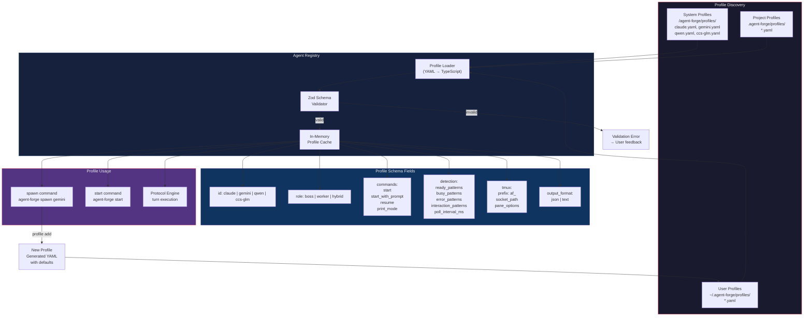
```mermaid
flowchart TD
    subgraph DISCOVERY["Profile Discovery"]
        SYS_P["System Profiles\n/agent-forge/profiles/\nclaude.yaml, gemini.yaml\nqwen.yaml, ccs-glm.yaml"]
        USER_P["User Profiles\n~/.agent-forge/profiles/\n*.yaml"]
        PROJ_P["Project Profiles\n.agent-forge/profiles/\n*.yaml"]
    end

    subgraph REGISTRY["Agent Registry"]
        LOADER["Profile Loader\n(YAML → TypeScript)"]
        VALIDATOR["Zod Schema\nValidator"]
        CACHE["In-Memory\nProfile Cache"]
    end

    subgraph PROFILE_SCHEMA["Profile Schema Fields"]
        ID["id: claude | gemini | qwen | ccs-glm"]
        ROLE["role: boss | worker | hybrid"]
        CMDS["commands:\n  start\n  start_with_prompt\n  resume\n  print_mode"]
        DETECT["detection:\n  ready_patterns\n  busy_patterns\n  error_patterns\n  interaction_patterns\n  poll_interval_ms"]
        TMUXCFG["tmux:\n  prefix: af_\n  socket_path\n  pane_options"]
        OUTFMT["output_format:\n  json | text"]
    end

    subgraph USAGE["Profile Usage"]
        SPAWN["spawn command\nagent-forge spawn gemini"]
        START["start command\nagent-forge start"]
        PROTO_USE["Protocol Engine\nturn execution"]
    end

    SYS_P --> LOADER
    USER_P --> LOADER
    PROJ_P --> LOADER

    LOADER --> VALIDATOR
    VALIDATOR -->|"valid"| CACHE
    VALIDATOR -->|"invalid"| ERR["Validation Error\n→ User feedback"]

    CACHE --> ID
    CACHE --> ROLE
    CACHE --> CMDS
    CACHE --> DETECT
    CACHE --> TMUXCFG
    CACHE --> OUTFMT

    CACHE --> SPAWN
    CACHE --> START
    CACHE --> PROTO_USE

    SPAWN -->|"profile add"| NEW_PROFILE["New Profile\nGenerated YAML\nwith defaults"]
    NEW_PROFILE --> USER_P

    style DISCOVERY fill:#1a1a2e,stroke:#e94560,color:#eee
    style REGISTRY fill:#16213e,stroke:#0f3460,color:#eee
    style PROFILE_SCHEMA fill:#0f3460,stroke:#533483,color:#eee
    style USAGE fill:#533483,stroke:#e94560,color:#eee
```

---

## 4. Session Lifecycle State Machine

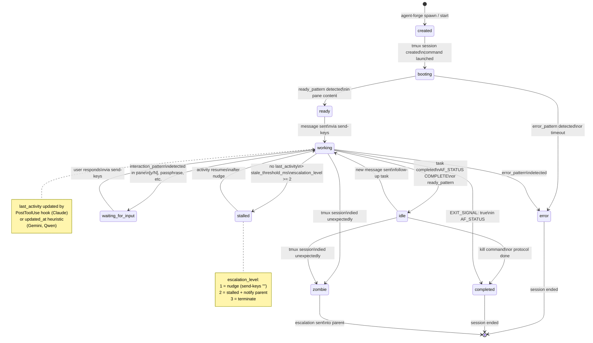
```mermaid
stateDiagram-v2
    [*] --> created : agent-forge spawn / start

    created --> booting : tmux session created\ncommand launched

    booting --> ready : ready_pattern detected\nin pane content

    booting --> error : error_pattern detected\nor timeout

    ready --> working : message sent\nvia send-keys

    working --> idle : task completed\nAF_STATUS COMPLETE\nor ready_pattern

    idle --> working : new message sent\nfollow-up task

    working --> waiting_for_input : interaction_pattern\ndetected in pane\n[y/N], passphrase, etc.

    waiting_for_input --> working : user responds\nvia send-keys

    working --> stalled : no last_activity\n> stale_threshold_ms\nescalation_level >= 2

    stalled --> working : activity resumes\nafter nudge

    idle --> completed : kill command\nor protocol done

    working --> completed : EXIT_SIGNAL: true\nin AF_STATUS

    working --> error : error_pattern\ndetected

    error --> [*] : session ended

    completed --> [*] : session ended

    working --> zombie : tmux session\ndied unexpectedly

    idle --> zombie : tmux session\ndied unexpectedly

    zombie --> [*] : escalation sent\nto parent

    note right of working
        last_activity updated by
        PostToolUse hook (Claude)
        or updated_at heuristic
        (Gemini, Qwen)
    end note

    note right of stalled
        escalation_level:
        1 = nudge (send-keys "")
        2 = stalled + notify parent
        3 = terminate
    end note
```

---

## 5. Session Store — Entity Relationship Diagram

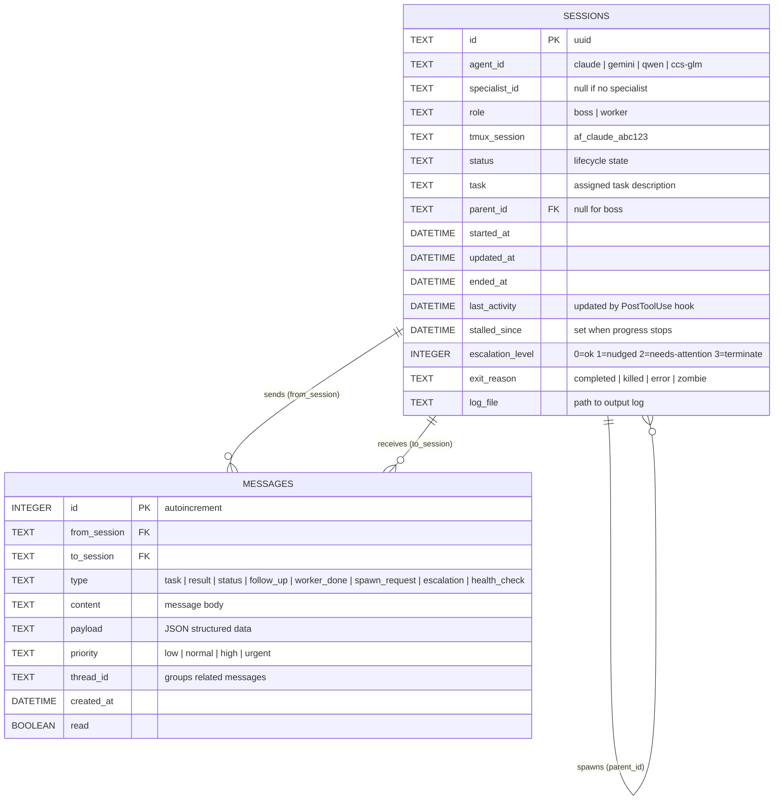
```mermaid
erDiagram
    SESSIONS {
        TEXT id PK "uuid"
        TEXT agent_id "claude | gemini | qwen | ccs-glm"
        TEXT specialist_id "null if no specialist"
        TEXT role "boss | worker"
        TEXT tmux_session "af_claude_abc123"
        TEXT status "lifecycle state"
        TEXT task "assigned task description"
        TEXT parent_id FK "null for boss"
        DATETIME started_at
        DATETIME updated_at
        DATETIME ended_at
        DATETIME last_activity "updated by PostToolUse hook"
        DATETIME stalled_since "set when progress stops"
        INTEGER escalation_level "0=ok 1=nudged 2=needs-attention 3=terminate"
        TEXT exit_reason "completed | killed | error | zombie"
        TEXT log_file "path to output log"
    }

    MESSAGES {
        INTEGER id PK "autoincrement"
        TEXT from_session FK
        TEXT to_session FK
        TEXT type "task | result | status | follow_up | worker_done | spawn_request | escalation | health_check"
        TEXT content "message body"
        TEXT payload "JSON structured data"
        TEXT priority "low | normal | high | urgent"
        TEXT thread_id "groups related messages"
        DATETIME created_at
        BOOLEAN read
    }

    SESSIONS ||--o{ MESSAGES : "sends (from_session)"
    SESSIONS ||--o{ MESSAGES : "receives (to_session)"
    SESSIONS ||--o{ SESSIONS : "spawns (parent_id)"
```

---

## 6. State Reconciliation Loop (3 Phases)

```mermaid
flowchart TD
    START(["⏱ Reconciliation Loop\nEvery 5 seconds"])

    subgraph PHASE1["Phase 1 — Liveness Check"]
        P1_ITER["For each session\nstatus NOT IN\n(completed, killed, error, zombie)"]
        P1_CHECK{"tmux session\nexists?"}
        P1_ZOMBIE["Mark status = zombie\nSend escalation message\nto parent session"]
        P1_OK["Session alive\n→ continue"]
    end

    subgraph PHASE2["Phase 2 — Progress Check (working sessions)"]
        P2_ITER["For each session\nstatus = working"]
        P2_THRESH["threshold =\nspecialist.stale_threshold_ms\n?? 600,000ms (10 min)"]
        P2_CHECK{"now - last_activity\n> threshold?"}
        P2_STALLED_CHECK{"stalled_since\nis null?"}
        P2_SET_STALLED["Set stalled_since = now\nescalation_level = 0"]
        P2_ESCALATE["escalation_level += 1"]
        P2_LEVEL1{"escalation_level\n== 1?"}
        P2_NUDGE["tmux send-keys ''\n(gentle nudge)"]
        P2_LEVEL2{"escalation_level\n>= 2?"}
        P2_STALL_STATE["Set status = stalled\nNotify parent session"]
        P2_CLEAR["Clear stalled_since\nescalation_level = 0"]
    end

    subgraph PHASE3["Phase 3 — Interaction Check (working sessions)"]
        P3_ITER["For each session\nstatus = working"]
        P3_CHECK{"pane content matches\ninteraction_pattern?\n[y/N], passphrase, etc."}
        P3_WAIT["Set status = waiting_for_input\nNotify user"]
        P3_OK2["No interaction\n→ continue"]
    end

    START --> P1_ITER
    P1_ITER --> P1_CHECK
    P1_CHECK -->|"No"| P1_ZOMBIE
    P1_CHECK -->|"Yes"| P1_OK
    P1_OK --> P2_ITER
    P1_ZOMBIE --> P2_ITER

    P2_ITER --> P2_THRESH
    P2_THRESH --> P2_CHECK
    P2_CHECK -->|"Yes (stalled)"| P2_STALLED_CHECK
    P2_STALLED_CHECK -->|"Yes (first time)"| P2_SET_STALLED
    P2_SET_STALLED --> P2_ESCALATE
    P2_STALLED_CHECK -->|"No (already stalled)"| P2_ESCALATE
    P2_ESCALATE --> P2_LEVEL1
    P2_LEVEL1 -->|"Yes"| P2_NUDGE
    P2_LEVEL1 -->|"No"| P2_LEVEL2
    P2_NUDGE --> P2_LEVEL2
    P2_LEVEL2 -->|"Yes"| P2_STALL_STATE
    P2_LEVEL2 -->|"No"| P3_ITER
    P2_CHECK -->|"No (active)"| P2_CLEAR
    P2_CLEAR --> P3_ITER
    P2_STALL_STATE --> P3_ITER

    P3_ITER --> P3_CHECK
    P3_CHECK -->|"Yes"| P3_WAIT
    P3_CHECK -->|"No"| P3_OK2
    P3_WAIT --> END(["⏱ Wait 5s\n→ Repeat"])
    P3_OK2 --> END

    style PHASE1 fill:#1a1a2e,stroke:#e94560,color:#eee
    style PHASE2 fill:#16213e,stroke:#0f3460,color:#eee
    style PHASE3 fill:#0f3460,stroke:#533483,color:#eee
```

---

## 7. Communication Protocol — Channel Architecture

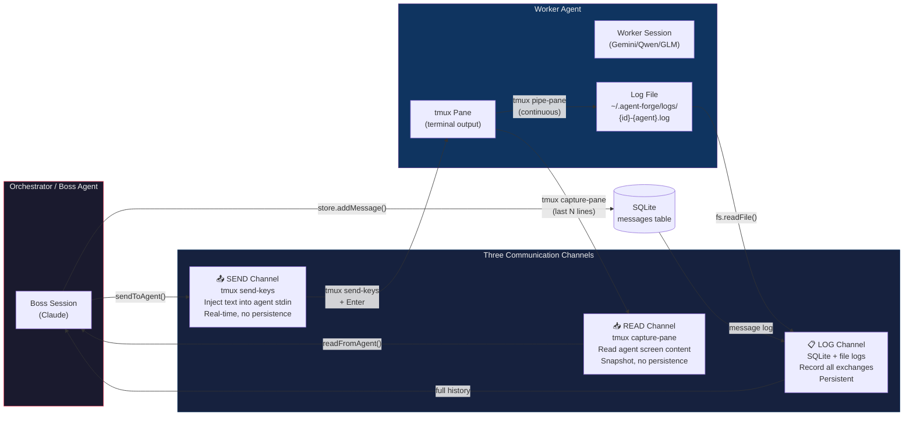
```mermaid
flowchart LR
    subgraph ORCHESTRATOR["Orchestrator / Boss Agent"]
        BOSS["Boss Session\n(Claude)"]
    end

    subgraph CHANNELS["Three Communication Channels"]
        direction TB
        SEND_CH["📤 SEND Channel\ntmux send-keys\nInject text into agent stdin\nReal-time, no persistence"]
        READ_CH["📥 READ Channel\ntmux capture-pane\nRead agent screen content\nSnapshot, no persistence"]
        LOG_CH["📋 LOG Channel\nSQLite + file logs\nRecord all exchanges\nPersistent"]
    end

    subgraph WORKER["Worker Agent"]
        WORKER_SESS["Worker Session\n(Gemini/Qwen/GLM)"]
        PANE["tmux Pane\n(terminal output)"]
        LOGFILE["Log File\n~/.agent-forge/logs/\n{id}-{agent}.log"]
    end

    BOSS -->|"sendToAgent()"| SEND_CH
    SEND_CH -->|"tmux send-keys\n+ Enter"| PANE

    PANE -->|"tmux capture-pane\n(last N lines)"| READ_CH
    READ_CH -->|"readFromAgent()"| BOSS

    PANE -->|"tmux pipe-pane\n(continuous)"| LOGFILE
    LOGFILE -->|"fs.readFile()"| LOG_CH
    LOG_CH -->|"full history"| BOSS

    BOSS -->|"store.addMessage()"| SQLITE[("SQLite\nmessages table")]
    SQLITE -->|"message log"| LOG_CH

    style ORCHESTRATOR fill:#1a1a2e,stroke:#e94560,color:#eee
    style CHANNELS fill:#16213e,stroke:#0f3460,color:#eee
    style WORKER fill:#0f3460,stroke:#533483,color:#eee
```

---

## 8. Send Protocol Flow

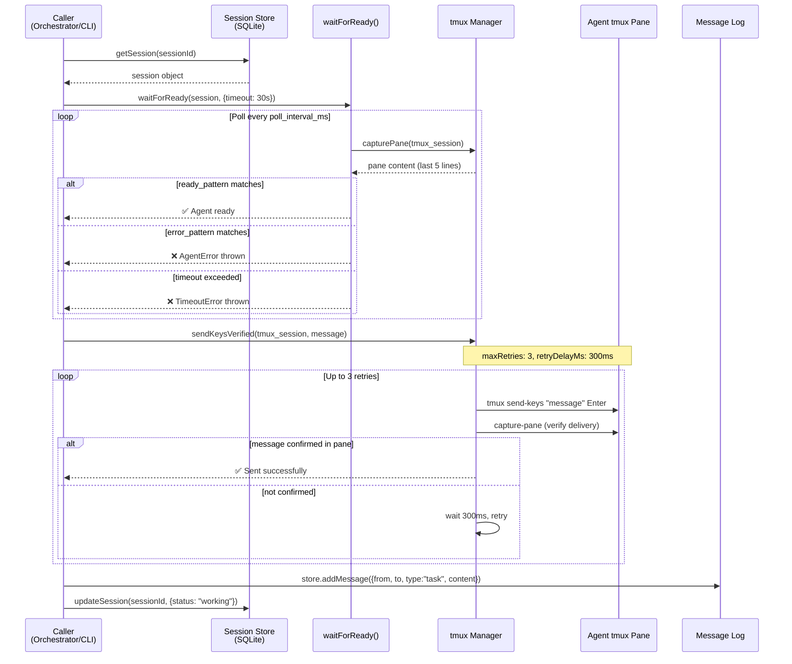
```mermaid
sequenceDiagram
    participant CALLER as Caller<br/>(Orchestrator/CLI)
    participant STORE as Session Store<br/>(SQLite)
    participant WAIT as waitForReady()
    participant TMUX as tmux Manager
    participant PANE as Agent tmux Pane
    participant LOG as Message Log

    CALLER->>STORE: getSession(sessionId)
    STORE-->>CALLER: session object

    CALLER->>WAIT: waitForReady(session, {timeout: 30s})

    loop Poll every poll_interval_ms
        WAIT->>TMUX: capturePane(tmux_session)
        TMUX-->>WAIT: pane content (last 5 lines)
        alt ready_pattern matches
            WAIT-->>CALLER: ✅ Agent ready
        else error_pattern matches
            WAIT-->>CALLER: ❌ AgentError thrown
        else timeout exceeded
            WAIT-->>CALLER: ❌ TimeoutError thrown
        end
    end

    CALLER->>TMUX: sendKeysVerified(tmux_session, message)
    Note over TMUX,PANE: maxRetries: 3, retryDelayMs: 300ms

    loop Up to 3 retries
        TMUX->>PANE: tmux send-keys "message" Enter
        TMUX->>PANE: capture-pane (verify delivery)
        alt message confirmed in pane
            TMUX-->>CALLER: ✅ Sent successfully
        else not confirmed
            TMUX->>TMUX: wait 300ms, retry
        end
    end

    CALLER->>LOG: store.addMessage({from, to, type:"task", content})
    CALLER->>STORE: updateSession(sessionId, {status: "working"})
```

---

## 9. Wait-for-Ready Detection Flow

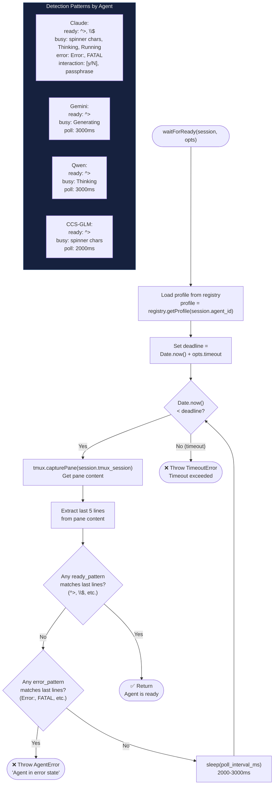
```mermaid
flowchart TD
    START(["waitForReady(session, opts)"])

    PROFILE["Load profile from registry\nprofile = registry.getProfile(session.agent_id)"]
    DEADLINE["Set deadline =\nDate.now() + opts.timeout"]

    LOOP_CHECK{"Date.now()\n< deadline?"}

    CAPTURE["tmux.capturePane(session.tmux_session)\nGet pane content"]
    LAST_LINES["Extract last 5 lines\nfrom pane content"]

    READY_CHECK{"Any ready_pattern\nmatches last lines?\n(^>, \\$, etc.)"}
    ERROR_CHECK{"Any error_pattern\nmatches last lines?\n(Error:, FATAL, etc.)"}
    SLEEP["sleep(poll_interval_ms)\n2000-3000ms"]

    READY_RETURN(["✅ Return\nAgent is ready"])
    ERROR_THROW(["❌ Throw AgentError\n'Agent in error state'"])
    TIMEOUT_THROW(["❌ Throw TimeoutError\nTimeout exceeded"])

    subgraph PATTERNS["Detection Patterns by Agent"]
        CLAUDE_P["Claude:\nready: ^>, \\$\nbusy: spinner chars, Thinking, Running\nerror: Error:, FATAL\ninteraction: [y/N], passphrase"]
        GEMINI_P["Gemini:\nready: ^>\nbusy: Generating\npoll: 3000ms"]
        QWEN_P["Qwen:\nready: ^>\nbusy: Thinking\npoll: 3000ms"]
        GLM_P["CCS-GLM:\nready: ^>\nbusy: spinner chars\npoll: 2000ms"]
    end

    START --> PROFILE
    PROFILE --> DEADLINE
    DEADLINE --> LOOP_CHECK

    LOOP_CHECK -->|"Yes"| CAPTURE
    LOOP_CHECK -->|"No (timeout)"| TIMEOUT_THROW

    CAPTURE --> LAST_LINES
    LAST_LINES --> READY_CHECK

    READY_CHECK -->|"Yes"| READY_RETURN
    READY_CHECK -->|"No"| ERROR_CHECK

    ERROR_CHECK -->|"Yes"| ERROR_THROW
    ERROR_CHECK -->|"No"| SLEEP

    SLEEP --> LOOP_CHECK

    style PATTERNS fill:#16213e,stroke:#0f3460,color:#eee
```

---

## 10. AF_STATUS Block Protocol Flow

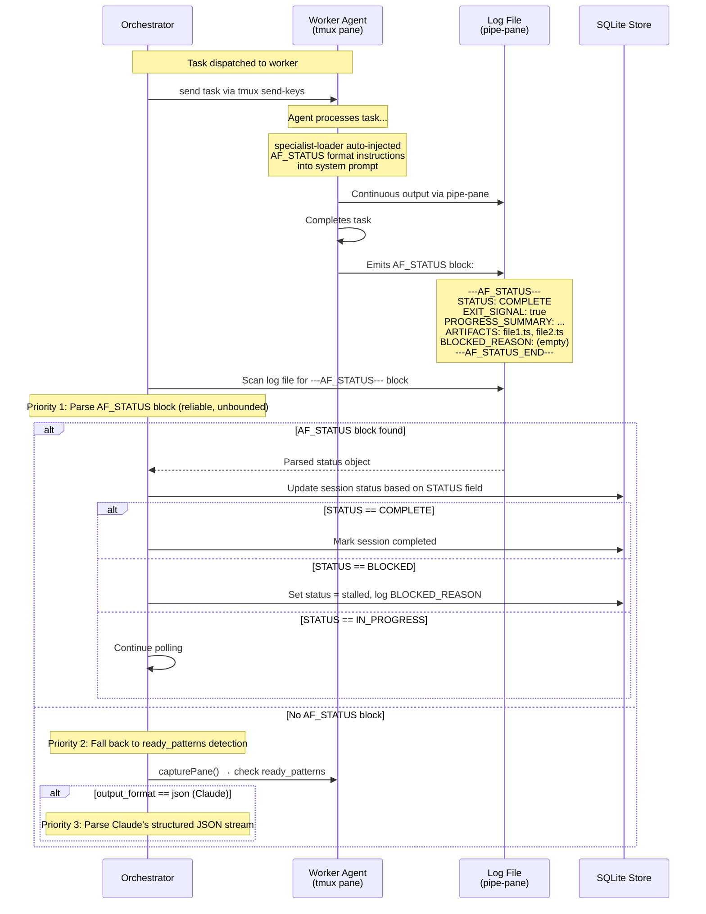
```mermaid
sequenceDiagram
    participant ORCH as Orchestrator
    participant WORKER as Worker Agent<br/>(tmux pane)
    participant LOGFILE as Log File<br/>(pipe-pane)
    participant STORE as SQLite Store

    Note over ORCH,WORKER: Task dispatched to worker

    ORCH->>WORKER: send task via tmux send-keys
    Note over WORKER: Agent processes task...
    Note over WORKER: specialist-loader auto-injected<br/>AF_STATUS format instructions<br/>into system prompt

    WORKER->>LOGFILE: Continuous output via pipe-pane
    WORKER->>WORKER: Completes task

    WORKER->>LOGFILE: Emits AF_STATUS block:
    Note over LOGFILE: ---AF_STATUS---<br/>STATUS: COMPLETE<br/>EXIT_SIGNAL: true<br/>PROGRESS_SUMMARY: ...<br/>ARTIFACTS: file1.ts, file2.ts<br/>BLOCKED_REASON: (empty)<br/>---AF_STATUS_END---

    ORCH->>LOGFILE: Scan log file for ---AF_STATUS--- block
    Note over ORCH: Priority 1: Parse AF_STATUS block (reliable, unbounded)

    alt AF_STATUS block found
        LOGFILE-->>ORCH: Parsed status object
        ORCH->>STORE: Update session status based on STATUS field
        alt STATUS == COMPLETE
            ORCH->>STORE: Mark session completed
        else STATUS == BLOCKED
            ORCH->>STORE: Set status = stalled, log BLOCKED_REASON
        else STATUS == IN_PROGRESS
            ORCH->>ORCH: Continue polling
        end
    else No AF_STATUS block
        Note over ORCH: Priority 2: Fall back to ready_patterns detection
        ORCH->>WORKER: capturePane() → check ready_patterns
        alt output_format == json (Claude)
            Note over ORCH: Priority 3: Parse Claude's structured JSON stream
        end
    end
```

---

## 11. Read Protocol Flow

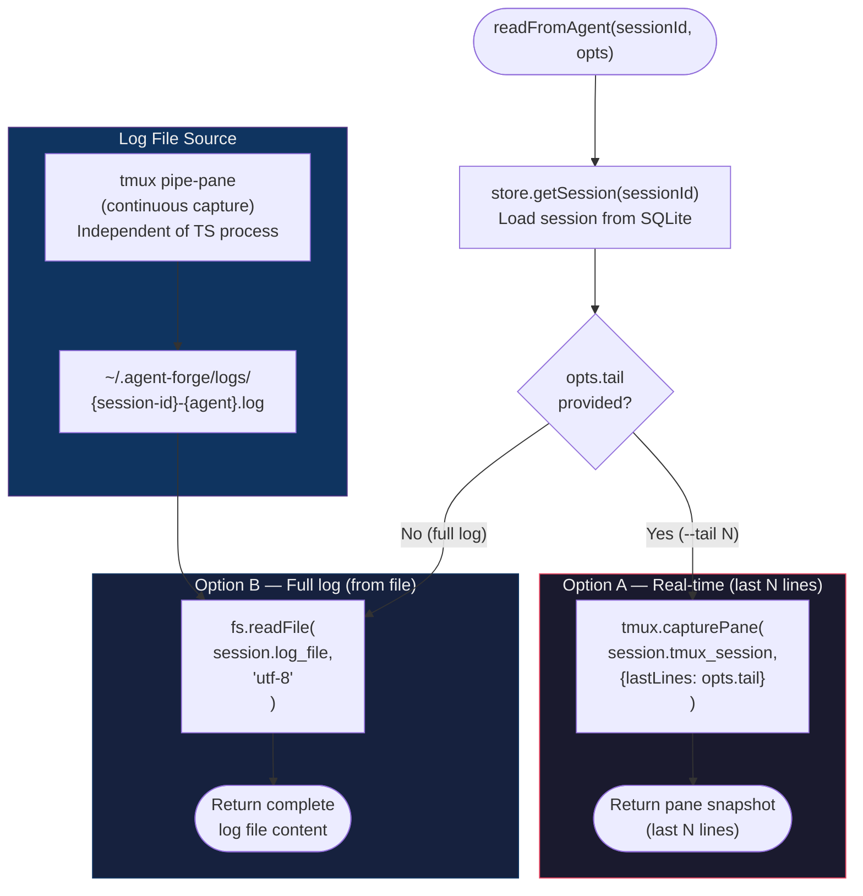
```mermaid
flowchart TD
    START(["readFromAgent(sessionId, opts)"])

    GET_SESS["store.getSession(sessionId)\nLoad session from SQLite"]

    TAIL_CHECK{"opts.tail\nprovided?"}

    subgraph OPTION_A["Option A — Real-time (last N lines)"]
        CAPTURE["tmux.capturePane(\n  session.tmux_session,\n  {lastLines: opts.tail}\n)"]
        RETURN_A(["Return pane snapshot\n(last N lines)"])
    end

    subgraph OPTION_B["Option B — Full log (from file)"]
        READ_FILE["fs.readFile(\n  session.log_file,\n  'utf-8'\n)"]
        RETURN_B(["Return complete\nlog file content"])
    end

    subgraph LOG_SOURCE["Log File Source"]
        PIPE_PANE["tmux pipe-pane\n(continuous capture)\nIndependent of TS process"]
        LOG_PATH["~/.agent-forge/logs/\n{session-id}-{agent}.log"]
    end

    START --> GET_SESS
    GET_SESS --> TAIL_CHECK

    TAIL_CHECK -->|"Yes (--tail N)"| CAPTURE
    TAIL_CHECK -->|"No (full log)"| READ_FILE

    CAPTURE --> RETURN_A
    READ_FILE --> RETURN_B

    PIPE_PANE --> LOG_PATH
    LOG_PATH --> READ_FILE

    style OPTION_A fill:#1a1a2e,stroke:#e94560,color:#eee
    style OPTION_B fill:#16213e,stroke:#0f3460,color:#eee
    style LOG_SOURCE fill:#0f3460,stroke:#533483,color:#eee
```

---

## 12. Protocol Engine — Collaborative Protocol

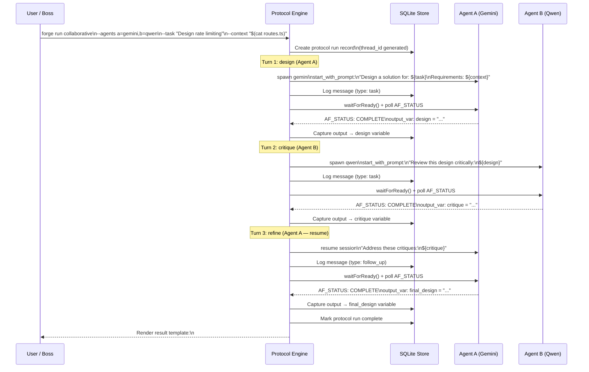
```mermaid
sequenceDiagram
    participant USER as User / Boss
    participant ENGINE as Protocol Engine
    participant STORE as SQLite Store
    participant AGENT_A as Agent A (Gemini)
    participant AGENT_B as Agent B (Qwen)

    USER->>ENGINE: forge run collaborative\n--agents a=gemini,b=qwen\n--task "Design rate limiting"\n--context "$(cat routes.ts)"

    ENGINE->>STORE: Create protocol run record\n(thread_id generated)

    Note over ENGINE: Turn 1: design (Agent A)
    ENGINE->>AGENT_A: spawn gemini\nstart_with_prompt:\n"Design a solution for: ${task}\nRequirements: ${context}"
    ENGINE->>STORE: Log message (type: task)
    ENGINE->>AGENT_A: waitForReady() + poll AF_STATUS
    AGENT_A-->>ENGINE: AF_STATUS: COMPLETE\noutput_var: design = "..."
    ENGINE->>STORE: Capture output → design variable

    Note over ENGINE: Turn 2: critique (Agent B)
    ENGINE->>AGENT_B: spawn qwen\nstart_with_prompt:\n"Review this design critically:\n${design}"
    ENGINE->>STORE: Log message (type: task)
    ENGINE->>AGENT_B: waitForReady() + poll AF_STATUS
    AGENT_B-->>ENGINE: AF_STATUS: COMPLETE\noutput_var: critique = "..."
    ENGINE->>STORE: Capture output → critique variable

    Note over ENGINE: Turn 3: refine (Agent A — resume)
    ENGINE->>AGENT_A: resume session\n"Address these critiques:\n${critique}"
    ENGINE->>STORE: Log message (type: follow_up)
    ENGINE->>AGENT_A: waitForReady() + poll AF_STATUS
    AGENT_A-->>ENGINE: AF_STATUS: COMPLETE\noutput_var: final_design = "..."
    ENGINE->>STORE: Capture output → final_design variable

    ENGINE->>STORE: Mark protocol run complete
    ENGINE-->>USER: Render result template:\n## Initial Design: ${design}\n## Critique: ${critique}\n## Refined Design: ${final_design}
```

---

## 13. Protocol Engine — Adversarial Protocol

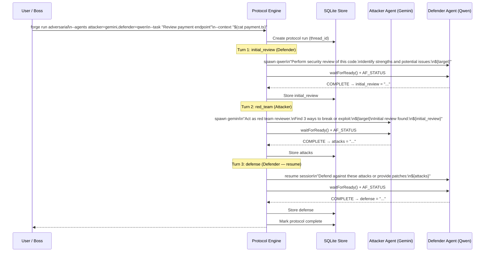
```mermaid
sequenceDiagram
    participant USER as User / Boss
    participant ENGINE as Protocol Engine
    participant STORE as SQLite Store
    participant ATTACKER as Attacker Agent (Gemini)
    participant DEFENDER as Defender Agent (Qwen)

    USER->>ENGINE: forge run adversarial\n--agents attacker=gemini,defender=qwen\n--task "Review payment endpoint"\n--context "$(cat payment.ts)"

    ENGINE->>STORE: Create protocol run (thread_id)

    Note over ENGINE: Turn 1: initial_review (Defender)
    ENGINE->>DEFENDER: spawn qwen\n"Perform security review of this code.\nIdentify strengths and potential issues:\n${target}"
    ENGINE->>DEFENDER: waitForReady() + AF_STATUS
    DEFENDER-->>ENGINE: COMPLETE → initial_review = "..."
    ENGINE->>STORE: Store initial_review

    Note over ENGINE: Turn 2: red_team (Attacker)
    ENGINE->>ATTACKER: spawn gemini\n"Act as red team reviewer.\nFind 3 ways to break or exploit:\n${target}\nInitial review found:\n${initial_review}"
    ENGINE->>ATTACKER: waitForReady() + AF_STATUS
    ATTACKER-->>ENGINE: COMPLETE → attacks = "..."
    ENGINE->>STORE: Store attacks

    Note over ENGINE: Turn 3: defense (Defender — resume)
    ENGINE->>DEFENDER: resume session\n"Defend against these attacks or provide patches:\n${attacks}"
    ENGINE->>DEFENDER: waitForReady() + AF_STATUS
    DEFENDER-->>ENGINE: COMPLETE → defense = "..."
    ENGINE->>STORE: Store defense

    ENGINE->>STORE: Mark protocol complete
    ENGINE-->>USER: ## Initial Review\n## Attack Vectors\n## Defense & Patches
```

---

## 14. Protocol Engine — Troubleshoot Protocol

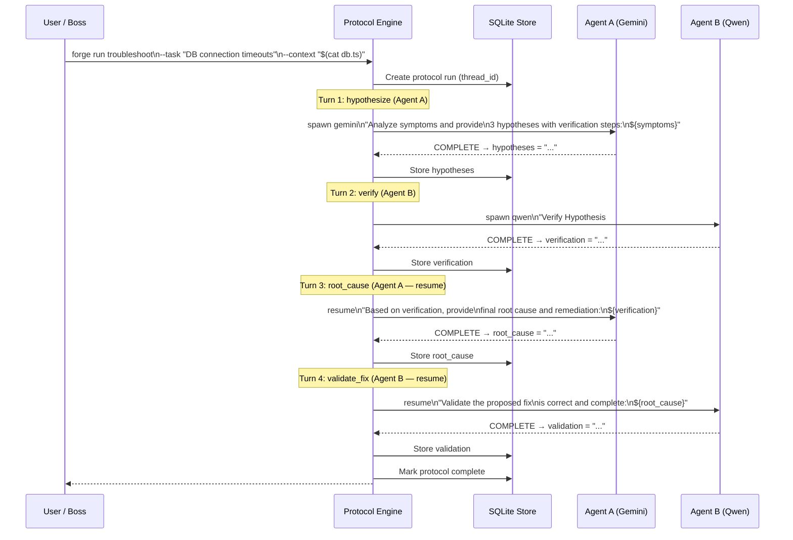
```mermaid
sequenceDiagram
    participant USER as User / Boss
    participant ENGINE as Protocol Engine
    participant STORE as SQLite Store
    participant AGENT_A as Agent A (Gemini)
    participant AGENT_B as Agent B (Qwen)

    USER->>ENGINE: forge run troubleshoot\n--task "DB connection timeouts"\n--context "$(cat db.ts)"

    ENGINE->>STORE: Create protocol run (thread_id)

    Note over ENGINE: Turn 1: hypothesize (Agent A)
    ENGINE->>AGENT_A: spawn gemini\n"Analyze symptoms and provide\n3 hypotheses with verification steps:\n${symptoms}"
    AGENT_A-->>ENGINE: COMPLETE → hypotheses = "..."
    ENGINE->>STORE: Store hypotheses

    Note over ENGINE: Turn 2: verify (Agent B)
    ENGINE->>AGENT_B: spawn qwen\n"Verify Hypothesis #1 using code:\n${hypotheses}\nCode: ${code}"
    AGENT_B-->>ENGINE: COMPLETE → verification = "..."
    ENGINE->>STORE: Store verification

    Note over ENGINE: Turn 3: root_cause (Agent A — resume)
    ENGINE->>AGENT_A: resume\n"Based on verification, provide\nfinal root cause and remediation:\n${verification}"
    AGENT_A-->>ENGINE: COMPLETE → root_cause = "..."
    ENGINE->>STORE: Store root_cause

    Note over ENGINE: Turn 4: validate_fix (Agent B — resume)
    ENGINE->>AGENT_B: resume\n"Validate the proposed fix\nis correct and complete:\n${root_cause}"
    AGENT_B-->>ENGINE: COMPLETE → validation = "..."
    ENGINE->>STORE: Store validation

    ENGINE->>STORE: Mark protocol complete
    ENGINE-->>USER: ## Hypotheses\n## Verification\n## Root Cause & Remediation\n## Fix Validation
```

---

## 15. Protocol Engine — Handshake Protocol

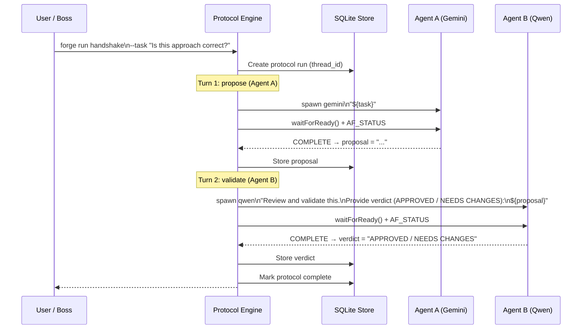
```mermaid
sequenceDiagram
    participant USER as User / Boss
    participant ENGINE as Protocol Engine
    participant STORE as SQLite Store
    participant AGENT_A as Agent A (Gemini)
    participant AGENT_B as Agent B (Qwen)

    USER->>ENGINE: forge run handshake\n--task "Is this approach correct?"

    ENGINE->>STORE: Create protocol run (thread_id)

    Note over ENGINE: Turn 1: propose (Agent A)
    ENGINE->>AGENT_A: spawn gemini\n"${task}"
    ENGINE->>AGENT_A: waitForReady() + AF_STATUS
    AGENT_A-->>ENGINE: COMPLETE → proposal = "..."
    ENGINE->>STORE: Store proposal

    Note over ENGINE: Turn 2: validate (Agent B)
    ENGINE->>AGENT_B: spawn qwen\n"Review and validate this.\nProvide verdict (APPROVED / NEEDS CHANGES):\n${proposal}"
    ENGINE->>AGENT_B: waitForReady() + AF_STATUS
    AGENT_B-->>ENGINE: COMPLETE → verdict = "APPROVED / NEEDS CHANGES"
    ENGINE->>STORE: Store verdict

    ENGINE->>STORE: Mark protocol complete
    ENGINE-->>USER: ## Proposal\n## Verdict
```

---

## 16. Routing Engine Decision Flow

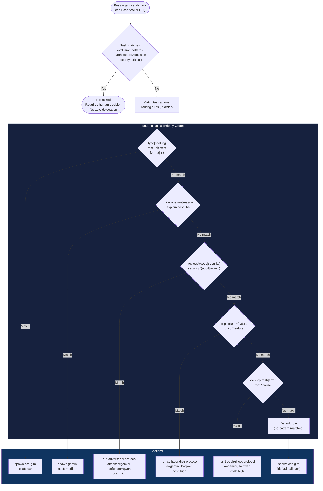
```mermaid
flowchart TD
    INPUT(["Boss Agent sends task\n(via Bash tool or CLI)"])

    EXCLUSION{"Task matches\nexclusion pattern?\n(architecture.*decision\nsecurity.*critical)"}

    EXCL_BLOCK(["🚫 Blocked\nRequires human decision\nNo auto-delegation"])

    PATTERN_MATCH["Match task against\nrouting rules (in order)"]

    subgraph RULES["Routing Rules (Priority Order)"]
        R1{"typo|spelling\ntest|unit.*test\nformat|lint"}
        R2{"think|analyze|reason\nexplain|describe"}
        R3{"review.*(code|security)\nsecurity.*(audit|review)"}
        R4{"implement.*feature\nbuild.*feature"}
        R5{"debug|crash|error\nroot.*cause"}
        DEFAULT["Default rule\n(no pattern matched)"]
    end

    subgraph ACTIONS["Actions"]
        SPAWN_GLM["spawn ccs-glm\ncost: low"]
        SPAWN_GEMINI["spawn gemini\ncost: medium"]
        PROTO_ADV["run adversarial protocol\nattacker=gemini, defender=qwen\ncost: high"]
        PROTO_COLLAB["run collaborative protocol\na=gemini, b=qwen\ncost: high"]
        PROTO_TROUBLE["run troubleshoot protocol\na=gemini, b=qwen\ncost: high"]
        SPAWN_DEFAULT["spawn ccs-glm\n(default fallback)"]
    end

    INPUT --> EXCLUSION
    EXCLUSION -->|"Yes"| EXCL_BLOCK
    EXCLUSION -->|"No"| PATTERN_MATCH

    PATTERN_MATCH --> R1
    R1 -->|"Match"| SPAWN_GLM
    R1 -->|"No match"| R2

    R2 -->|"Match"| SPAWN_GEMINI
    R2 -->|"No match"| R3

    R3 -->|"Match"| PROTO_ADV
    R3 -->|"No match"| R4

    R4 -->|"Match"| PROTO_COLLAB
    R4 -->|"No match"| R5

    R5 -->|"Match"| PROTO_TROUBLE
    R5 -->|"No match"| DEFAULT

    DEFAULT --> SPAWN_DEFAULT

    style RULES fill:#16213e,stroke:#0f3460,color:#eee
    style ACTIONS fill:#0f3460,stroke:#533483,color:#eee
```

---

## 17. CLI Command Structure

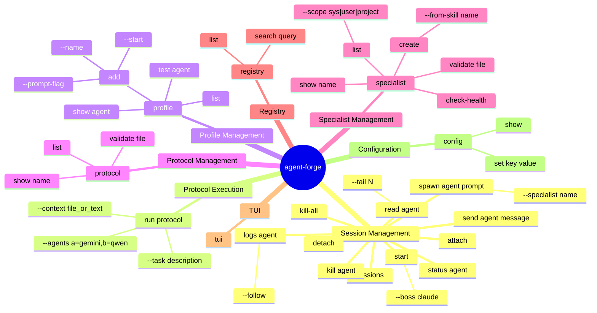
```mermaid
mindmap
  root((agent-forge))
    Session Management
      start
        --boss claude
      spawn agent prompt
        --specialist name
      send agent message
      read agent
        --tail N
      status agent
      sessions
      kill agent
      kill-all
      attach
      detach
      logs agent
        --follow
    Protocol Execution
      run protocol
        --agents a=gemini,b=qwen
        --task description
        --context file_or_text
    Profile Management
      profile
        list
        add
          --name
          --start
          --prompt-flag
        test agent
        show agent
    Protocol Management
      protocol
        list
        show name
        validate file
    Specialist Management
      specialist
        list
          --scope sys|user|project
        show name
        create
          --from-skill name
        validate file
        check-health
    Registry
      registry
        list
        search query
    TUI
      tui
    Configuration
      config
        show
        set key value
```

---

## 18. TUI Dashboard Component Architecture

```mermaid
graph TB
    subgraph TUI_APP["TUI Application (Ink/React)"]
        APP["app.tsx\nRoot Component\nKeyboard event handler"]

        subgraph PANELS["Panel Components"]
            FLEET["fleet-panel.tsx\nAgent list\nStatus, duration, role\nspecialist indicator\nPoll: 2-5s"]
            AGENT_VIEW["agent-view.tsx\nSelected agent output\ntmux capture-pane\nstreaming"]
            MESSAGES["messages-panel.tsx\nInter-agent message log\nSQLite messages table"]
            PROTOCOL["protocol-panel.tsx\nRunning protocol state\nTurn progress\nElapsed time"]
            REGISTRY["registry-panel.tsx\nSpecialists (sys/user/proj)\nProtocols\nProfiles\nSkills (read-only)"]
            STATUS_BAR["status-bar.tsx\nF-key hints\nGlobal status"]
        end

        subgraph HOOKS["React Hooks"]
            USE_SESS["use-sessions.ts\nSQLite polling\nSession state"]
            USE_OUTPUT["use-agent-output.ts\ntmux capture-pane\nStreaming output"]
            USE_PROTO["use-protocol-state.ts\nProtocol run state\nTurn tracking"]
        end
    end

    subgraph KEYBINDINGS["Keybindings"]
        KB_NAV["↑↓ Navigate fleet"]
        KB_ENTER["Enter Focus agent\n(full-screen output)"]
        KB_S["s Spawn worker\n(interactive prompt)"]
        KB_K["k Kill agent\n(with confirmation)"]
        KB_M["m Send message\nto selected agent"]
        KB_R["r Run protocol\n(workflow + agent select)"]
        KB_L["l Open log in $PAGER"]
        KB_T["t tmux pass-through\n(direct pane access)"]
        KB_F5["F5 Full-screen log view"]
        KB_F6["F6 Toggle Registry panel"]
        KB_Q["q Quit TUI\n(agents continue)"]
    end

    APP --> FLEET
    APP --> AGENT_VIEW
    APP --> MESSAGES
    APP --> PROTOCOL
    APP --> REGISTRY
    APP --> STATUS_BAR

    FLEET --> USE_SESS
    AGENT_VIEW --> USE_OUTPUT
    MESSAGES --> USE_SESS
    PROTOCOL --> USE_PROTO

    APP --> KB_NAV
    APP --> KB_ENTER
    APP --> KB_S
    APP --> KB_K
    APP --> KB_M
    APP --> KB_R
    APP --> KB_L
    APP --> KB_T
    APP --> KB_F5
    APP --> KB_F6
    APP --> KB_Q

    style TUI_APP fill:#1a1a2e,stroke:#e94560,color:#eee
    style PANELS fill:#16213e,stroke:#0f3460,color:#eee
    style HOOKS fill:#0f3460,stroke:#533483,color:#eee
    style KEYBINDINGS fill:#533483,stroke:#e94560,color:#eee
```

---

## 19. Specialist System — Brain + Body Architecture

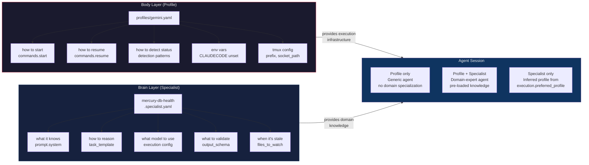
```mermaid
graph LR
    subgraph BODY["Body Layer (Profile)"]
        direction TB
        PROF["profiles/gemini.yaml"]
        B1["how to start\ncommands.start"]
        B2["how to resume\ncommands.resume"]
        B3["how to detect status\ndetection patterns"]
        B4["env vars\nCLAUDECODE unset"]
        B5["tmux config\nprefix, socket_path"]
        PROF --> B1
        PROF --> B2
        PROF --> B3
        PROF --> B4
        PROF --> B5
    end

    subgraph BRAIN["Brain Layer (Specialist)"]
        direction TB
        SPEC["mercury-db-health\n.specialist.yaml"]
        BR1["what it knows\nprompt.system"]
        BR2["how to reason\ntask_template"]
        BR3["what model to use\nexecution config"]
        BR4["what to validate\noutput_schema"]
        BR5["when it's stale\nfiles_to_watch"]
        SPEC --> BR1
        SPEC --> BR2
        SPEC --> BR3
        SPEC --> BR4
        SPEC --> BR5
    end

    subgraph SESSION["Agent Session"]
        direction TB
        SESS_TYPE1["Profile only\nGeneric agent\nno domain specialization"]
        SESS_TYPE2["Profile + Specialist\nDomain-expert agent\npre-loaded knowledge"]
        SESS_TYPE3["Specialist only\nInferred profile from\nexecution.preferred_profile"]
    end

    BODY -->|"provides execution\ninfrastructure"| SESSION
    BRAIN -->|"provides domain\nknowledge"| SESSION

    style BODY fill:#1a1a2e,stroke:#e94560,color:#eee
    style BRAIN fill:#16213e,stroke:#0f3460,color:#eee
    style SESSION fill:#0f3460,stroke:#533483,color:#eee
```

---

## 20. Specialist Spawn Flow

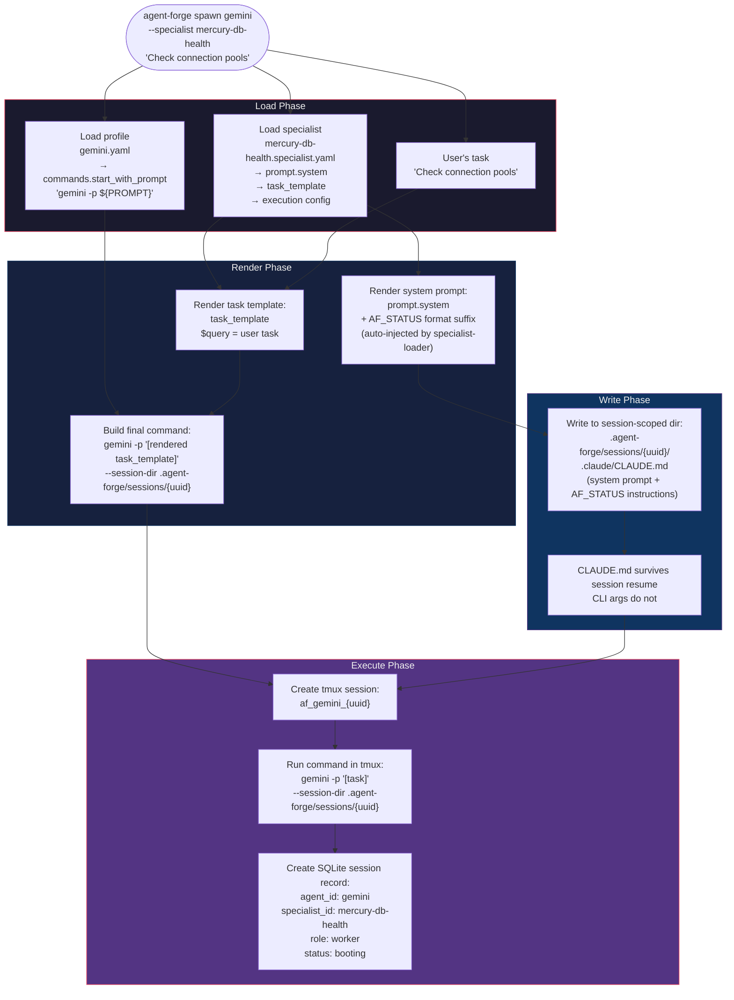
```mermaid
flowchart TD
    CMD(["agent-forge spawn gemini\n--specialist mercury-db-health\n'Check connection pools'"])

    subgraph LOAD["Load Phase"]
        LOAD_PROF["Load profile\ngemini.yaml\n→ commands.start_with_prompt\n'gemini -p ${PROMPT}'"]
        LOAD_SPEC["Load specialist\nmercury-db-health.specialist.yaml\n→ prompt.system\n→ task_template\n→ execution config"]
        LOAD_TASK["User's task\n'Check connection pools'"]
    end

    subgraph RENDER["Render Phase"]
        RENDER_SYS["Render system prompt:\nprompt.system\n+ AF_STATUS format suffix\n(auto-injected by specialist-loader)"]
        RENDER_TASK["Render task template:\ntask_template\n$query = user task"]
        RENDER_CMD["Build final command:\ngemini -p '[rendered task_template]'\n--session-dir .agent-forge/sessions/{uuid}"]
    end

    subgraph WRITE["Write Phase"]
        WRITE_CLAUDE["Write to session-scoped dir:\n.agent-forge/sessions/{uuid}/\n.claude/CLAUDE.md\n(system prompt + AF_STATUS instructions)"]
        NOTE_PERSIST["CLAUDE.md survives session resume\nCLI args do not"]
    end

    subgraph EXECUTE["Execute Phase"]
        CREATE_TMUX["Create tmux session:\naf_gemini_{uuid}"]
        RUN_CMD["Run command in tmux:\ngemini -p '[task]'\n--session-dir .agent-forge/sessions/{uuid}"]
        LOG_SESS["Create SQLite session record:\nagent_id: gemini\nspecialist_id: mercury-db-health\nrole: worker\nstatus: booting"]
    end

    CMD --> LOAD_PROF
    CMD --> LOAD_SPEC
    CMD --> LOAD_TASK

    LOAD_PROF --> RENDER_CMD
    LOAD_SPEC --> RENDER_SYS
    LOAD_SPEC --> RENDER_TASK
    LOAD_TASK --> RENDER_TASK

    RENDER_SYS --> WRITE_CLAUDE
    RENDER_TASK --> RENDER_CMD
    WRITE_CLAUDE --> NOTE_PERSIST

    RENDER_CMD --> CREATE_TMUX
    NOTE_PERSIST --> CREATE_TMUX
    CREATE_TMUX --> RUN_CMD
    RUN_CMD --> LOG_SESS

    style LOAD fill:#1a1a2e,stroke:#e94560,color:#eee
    style RENDER fill:#16213e,stroke:#0f3460,color:#eee
    style WRITE fill:#0f3460,stroke:#533483,color:#eee
    style EXECUTE fill:#533483,stroke:#e94560,color:#eee
```

---

## 21. Specialist Discovery — 3-Scope Resolution

```mermaid
flowchart TD
    REQUEST(["specialist-loader.loadAll()\nor\nspecialist-loader.load('mercury-db-health')"])

    subgraph SCOPE1["Scope 1 — Project (Highest Priority)"]
        PROJ_SCAN[".agent-forge/specialists/\n*.specialist.yaml"]
        PROJ_FILES["mercury-db-health.specialist.yaml\nmercury-ingestion.specialist.yaml\nmercury-api-guard.specialist.yaml"]
    end

    subgraph SCOPE2["Scope 2 — User"]
        USER_SCAN["~/.agent-forge/specialists/\n*.specialist.yaml"]
        USER_FILES["doc-writer.specialist.yaml\n(user custom specialists)"]
    end

    subgraph SCOPE3["Scope 3 — System (Lowest Priority)"]
        SYS_SCAN["<agent-forge-install>/specialists/\n*.specialist.yaml"]
        SYS_FILES["code-reviewer.specialist.yaml\nsecurity-auditor.specialist.yaml"]
    end

    MERGE["Merge by metadata.name\nProject overrides User\nUser overrides System"]

    VALIDATE["Zod Schema Validation\nfor each specialist"]

    RESULT["Resolved Specialist Map\n{name → SpecialistConfig}"]

    STALE_CHECK["Optional: staleness check\nfiles_to_watch vs metadata.updated"]

    REQUEST --> PROJ_SCAN
    PROJ_SCAN --> PROJ_FILES
    REQUEST --> USER_SCAN
    USER_SCAN --> USER_FILES
    REQUEST --> SYS_SCAN
    SYS_SCAN --> SYS_FILES

    PROJ_FILES --> MERGE
    USER_FILES --> MERGE
    SYS_FILES --> MERGE

    MERGE --> VALIDATE
    VALIDATE -->|"valid"| RESULT
    VALIDATE -->|"invalid"| ERR["Validation Error\nLog warning, skip"]

    RESULT --> STALE_CHECK
    STALE_CHECK -->|"STALE"| WARN["⚠️ STALE warning\nfiles changed after\nspecialist update"]
    STALE_CHECK -->|"AGED"| WARN2["⚠️ AGED warning\nthreshold exceeded"]
    STALE_CHECK -->|"OK"| OK["✅ Specialist ready\nfor use"]

    style SCOPE1 fill:#1a1a2e,stroke:#e94560,color:#eee
    style SCOPE2 fill:#16213e,stroke:#0f3460,color:#eee
    style SCOPE3 fill:#0f3460,stroke:#533483,color:#eee
```

---

## 22. Staleness Detection Flow

```mermaid
flowchart TD
    START(["agent-forge specialist check-health\nor\ncheckHealth() called"])

    LOAD_ALL["loader.loadAll()\nLoad all specialists\nfrom 3 scopes"]

    ITER["For each specialist"]

    subgraph STALE_CHECK["Staleness Check"]
        FILES_CHECK["For each file in\nvalidation.files_to_watch"]
        FILE_MTIME["Get file mtime:\nfs.statSync(file).mtime"]
        SPEC_UPDATED["Get specialist updated:\nnew Date(spec.metadata.updated)"]
        STALE_COMP{"fileModified\n> specUpdated?"}
        STALE_FLAG["stale = true\n(watched file changed\nafter specialist update)"]
    end

    subgraph AGE_CHECK["Age Check"]
        DAYS_SINCE["daysSince(spec.metadata.updated)"]
        AGE_COMP{"days > stale_threshold_days?\n(default: 14 days)"}
        AGED_FLAG["aged = true\n(threshold exceeded)"]
    end

    subgraph REPORT["Health Report"]
        STATUS_STALE["status: STALE\nreason: 'Watched files changed'"]
        STATUS_AGED["status: AGED\nreason: 'Threshold exceeded'"]
        STATUS_OK["status: OK\nreason: null"]
    end

    OUTPUT["Output:\nmercury-db-health: OK (updated 3d ago)\nmercury-ingestion: STALE (models.py changed 2d after update)"]

    START --> LOAD_ALL
    LOAD_ALL --> ITER
    ITER --> FILES_CHECK
    FILES_CHECK --> FILE_MTIME
    FILES_CHECK --> SPEC_UPDATED
    FILE_MTIME --> STALE_COMP
    SPEC_UPDATED --> STALE_COMP
    STALE_COMP -->|"Yes"| STALE_FLAG
    STALE_COMP -->|"No"| DAYS_SINCE

    STALE_FLAG --> STATUS_STALE
    DAYS_SINCE --> AGE_COMP
    AGE_COMP -->|"Yes"| AGED_FLAG
    AGE_COMP -->|"No"| STATUS_OK
    AGED_FLAG --> STATUS_AGED

    STATUS_STALE --> OUTPUT
    STATUS_AGED --> OUTPUT
    STATUS_OK --> OUTPUT
```

---

## 23. Knowledge Layer Hierarchy

```mermaid
graph TB
    subgraph LAYER1["Layer 1 — Rules (Always-on Constraints)"]
        RULES[".rules.md\nLoaded: Every session\nPurpose: Behavioral guardrails\nExamples:\n• Never commit credentials\n• Always use parameterized queries\n• Cannot be overridden by skills or specialists"]
    end

    subgraph LAYER2["Layer 2 — Skills (On-demand Procedures)"]
        SKILLS["SKILL.md\nLoaded: When explicitly invoked\nPurpose: How to perform a specific workflow\nExamples:\n• delegating/SKILL.md\n• orchestrating-agents/SKILL.md\nCan be promoted to Specialists"]
    end

    subgraph LAYER3["Layer 3 — Specialists (Domain Expert Config)"]
        SPECIALISTS[".specialist.yaml\nLoaded: When spawned with --specialist flag\nPurpose: Full Brain layer\n• system prompt (what it knows)\n• task_template (how to reason)\n• output_schema (what to validate)\n• files_to_watch (staleness detection)\n• capabilities (file_scope, blocked_tools)"]
    end

    subgraph PROMOTION["Skill → Specialist Promotion"]
        PROMOTE["agent-forge specialist create\n--from-skill delegating\n\nReads SKILL.md frontmatter\nExtracts: name, description\nGenerates: .specialist.yaml template\nUser fills: execution config,\nprompt templates, validation rules"]
    end

    LAYER1 -->|"invariant layer\nprepended to every\nsession CLAUDE.md"| SESSION(["Agent Session\nCLAUDE.md"])
    LAYER2 -->|"invoked explicitly\nby agent or user"| SESSION
    LAYER3 -->|"loaded at spawn time\nvia --specialist flag"| SESSION

    SKILLS -->|"promote"| PROMOTE
    PROMOTE -->|"creates"| SPECIALISTS

    style LAYER1 fill:#1a1a2e,stroke:#e94560,color:#eee
    style LAYER2 fill:#16213e,stroke:#0f3460,color:#eee
    style LAYER3 fill:#0f3460,stroke:#533483,color:#eee
    style PROMOTION fill:#533483,stroke:#e94560,color:#eee
```

---

## 24. Versioning Roadmap Timeline

```mermaid
timeline
    title Agent Forge Release Roadmap

    section Foundation
        v0.1.0 MVP : Core orchestrator, session store, tmux manager
                   : CLI: start, spawn, send, read, status, kill, sessions
                   : Profiles: claude, gemini built-in
                   : No protocols, no TUI

    section Protocols
        v0.2.0 Protocols : Protocol engine: YAML parser + executor
                         : Built-in: handshake, collaborative
                         : CLI: run, protocol list/show/validate
                         : Profiles: +qwen, +ccs-glm

    section TUI
        v0.3.0 TUI : Dashboard: fleet panel, agent view, messages, keybindings
                   : tmux pass-through (t key)
                   : Status bar tmux integration

    section Specialists
        v0.4.0 Specialist System : Specialist loader: .specialist.yaml discovery, Zod validation
                                 : CLI: specialist list/show/create/validate/check-health
                                 : spawn --specialist flag
                                 : 3-scope discovery: system, user, project
                                 : Built-in: code-reviewer, security-auditor

    section Advanced
        v0.5.0 Advanced Protocols : Built-in: +adversarial, +troubleshoot
                                  : Protocol variables, conditional turns
                                  : Routing engine (pattern → agent/protocol)
                                  : Registry CLI: unified view of all resources

    section Resilience
        v0.6.0 Resilience : Zombie detection (Phase 1)
                          : Stalled-agent detection (Phase 2)
                          : waiting_for_input detection (Phase 3)
                          : Progressive escalation
                          : Circuit breaker (CLOSED/HALF_OPEN/OPEN)
                          : AF_STATUS block + JSONL event bridge
                          : attach/detach lifecycle

    section Production
        v1.0.0 Production : Full documentation, CI/CD, npm publish
                          : Stability, edge case handling
                          : Migration guide from skills

    section Future
        v1.1.0 Custom Profiles : profile add CLI, community sharing
        v1.2.0 Advanced TUI : Mouse support, split-pane layouts
        v1.3.0 Hooks & Events : 8 hook types, Mode A/B, protocol hooks
        v1.4.0 Proactive Specialists : Heartbeat system, staleness auto-detection
        v1.5.0 Autonomous Ops : Container mode, git-native changes, event-driven triggers
        v2.0.0 ForgeManager : Community marketplace, protocol composition
```

---

## 25. Project File Structure

```mermaid
graph TD
    ROOT["agent-forge/"]

    subgraph SRC["src/"]
        INDEX["index.ts\nCLI entry point"]

        subgraph CLI_DIR["cli/"]
            PARSER["parser.ts"]
            subgraph CMDS["commands/"]
                C_START["start.ts"]
                C_SPAWN["spawn.ts"]
                C_SEND["send.ts"]
                C_READ["read.ts"]
                C_STATUS["status.ts"]
                C_RUN["run.ts\nProtocol execution"]
                C_PROFILE["profile.ts"]
                C_PROTOCOL["protocol.ts"]
                C_TUI["tui.ts"]
                C_SESSIONS["sessions.ts"]
            end
        end

        subgraph CORE_DIR["core/"]
            ORCH_TS["orchestrator.ts\nMain orchestration logic"]
            SESS_STORE["session-store.ts\nSQLite session management"]
            MSG_BUS["message-bus.ts\nInter-agent messaging"]
            REGISTRY_TS["registry.ts\nAgent profile registry"]
            PROTO_ENG["protocol-engine.ts\nYAML protocol executor"]
            SPEC_LOAD["specialist-loader.ts\nDiscovery, validation, rendering"]
            WATCHDOG["watchdog.ts\nReconciliation loop v0.6.0"]
            EVT_BRIDGE["event-bridge.ts\nJSONL event emitter v0.6.0"]
            HOOK_DEP["hook-deployer.ts\nDeploy Claude Code hooks v1.3.0"]
        end

        subgraph TMUX_DIR["tmux/"]
            TMUX_MGR["manager.ts\nSession CRUD"]
            TMUX_DET["detector.ts\nStatus detection"]
            TMUX_CAP["capture.ts\ncapture-pane + pipe-pane"]
            TMUX_LAY["layout.ts\nLayout presets"]
        end

        subgraph TUI_DIR["tui/"]
            APP_TSX["app.tsx\nInk root component"]
            subgraph COMP["components/"]
                FLEET_TSX["fleet-panel.tsx"]
                AGENT_TSX["agent-view.tsx"]
                MSG_TSX["messages-panel.tsx"]
                PROTO_TSX["protocol-panel.tsx"]
                REG_TSX["registry-panel.tsx"]
                STAT_TSX["status-bar.tsx"]
            end
            subgraph HOOK_DIR["hooks/"]
                H_SESS["use-sessions.ts"]
                H_OUT["use-agent-output.ts"]
                H_PROTO["use-protocol-state.ts"]
            end
        end

        subgraph TYPES_DIR["types/"]
            T_PROF["profile.ts"]
            T_SESS["session.ts"]
            T_PROTO["protocol.ts"]
            T_MSG["message.ts"]
            T_SPEC["specialist.ts"]
        end
    end

    subgraph PROFILES_DIR["profiles/"]
        P_CLAUDE["claude.yaml"]
        P_GEMINI["gemini.yaml"]
        P_QWEN["qwen.yaml"]
        P_GLM["ccs-glm.yaml"]
    end

    subgraph PROTOCOLS_DIR["protocols/"]
        PR_COLLAB["collaborative.yaml"]
        PR_ADV["adversarial.yaml"]
        PR_TROUBLE["troubleshoot.yaml"]
        PR_HAND["handshake.yaml"]
    end

    subgraph SPEC_DIR["specialists/"]
        SP_CODE["code-reviewer\n.specialist.yaml"]
        SP_SEC["security-auditor\n.specialist.yaml"]
    end

    ROOT --> SRC
    ROOT --> PROFILES_DIR
    ROOT --> PROTOCOLS_DIR
    ROOT --> SPEC_DIR

    SRC --> INDEX
    SRC --> CLI_DIR
    SRC --> CORE_DIR
    SRC --> TMUX_DIR
    SRC --> TUI_DIR
    SRC --> TYPES_DIR

    style SRC fill:#1a1a2e,stroke:#e94560,color:#eee
    style PROFILES_DIR fill:#16213e,stroke:#0f3460,color:#eee
    style PROTOCOLS_DIR fill:#0f3460,stroke:#533483,color:#eee
    style SPEC_DIR fill:#533483,stroke:#e94560,color:#eee
```

---

## 26. Boss/Worker Orchestration Model

```mermaid
flowchart TD
    subgraph BOSS_LAYER["Boss Layer"]
        BOSS["Claude (Boss)\naf_claude_xxx\nrole: boss\nOrchestrates via Bash tool"]
    end

    subgraph ORCHESTRATOR_LAYER["Orchestration Layer"]
        FORGE["agent-forge CLI\n(called by Claude via Bash)"]
        PROTO_ENG2["Protocol Engine\n(YAML-driven turns)"]
        ROUTER2["Routing Engine\n(pattern matching)"]
        MSG_BUS2["Message Bus\n(SQLite messages table)"]
    end

    subgraph WORKER_LAYER["Worker Layer"]
        W1["Gemini Worker\naf_gemini_xxx\nrole: worker\nspecialist: security-auditor"]
        W2["Qwen Worker\naf_qwen_xxx\nrole: worker\nspecialist: mercury-db-health"]
        W3["CCS-GLM Worker\naf_glm_xxx\nrole: worker\n(no specialist)"]
    end

    subgraph TMUX_INFRA["tmux Infrastructure"]
        T1["af_claude_xxx\ntmux session"]
        T2["af_gemini_xxx\ntmux session"]
        T3["af_qwen_xxx\ntmux session"]
        T4["af_glm_xxx\ntmux session"]
    end

    subgraph PERSISTENCE["Persistence"]
        DB[("SQLite\nstate.db\nsessions + messages")]
        LOGS2["Log Files\n*.log"]
    end

    BOSS -->|"Bash: agent-forge spawn gemini\n'Review auth module'"| FORGE
    BOSS -->|"Bash: agent-forge read gemini"| FORGE
    BOSS -->|"Bash: agent-forge run adversarial"| FORGE

    FORGE --> PROTO_ENG2
    FORGE --> ROUTER2
    FORGE --> MSG_BUS2

    PROTO_ENG2 -->|"spawn + send"| W1
    PROTO_ENG2 -->|"spawn + send"| W2
    ROUTER2 -->|"spawn"| W3

    MSG_BUS2 -->|"task message"| W1
    MSG_BUS2 -->|"task message"| W2
    W1 -->|"result message"| MSG_BUS2
    W2 -->|"result message"| MSG_BUS2

    W1 --> T2
    W2 --> T3
    W3 --> T4
    BOSS --> T1

    T1 --> LOGS2
    T2 --> LOGS2
    T3 --> LOGS2
    T4 --> LOGS2

    FORGE --> DB
    MSG_BUS2 --> DB

    style BOSS_LAYER fill:#1a1a2e,stroke:#e94560,color:#eee
    style ORCHESTRATOR_LAYER fill:#16213e,stroke:#0f3460,color:#eee
    style WORKER_LAYER fill:#0f3460,stroke:#533483,color:#eee
    style TMUX_INFRA fill:#533483,stroke:#e94560,color:#eee
    style PERSISTENCE fill:#1a1a2e,stroke:#0f3460,color:#eee
```

---

*Generated from Agent Forge PRD v1.2.0 — 2026-02-27*
