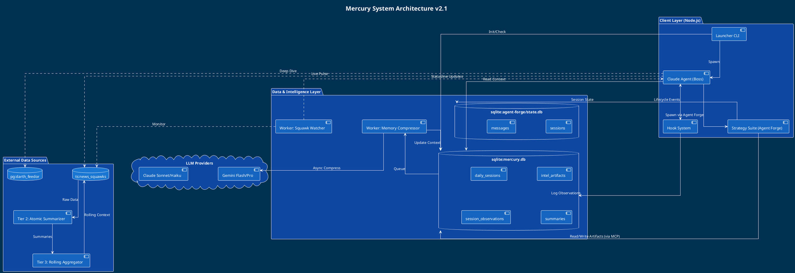
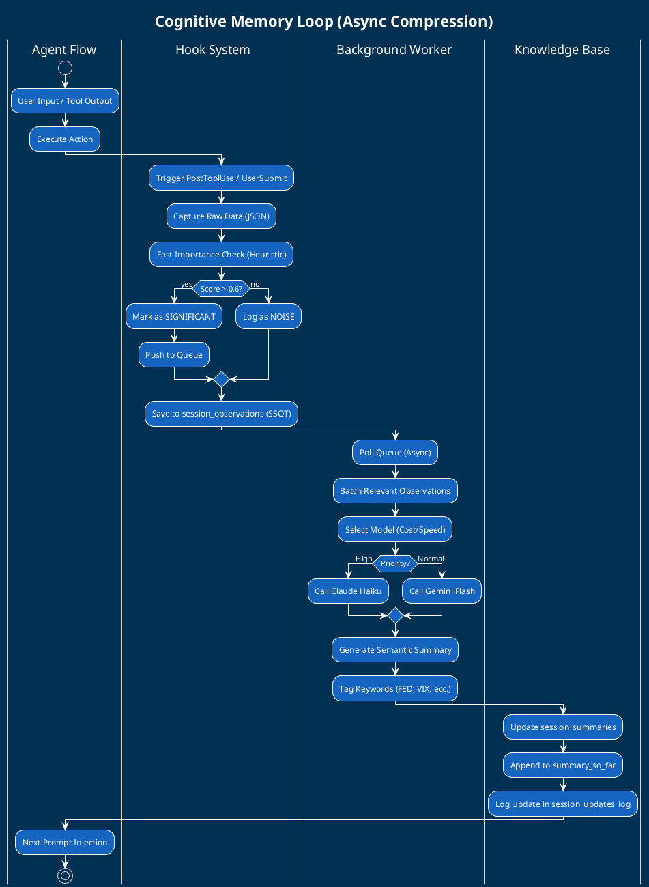
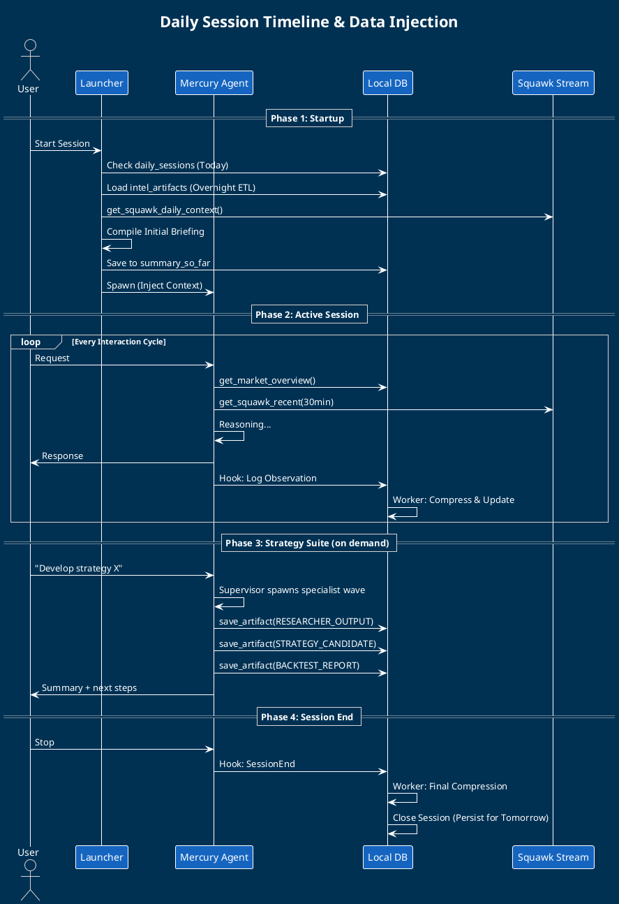

# Mercury Terminal — Workflow Agente

## Stack di Sistema (Visione d'Insieme)

Il sistema Mercury è organizzato in tre layer sovrapposti, ognuno con responsabilità distinte:
**Layer 1 — Agent Forge** (infrastruttura): gestisce sessioni tmux, comunicazione inter-agente, lifecycle degli agenti, persistenza delle sessioni in SQLite (`~/.agent-forge/state.db`), protocolli YAML dichiarativi, e il sistema Brain+Body (Profile = come eseguire, Specialist = cosa sa). Tutti gli agenti Mercury sono Agent Forge specialists.
**Layer 2 — Mercury Workflow** (questo documento): definisce il cognitive loop del front-agent, la memoria a due livelli (SQLite `mercury.db`), il sistema di hook per l'iniezione del contesto, i background worker, e la strategy suite. Interagisce con Agent Forge per spawnare agenti specializzati.
**Layer 3 — Mercury Terminal** (interfaccia): il wrapper Bun/TypeScript che al lancio mostra la splash screen, gestisce la navigazione tra sessioni parallele, le visualizzazioni di mercato, e la status bar tmux. Descritto in [[interfaccia-sistema-dump]].
I due database coesistono con responsabilità **completamente separate**:
- `~/.agent-forge/state.db` — fonte di verità per liveness, parentela sessioni, message bus inter-agente. **Scritto esclusivamente da Agent Forge.** Mercury non scrive mai in `state.db` direttamente — interagisce con esso solo tramite l'API di Agent Forge (spawn, message, status update).
- `mercury.db` — fonte di verità per contesto cognitivo, memoria compressa, artifacts, preferenze utente. **Scritto esclusivamente da Mercury** tramite `mercury-local` MCP server.

La correlazione tra i due DB avviene via `task_ref` (UUID condiviso). Nessuno dei due deve sostituire l'altro.
**Perimetro del sistema:** Mercury Terminal AI gestisce contesto cognitivo, analisi, e workflow agentici. Non esegue ordini di mercato. L'esecuzione fisica avviene nel layer separato C++ Core + Rithmic API (TUI Orchestrator Rust/Ratatui, GUI Qt), su cui Mercury AI non ha accesso diretto. Il sistema AI ragiona *sopra* il dato di mercato, non dentro il flusso di esecuzione.
> **Risolto (v1.2):** Il Researcher scrive direttamente in `mercury.db` tramite `mercury-local` MCP server. Il Supervisor riceve un messaggio `worker_done` nel message bus di Agent Forge con `payload` JSON contenente `artifact_ids: [uuid]` — un riferimento, non il contenuto. Il Supervisor interroga `mercury-local` solo se deve sintetizzare. Il contenuto pesante viaggia in `mercury.db`; il coordinamento viaggia nel message bus di Agent Forge (`state.db`). La correlazione tra i due DB avviene via `task_ref` (uuid condiviso generato dal Supervisor al momento dello spawn, incluso nel `payload` di ogni messaggio Agent Forge e salvato come campo `task_ref` in ogni artifact Mercury correlato).
---

# PHASE 1 — Startup Procedure

## 1.1 Startup e Health Check

Il Launcher `@mercury/cli` esegue una serie di check bloccanti in sequenza prima di avviare qualsiasi agente. I check servono a garantire che il sistema sia integro e che nessun agente operi su infrastruttura degradata.
**Check MCP:** verifica la presenza di `mcp__mmd-market-intelligence` e `mcp__mercury-local` tramite `claude mcp list`. Se assenti, propone installazione guidata o fallback.
**Check Model Engine:** verifica `gemini cli` tramite ping. In caso di fallimento propone installazione guidata o fallback a Haiku per le operazioni di compressione.
**Check Connettività:** ping a `darth_feedor` (Postgres remoto) per garantire l'accesso ai dati qualitativi.
**Spawn Processi Background:**
- Avvia `mercury-local` (MCP server per accesso sicuro a `mercury.db`)
- Avvia `mercury-worker` (Memory Compressor, usa gemini-2.5-lite per compressione asincrona degli hook)
**Verifica `mercury.db`:** se assente, inizializza lo schema. Le tabelle sono: `daily_sessions`, `intel_artifacts`, `launchEvents_logs`, `session_observations`, `session_summaries`, `session_updates_log`, `user_preferences`, `system_state`.
**Statusline:** il Launcher modifica direttamente il file di configurazione statusline di Claude Code. Solo dopo il completamento di tutti i check scrive `health_status='OK'` in `system_state`.
**Selezione modello per fase:** il sistema adotta una strategia cost-aware per la selezione del modello durante ogni fase operativa. Per esplorazione e check rapidi si usa Haiku. Per analisi di sessione e compressione si usa Gemini Flash o Haiku. Per generazione analisi profonde e strategy workflow si usa Sonnet o Gemini Pro. Opus è riservato a ragionamento profondo su richiesta esplicita. Questa gerarchia va resa esplicita in `user_preferences` e rispettata da tutti i worker.
| Modello | Input $/MTok | Output $/MTok | Caso d'uso Mercury |
|---|---|---|---|
| GLM-4 | $0.05 | $0.10 | Pre-screening observations ad alto volume, filtri rapidi |
| Gemini 2.5-lite | $0.075 | $0.15 | Memory Compressor batch async, sommari background |
| Claude Haiku | $0.40 | $2.00 | Health check, importance scoring, comandi slash veloci |
| Gemini Pro | $1.25 | $5.00 | ETL semantico overnight, deep-dive qualitativo |
| Claude Sonnet | $3.00 | $15.00 | Analisi profonde, strategy workflow, sintesi Supervisor |
| Claude Opus | $15.00 | $75.00 | Ragionamento profondo su richiesta esplicita (raro) |

_Pricing allineata con `MODEL_PRICING` condivisa dell'ecosistema (Agent Forge PRD §11.3). In caso di aggiornamento prezzi, la fonte autoritativa è la shared table — questo documento si adatta._
**Limiti MCP attivi (policy Mercury-only):** per preservare la finestra di contesto, Mercury mantiene meno di **10 MCP attivi per sessione** (soglia empirica: oltre 10 MCP attivi la finestra effettiva si riduce significativamente da 200k). Questa è una policy specifica di Mercury Terminal — Agent Forge e unitAI non impongono questo limite. La configurazione MCP per il front-agent e per ciascun agente della strategy suite deve essere dichiarata esplicitamente nel rispettivo `.specialist.yaml`.
> **Aperto:** Come si gestisce il fallimento parziale degli health check? Se `darth_feedor` non risponde ma tutti gli altri check passano, si avvia in modalità degradata (senza news feed) o si blocca? La policy di degradazione graceful non è ancora definita per nessun componente.
---

## 1.2 Verifica e Gestione Preferenze

→ Schema `user_preferences` in [[spec-data-layer-and-tools]]
Prima di generare il briefing il Launcher interroga `user_preferences`. Se vuota o incompleta avvia il wizard `@mercury/cli configure`:
- Asset Class (testo libero/keyword)
- Macro Topics (FED, Tech, Energy…)
- Risk Profile (Intraday, Swing, Investor)
- Default: l'utente può scegliere un profilo generico e configurare in seguito
Le preferenze filtrano implicitamente tutta la pipeline ETL, il market snapshot, e la generazione analisi. Il meccanismo di filtraggio deve essere esplicito: avviene nel system prompt dell'agente (iniettato via hook), nel tool call (parametro passato agli MCP), o in entrambi? Scegliere uno e documentarlo.
Le preferenze sono modificabili in qualsiasi momento con `/user_preferences`.
---

## 1.3 Context Freshness e Analisi Contesto
### 1.3.1 `intel_artifacts` — ETL e Context Freshness
→ Schema `intel_artifacts` in [[spec-data-layer-and-tools]]
**Pipeline di Aggiornamento:**
Il Launcher interroga `darth_feedor.articles` e `darth_feedor.newssquawks` cercando contenuti nuovi rispetto all'ultimo `created_at` in `intel_artifacts` (filtrato per `source_type='SYSTEM_ETL'`). Esegue analisi semantica con Gemini Pro per raggruppare i contenuti per topic (FED, GEOPOLITICS, FISCAL, EQUITIES, ecc.).
Per ogni topic:
- Se nuovo nella finestra temporale (3-5 giorni): crea entry con `is_latest=1`
- Se esiste già e `is_latest=1`: confronta con nuovi dati. Se c'è evoluzione significativa crea nuova versione con sezione `# EVOLUTION`, archiviando la precedente (`is_latest=0`)
- Se nessuna variazione: aggiorna solo il timestamp senza creare righe
**Session Resume (Delta ETL):** al resume di una sessione `status='OPEN'` esistente, l'ETL non riesegue da zero. Il Launcher legge `last_active_at` dalla sessione e processa esclusivamente gli articoli con `created_at > last_active_at`. Questo mantiene il costo del resume proporzionale all'attività reale nel gap temporale, non all'intera storia del database.
Il delta semantico nella sezione `# EVOLUTION` è il meccanismo chiave che permette all'agente di capire cosa è cambiato senza rileggere l'intero artifact.
### 1.3.2 `daily_sessions` e Context Injection
→ Schema `daily_sessions` in [[spec-data-layer-and-tools]]
**Flow di Inizializzazione:**
Per sessione **NUOVA** (nessuna entry con `date=TODAY`): crea entry con `status='OPEN'`, assembla il Briefing Iniziale (System Intel + Agent Intel + Market Snapshot), inietta il `rolling_daily_context` da `get_squawk_daily_context` come "Real-time Narrative Seed", e persiste tutto in `summary_so_far`. Questo campo è il seed della memoria, aggiornato incrementalmente dal Background Worker.
Per sessione **RESUME** (`status='OPEN'` esistente): carica il `summary_so_far` corrente, che contiene già briefing + aggiornamenti successivi dell'intera giornata.
**Nota tecnica MCP:** l'accesso a `mercury.db` avviene esclusivamente tramite `mercury-local` MCP server. Nessun agente deve accedere direttamente al file SQLite.
---

## 1.4 Avvio Claude e Injection

**SSOT del sistema:**
- `daily_sessions.summary_so_far`: fonte unica del contesto attivo. Inizializzato dal Launcher, aggiornato dal Background Worker.
- `session_observations`: fonte unica degli eventi. Log grezzo di tutto ciò che accade. Input per il compressore.
- `session_summaries`: fonte unica della storia. Memoria compressa delle sessioni passate/corrente.
**Launch Flow:**
Il Launcher avvia il processo `claude` con `SESSION_ID` come variabile d'ambiente. L'hook `SessionStart` si attiva automaticamente, legge `daily_sessions.summary_so_far` e lo restituisce come `additionalContext` in formato JSON. L'hook non genera nulla: si limita a leggere e iniettare ciò che il Launcher ha preparato. Logga l'evento in `session_observations`.
**Nota UX:** la fase di avvio mostra log di progresso per ogni check, stile programma oldschool. Semplice ma informativo.
---

# FASE 2 — Sessione Utente

## 2.0 Principio Thin Orchestrator

Il front-agent opera come un orchestratore "sottile": non esegue direttamente il lavoro pesante ma coordina, delega, e sintetizza. Questo principio — mutuato dall'architettura GSD — implica che l'agente principale mantenga il proprio utilizzo di contesto basso (target: 10-15% per le operazioni di orchestrazione pura) passando percorsi di file agli agenti specializzati invece che il loro contenuto. Il contenuto pesante viaggia tra agenti tramite `mercury.db` e Agent Forge messages, non attraverso il contesto del front-agent.
Ogni agente spawnato (worker) riceve un **contesto fresco** di 200k token. Questo è il vantaggio fondamentale dell'architettura multi-agente: ogni specialist opera con la sua capacità cognitiva completa, non degradata dalla storia della sessione principale.
---

## 2.0.1 Background Operations — Active Workers

Oltre al front-agent, il sistema si basa su worker headless che garantiscono reattività e aggiornamento dati senza bloccare l'UX.
**`mercury-worker` (Memory Compressor):** processo Bun/TS principale per la gestione asincrona degli hook. Usa `gemini-2.5-lite` per valutare l'importanza degli eventi e comprimere le osservazioni in summaries. Gestisce l'injection automatica nel `summary_so_far`. Il worker implementa un **circuit breaker** a tre stati: CLOSED (operazione normale con tracking progressi), HALF_OPEN (monitoraggio del recupero), OPEN (esecuzione bloccata, richiede intervento manuale). Il circuito si apre se per N cicli consecutivi (default: 3) non viene rilevato alcun progresso — nessun artifact nuovo, nessun summary aggiornato — o se lo stesso errore si ripete per M cicli (default: 5).
**`mercury-local` (Local MCP Server):** interfaccia sicura verso `mercury.db`. Gestisce tutte le letture/scritture strutturate.
**`darth_feedor-watcher` (Intel Monitor — Planned):** worker leggero per il polling continuo di `darth_feedor.articles`. Obiettivo: aggiornare `intel_artifacts` in real-time se arrivano news critiche, notificando l'agente via hook. Questo componente è attualmente il punto più critico non implementato: senza di lui il sistema è reattivo solo su richiesta esplicita, non proattivo come descritto nella sezione 2.2.
**API HTTP del Worker Service:** `mercury-worker` espone un server HTTP su `http://127.0.0.1:37000`. Endpoints:
- `GET /health` — stato del worker: circuit breaker state, queue length, timestamp ultima compressione
- `GET /context/briefing` — recupera il briefing corrente (alternativa all'MCP per contesti headless o script)
- `POST /ingest/observation` — riceve un'osservazione dagli hook (tecnologia: Fastify o Express)
- `POST /session/update` — aggiorna lo stato della sessione corrente
Il pattern **Fire & Forget** è critico per l'UX: l'hook fa POST a `/ingest/observation` e ritorna immediatamente senza attendere la compressione. Il worker processa la queue in background. Latenza percepita dall'utente: zero.
**Importance Scoring Heuristics:** prima di inserire un'osservazione in queue di compressione, il worker assegna uno score:
- Score base per tool: `save_artifact`=0.95, `get_market_overview`=0.9, `get_amt_snapshot`=0.85, `get_volatility_metrics`=0.8, `query_artifacts`=0.3 (read-only, basso valore)
- Bonus anomalia: +0.15 per termini "extreme"/"spike"/"anomalous" nel contenuto; +0.20 per "reversal"/"breakout"
- Soglia per queue di compressione: 0.6. Sotto soglia: logga in `session_observations` ma non entra in queue.
→ Specifica tecnica: [[spec-data-layer-and-tools#2.1 I Cinque Hook Lifecycle]] e [[spec-data-layer-and-tools#2.2 Background Worker: Memory Compressor]]
> **Aperto:** Quando il Memory Compressor produce un summary corrotto (contenuto incoerente o troncato), cosa succede al `summary_so_far`? Serve un meccanismo di validazione dell'output della compressione prima dell'injection. Attualmente non è definito.
---

## 2.1 Artifacts e Articles Analysis

**Accesso Intel:** l'agente accede agli artifact via `query_artifacts` (per `intel_artifacts` storici/tematici) e `get_session_briefing` (per il contesto attivo filtrato). Per approfondimenti su notizie, interroga direttamente `darth_feedor.articles` via MCP.
**Analisi e Persistenza:** quando l'agente genera un'analisi significativa (es. "Correlazione VIX-SPX anomala"), esegue `save_artifact` con `auto_compress=true`. L'analisi viene salvata in `intel_artifacts` con `source_type='AGENT_GENERATED'`, il Background Worker la comprime immediatamente e la appende a `summary_so_far`, rendendola parte della memoria a breve termine per il resto della sessione.
**Workflow Deep-Dive:** prima di un deep-dive, l'agente verifica la presenza di artifact esistenti sul topic per evitare duplicati. Se procede, il hook `PostToolUse` cattura la nuova analisi e il worker aggiorna `intel_artifacts`.
---

## 2.2 /mercury-data — Market Intelligence

**Constant Market Pulse:** è imperativo che l'agente mantenga un contatto costante con lo stato del mercato. Tramite hook `UserPromptSubmit` arricchito o istruzione rigida nel System Prompt, l'agente consulta `get_market_overview` regolarmente anche se l'utente non lo chiede esplicitamente.
- **Detection regime:** in base a [[collection-strategie-analisi]], notificandone l'utente
- **Live News Pulse:** `get_squawk_recent` (atomic summaries 5-30min) per awareness immediata senza costi di lettura raw
- **Payload:** le chiamate devono essere ottimizzate (target < 10kb) per non inquinare il contesto
**Tooling primario:** `get_market_overview` (stato generale), `get_amt_snapshot` (Auction Market Theory), `get_volatility_metrics` (VIX/Term Structure).
**Workflow Reattivo:** l'agente rileva un trigger (esplicito o proattivo) → chiama `get_market_overview` filtrato → l'hook `PostToolUse` cattura l'output → il worker valuta se l'aggiornamento è significativo per `summary_so_far`.
> **Aperto:** Il "filtro implicito per user_preferences" sulla generazione analisi va reso esplicito. Dove avviene? Nel system prompt (statico), nel parametro del tool call (dinamico), o in entrambi? Scegliere uno ha implicazioni sulla consistenza e sul costo. Attualmente non è definito.
### 2.2.1 Regole Operative per l'Analisi di Mercato
L'agente osserva una serie di constraint metodologici come precondizioni prima di generare analisi. Derivati dalla base di conoscenza [[collection-strategie-analisi]], devono essere iniettati come istruzioni rigide nel system prompt del front-agent.
**Compass Primario:** ZN (T-Note 10Y) è la bussola operativa. Ogni analisi su equity, credit, o macro deve citare la posizione attuale di ZN come contesto. Il belly della curva (5Y-10Y) è il segmento più reattivo alle aspettative di politica monetaria.
**Leading Indicators Tasso:** i contratti SOFR front-end (trimestre Z, H, M più vicino) sono leading indicators per le aspettative Fed. Un'inversione nello spread front/back segnala anticipo di cambio politica. Da consultare prima di ogni analisi macro che coinvolga tassi.
**Gold e Tassi Reali:** la relazione gold/asset inflation-sensitive usa i real yields (TIPS), non i nominal yields. Il nominal yield da solo è fuorviante. Se l'analisi riguarda oro, l'agente recupera il real yield dal feed prima di concludere.
**Volume Accumulation:** per asset ad alta volatilità (VIX, crude oil, UVXY), il rilevamento di accumulazione di volume su livelli chiave precede spesso i breakout. L'agente menziona volume accumulation quando suggerisce entry su questi asset.
**Discovery Window:** la finestra 8:20-9:00 ET (Opening 30min IB) è la fase di massima informazione per determinare il regime intraday. L'agente riconosce questa finestra nei commenti time-sensitive e posiziona le sue stime di regime rispetto ad essa.
---

## 2.3 Generazione Analisi

Due scenari di generazione analisi, determinati da [[collection-strategie-analisi]] e [[00_Master_Index|concetti-schemi]]:
**Scenario 1 — Strategy-driven:** scan nella collezione di strategie (`market-data` timescaleDB) per accedere a conoscenza non convenzionale e determinare scenari e outcome favorevoli rispetto a situazioni di mercato specifiche. Rende l'agente tecnicamente più capace su setup quantitativi.
**Scenario 2 — Macro/Long-term:** analisi con outlook più lungo, che usa la collezione `concetti-schemi`. Entrambe le collezioni forniscono all'agente conoscenza non pubblicamente disponibile.
**Integrazione Preferenze:** ogni richiesta è filtrata da `user_preferences` (fase 1.2), ma il sistema deve anche espandere la visione dell'utente oltre il proprio asset preferito — un "open-your-mind" contestuale che non ignora mai i dati macro rilevanti per nessun trader.
**Strategy Knowledge Base — Pipeline di Ingestion:** la conoscenza di dominio che alimenta gli scenari strategici non proviene solo da documenti istituzionali ma da materiale didattico strutturato (video corsi, PDF, paper). Il pipeline di ingestion è:
1. Sorgente (video corso, PDF, paper) → estrazione trascritti o testo
2. Worker agent di chunking semantico → una sezione per file `.md`
3. Ogni `.md` processata da un worker agent → inserita in tabella DB dedicata con metadata ricco (topic, source, confidence, tradeable_setup flag)
4. I `concetti-schemi` (knowledge base didattica esistente) vengono estratti dallo stesso pipeline e inseriti nella stessa tabella
La Strategy Knowledge Base è consultabile via MCP dal Researcher e dal Developer. A differenza degli `intel_artifacts`, le entry della Knowledge Base sono **permanenti**: non hanno `is_latest`, non scadono, vengono integrate non sostituite. Rappresentano la conoscenza stabile di dominio, non l'intelligence temporale.
---

## 2.4 Sistema di Subagents, Skills, Comandi e Hook

Questo è il componente attualmente meno specificato e quello che impatta di più l'usabilità quotidiana. Serve una definizione granulare per ogni tipologia di scenario.
**Hook System:** cinque hook lifecycle gestiscono il cognitive loop. `SessionStart` inietta il contesto. `UserPromptSubmit` arricchisce ogni richiesta con il market pulse. `PreToolUse` e `PostToolUse` catturano il 100% degli eventi per il Memory Compressor. `Stop` (o `SessionEnd`) finalizza la sessione. Questa copertura 100% (pattern da *everything-claude-code* v2) consente di costruire "istinti" atomici con punteggi di confidenza che si accumulano nel tempo.
**Sistema di Apprendimento Continuo:** ispirato al pattern Continuous Learning v2, ogni coppia PreToolUse/PostToolUse traccia non solo l'evento ma il delta di importanza. Il worker assegna un confidence score agli eventi che si ripetono con esito positivo. Nel tempo questi si raggruppano in pattern riconoscibili che alimentano `intel_artifacts` con `source_type='LEARNED_PATTERN'`. Il comando `/evolve` (da implementare) consente di promuovere un pattern sufficientemente consolidato a skill o specialist YAML.
**Comandi Slash:** ogni scenario ricorrente deve avere un comando slash dedicato come trigger sicuro e deterministico. La lista di comandi nasce dall'analisi degli scenari più frequenti in sessione. Esempi: `/session-prep`, `/deep-dive`, `/regime-check`, `/review-trades`, `/user_preferences`. L'elenco definitivo va costruito osservando sessioni reali.
**Skills e Subagents:** le skills sono workflow procedurali (come fare qualcosa). I subagent sono istanze isolate con permessi e contesto limitati per compiti pesanti. Per richieste che richiedono lettura di molti artifacts o deep-dive su darth_feedor, il front-agent spawna un subagent con contesto fresco via Agent Forge invece di fare tutto nel proprio contesto.
**Limit dei permessi:** ogni agente spawnato ha un set di tool limitato al necessario per il proprio compito. Il Researcher ha accesso a darth_feedor e market-data MCP. Il Developer ha accesso agli script di analisi locali. Il Documentor ha accesso read/write alla repo. Il Backtester ha accesso ai database quantitativi. Il front-agent orchestratore non esegue direttamente il lavoro pesante degli specialist.
> **Risolto (v1.2):** La nomenclatura è ora distinta. **Claude Code hooks** (8 tipi ufficiali: SessionStart, UserPromptSubmit, PreToolUse, PostToolUse, Stop, PreCompact, SessionEnd, Notification + PostToolUseFailure) sono lifecycle hooks della sessione Claude. **Agent Forge hooks** (v1.3.0: pre-spawn, post-spawn, protocol-complete, turn-failed) sono lifecycle hooks dell'orchestratore. Nei documenti: "Claude hook" o "session hook" per il primo layer, "forge hook" o "orchestrator hook" per il secondo.
---

## 2.5 Resilienza degli Agenti Spawnati

Gli agenti worker non possono essere lasciati liberi di organizzarsi autonomamente: vanno guidati e monitorati. Il pattern Ralph introduce meccanismi che il Supervisor della strategy suite deve implementare.
**Circuit Breaker per Agent Forge workers:** ogni agente della strategy suite (Researcher, Developer, ecc.) opera con un circuit breaker locale che traccia il progresso per iterazione. Se N cicli consecutivi non producono file modificati, artifact nuovi, o commit Git — il circuit breaker passa a HALF_OPEN e notifica il Supervisor. Se la condizione persiste, passa a OPEN e richiede intervento manuale. Questo previene loop infiniti e spreco di token su task bloccati.
**Intelligent Exit Detection:** un agente sa quando ha finito quando si verificano condizioni esplicite e misurabili. GSD formalizza questo tramite criteri `<done>` per ogni task atomico. Per Mercury: l'agente Researcher ha finito quando tutti i topic richiesti hanno un artifact `is_latest=1` aggiornato. Il Developer ha finito quando gli script sono stati creati/modificati e il loro output corrisponde al deliverable atteso. Il Backtester ha finito quando i risultati del backtest sono stati salvati e il summary prodotto. Il Documentor ha finito quando tutti i diff dall'ultimo suo run sono stati processati.
**Rate Limiting:** il sistema di spawn deve rispettare i limiti API. Se in un'ora vengono effettuate troppe chiamate, il Supervisor mette in pausa lo spawn di nuovi agenti e aspetta il reset. Questo va integrato nella logica di orchestrazione del Supervisor, non lasciato al singolo agente.
**Gestione del limite 5 ore Claude Code:** il sistema deve rilevare quando il front-agent si avvicina al limite di utilizzo e proporre all'utente di continuare in una nuova sessione o di passare il controllo a un agente Gemini temporaneo per le operazioni non critiche.
---

# FASE 3 — Strategy Suite

## 3.0 Visione: Office of Agents

La strategy suite implementa la visione dell'"ufficio di agenti continuo" — un set di specialist che lavorano in parallelo o sequenzialmente su richiesta dell'utente o autonomamente, ognuno con il proprio dominio di competenza, connessi tramite Agent Forge e `mercury.db`.
Gli agenti della strategy suite sono Agent Forge specialists definiti in `.specialist.yaml` e posizionati in `.agent-forge/specialists/` nella directory del progetto Mercury. Il path canonico per tutti i mercury-strategy specialists è:
```
<mercury-project>/.agent-forge/specialists/
  mercury-strategy-researcher.specialist.yaml
  mercury-strategy-developer.specialist.yaml
  mercury-strategy-documentor.specialist.yaml
  mercury-strategy-backtester.specialist.yaml
```
Il loro specialist YAML definisce: il system prompt specifico per dominio, il template del task con output atteso strutturato, il modello preferito, i MCP abilitati, e le condizioni di staleness. Tutti condividono l'accesso a `mercury.db` tramite `mercury-local` MCP, ma ognuno ha permessi di tool limitati al proprio dominio.

> **Campo Mercury-specific — `prompt.normalize_template`:** I mercury-strategy specialists possono includere il campo `prompt.normalize_template` nel loro YAML per gestire correzioni di output (es. word count violations, format enforcement). Questo campo è **di proprietà esclusiva di Mercury**: Agent Forge e unitAI lo ignorano (policy "never reject unknown fields"), ma non lo implementano. Nessun altro sistema deve adottare questo campo senza coordinamento con Mercury. Il loader di Agent Forge lo accetta e lo passa allo specialist senza elaborazione.
> **Risolto (v1.2):** Agent Forge v0.6.0 introduce `checkpoint.json` per-sessione in `.agent-forge/sessions/{id}/checkpoint.json`. Al riavvio, `agent-forge attach` legge i checkpoint, verifica quali sessioni tmux esistono ancora (con socket path configurabile, non volatile come `/tmp`), e offre all'utente la lista delle sessioni recuperabili. Per Mercury: il Supervisor della strategy suite scrive un checkpoint dopo ogni onda completata. Se la sessione muore a metà Onda 2, il restore parte dall'ultimo checkpoint validato (fine Onda 1), non da zero. Il socket tmux di Agent Forge deve essere configurato su `~/.tmux/agent-forge` (non sotto `/tmp`) per sopravvivere ai restart del sistema.
> **Gap Critico — Workspace/Issues (`07-critical-review-gap-analysis`):** il salto dalla strategy suite come "configurazione di prompt" alla strategy suite come "piattaforma di agenti collaborativi" richiede tre componenti attualmente mancanti: (1) **Workspace/Issues SQLite** — memoria condivisa cross-specialist e cross-sessione, con tabelle `issues`, `comments`, `relations` per coordinazione asincrona; senza di essa ogni specialist opera in silos e non può riferirsi al lavoro di un collega da sessioni precedenti; (2) **MCP server per l'invocazione dei specialist** — astrae la lifecycle management invece di fare spawning diretto via tmux; (3) **SpecialistArchitect** — wizard automatizzato per la creazione di nuovi specialist YAML. Questi tre pezzi trasformano la suite da un set di prompt indipendenti a un ufficio di agenti genuinamente collaborativo.
---

## 3.1 Agente Supervisor (Orchestratore)

Il Supervisor è il boss agent della strategy suite. Opera come orchestratore sottile: usa il 10-15% del contesto per coordinare, non per eseguire lavoro diretto. Interagisce con l'utente per affinare e pre-preparare le richieste prima di delegarle agli specialist.
**Responsabilità:**
- Riceve la richiesta dell'utente (dal front-agent principale o direttamente)
- Affina la richiesta: pone domande disambiguanti, definisce scope e deliverable attesi
- Costruisce il grafico di dipendenze tra i task degli specialist (chi dipende da chi)
- Spawna gli agenti nelle "onde" appropriate (parallelo dove possibile, sequenziale dove ci sono dipendenze)
- Monitora il circuit breaker di ogni agente spawnato
- Raccoglie e sintetizza gli output strutturati (non il testo grezzo)
- Verifica il completamento tramite spot-check (esistenza artifacts, commit Git, assenza failure markers)
- Propone all'utente azioni successive o persiste il lavoro per ripresa futura
Il Supervisor non legge mai l'output grezzo degli agenti tramite tmux capture-pane. Riceve output strutturati tramite header markdown standard concordati (es. `## RESEARCH COMPLETE`, `## STRATEGY DEVELOPED`, `## BACKTEST COMPLETE`). L'orchestratore analizza questi header senza operazioni aggiuntive sui file.
---

## 3.2 Strategy Researcher

**Specialist:** `mercury-strategy-researcher.specialist.yaml`
**Profilo:** hybrid (può operare come worker o avviare sub-ricerche parallele)
**MCP abilitati:** `darth_feedor`, `mmd-market-intelligence`, `deepwiki`, `context7`, `github-grep`, `firecrawl`
Riceve la richiesta dell'utente (già affinata dal Supervisor) e si occupa di raccogliere e preparare i dati per il Developer.
**darth_feedor — Vector Search:** oltre alla ricerca testuale classica, `darth_feedor` (PostgreSQL + `pgvector`) espone ricerca semantica per similarità su `news_squawks`, `newsletter_summaries`, e `articles`. Il Researcher può interrogare per analogia narrativa tra finestre temporali diverse: "trova squawks semanticamente simili a quelli di marzo 2023 durante la crisi SVB" — anche quando la terminologia esatta non coincide. Questo abilita pattern recognition su eventi storici comparabili che keyword search non intercetterebbe.
Riceve la richiesta dell'utente (già affinata dal Supervisor) e si occupa di raccogliere e preparare i dati per il Developer. Usa tutti gli MCP disponibili per fare cross-check su: articoli e documenti istituzionali (`darth_feedor`), dati di mercato storici (`market-data`), letteratura tecnica e repo di riferimento (`deepwiki`, `context7`, `github-grep`), fonti web fresche (`firecrawl`). Pulisce, struttura e normalizza i dati. Produce un artifact `RESEARCHER_OUTPUT` che il Developer leggerà come input.
Il Researcher non produce strategie. Produce dati organizzati, fonti citate, e un riassunto delle evidenze trovate. Il confine con il Developer è netto.
---

## 3.3 Strategy Developer

**Specialist:** `mercury-strategy-developer.specialist.yaml`
**Profilo:** worker
**MCP abilitati:** `mercury-local` (accesso ArcticDB/SQLite per quantitativi), script di analisi locali
Riceve il `RESEARCHER_OUTPUT` e lavora sui dati preparati. Ha accesso a script specifici per analisi e processing. Può generare nuovi script programmaticamente, ma non sovrascrive mai i default di sistema (connettori DB, configurazioni base). Individua correlazioni tra eventi macroeconomici e movimenti di mercato. Produce una strategy candidate con logica chiara, condizioni di ingresso/uscita, e parametri.
> **Aperto:** Quale database per i dati qualitativi del Developer? ArcticDB è ottimo per serie temporali quantitative (OHLCV, tick). Per dati qualitativi (sentiment scores, narrative tags, macro events) SQLite FTS5 o DuckDB sono più adatti. La scelta impatta l'API del `mercury-local` MCP e va fatta prima di implementare il Developer specialist.
---

## 3.4 Strategy Documentor

**Specialist:** `mercury-strategy-documentor.specialist.yaml`
**Profilo:** worker (può operare anche con heartbeat schedulato)
**MCP abilitati:** `mercury-local`, accesso read/write alla repo dell'utente (creata in fase di installazione)
Mantiene la documentazione aggiornata e coerente. Può essere invocato dagli altri agenti al completamento di un task, oppure girare in autonomia monitorando diff e cambiamenti locali. Nel processo di installazione viene creata la repo dedicata dell'utente su cui opera. Traccia ogni versione delle strategie, degli script e degli artifacts con metadata completa.
Il Documentor implementa il pattern di **staleness detection** del sistema specialist YAML: monitora i file `files_to_watch` definiti nel suo specialist e si ri-attiva automaticamente quando rileva modifiche non ancora documentate.
---

## 3.5 Strategy Backtester

**Specialist:** `mercury-strategy-backtester.specialist.yaml`
**Profilo:** worker
**MCP abilitati:** `mercury-local` (ArcticDB per dati storici quantitativi), tool di backtesting
Si occupa di backtesting e validazione dei risultati. È un set quantops dedicato. Riceve la strategy candidate dal Developer e produce metriche di performance (Sharpe Ratio, max drawdown, win rate, ecc.) su finestre temporali definite. Produce un `BACKTEST_REPORT` strutturato. Non decide se la strategia è "buona" o "cattiva" — riporta i numeri. La valutazione spetta all'utente.
---

## 3.6 Workflow della Strategy Suite — Esecuzione a Onde

Il Supervisor costruisce un grafico di dipendenze prima di spawnare qualsiasi agente. I task senza dipendenze reciproche vengono raggruppati nella stessa "onda" ed eseguiti in parallelo. Le onde vengono eseguite in sequenza.
Un workflow tipico:
**Onda 1 (parallela):** Researcher raccoglie dati + Documentor verifica lo stato attuale della documentazione esistente sul topic.
**Onda 2 (sequenziale):** Developer elabora il `RESEARCHER_OUTPUT` e produce la strategy candidate.
**Onda 3 (parallela):** Backtester testa la strategy + Documentor inizia a documentare la logica del Developer.
**Checkpoint:** dopo Onda 3, il Supervisor presenta i risultati all'utente. L'utente può approvare, richiedere modifiche, o scartare. Se richiede modifiche, il Supervisor spawna una nuova onda targeted senza rigenerare tutto.
Ogni task completato genera un commit atomico. Questo garantisce tracciabilità e la possibilità di riprendere da un checkpoint preciso se la sessione viene interrotta.
---

## 3.7 Gestione del Failure nella Strategy Suite

Il failure handling era il gap più critico identificato nell'analisi del sistema. La policy è:
**Turn failure in un protocollo:** se un agente worker fallisce, il Supervisor riceve un failure marker nel suo output strutturato (`## FAILED: <reason>`). Il Supervisor NON riprova automaticamente più di due volte lo stesso turn. Alla seconda failure, notifica l'utente con il contesto del fallimento e propone azioni: retry manuale, skip del task, o abort dell'intera onda.
**Zombie detection:** tramite il reconciliation loop di Agent Forge (ogni 5s), se una sessione tmux muore senza produrre output strutturato, viene marcata zombie. Il Supervisor riceve la notifica zombie come evento nel message bus e lo tratta come failure.
**Context pollution prevention:** il Supervisor non legge mai l'output grezzo. Questo è fondamentale: un agente che produce output enorme o mal formato non deve inquinare il contesto del Supervisor. Il Supervisor legge solo il blocco strutturato dopo l'header markdown standard.
---

# FASE 4 — Persistenza e Evoluzione

## 4.1 Trade Ideas

Quando l'agente genera idee di trade o analisi predittive, la persistenza è garantita dal sistema Artifacts + Hooks.
L'agente chiama `save_artifact` con `type='AGENT_GENERATED'`, `topic='TRADE_IDEA_ES'` (o simile), `auto_compress=true`. Il sistema salva in `intel_artifacts`, attiva compressione immediata verso `summary_so_far`, e logga in `session_updates_log`.
**Intraday:** il `summary_so_far` compresso contiene l'idea in forma condensata. L'agente "se lo ricorda" ad ogni nuovo prompt.
**Multi-day:** al riavvio (fase 1.3), il Launcher recupera gli artifacts `TRADE_IDEA` recenti e li inietta nel Briefing.
Il comando `/review_trades` triggera una ricerca su `intel_artifacts` filtrata per le idee attive.
---

## 4.2 Ricerche Approfondite

Un utente può avviare un deep-dive su un argomento (sviluppo strategia o ricerca narrative/studio). L'interazione inizia naturalmente in sessione. A un certo punto — o su rilevamento dell'agente o su richiesta esplicita — il sistema propone di persistere la tematica per riprenderla in futuro, sia per continuare la ricerca che per implementare una strategia. Questo è il trigger di entry point naturale per la strategy suite (Fase 3).
---

# 5.0 Refactoring e Next Steps

Il workflow supera le fragilità precedenti basate su file system (JSON/Markdown sparsi) centralizzando tutto su SQLite (`mercury.db`) e Postgres (`darth_feedor`).
**Punti consolidati:**
- **SSOT:** `daily_sessions` (Active Context) + `intel_artifacts` (Knowledge Base)
- **Async Config:** User Preferences gestite separatamente e iniettate alla fonte
- **Injection:** delegata a Hook `SessionStart`, pulendo il Launcher
- **Memory:** compressione continua in background via Worker
**Da fare per la prossima iterazione:**
1. Definire la policy di degradazione graceful per ogni health check (sezione 1.1)
2. Specificare il meccanismo di filtraggio delle preferenze (sezione 2.2)
3. Scrivere la spec completa del sistema hook/slash/subagent (sezione 2.4)
4. Scegliere il database per i dati qualitativi del Developer (sezione 3.3)
5. Definire il formato di ritorno strutturato di ogni specialist (section 3.1)
6. Implementare `darth_feedor-watcher` prima di dichiarare il sistema proattivo
---

## Linked Specifications

- **Launcher Implementation:** [[node-js-launcher-front-end]]
- **Database Schema:** [[spec-data-layer-and-tools]]
- **UX Strategy:** [[plan-ux-interactive-strategy]]
- **Final Architecture:** [[architecture-mercury-hooks-worker]]
- **Interfaccia e Strategy Suite:** [[interfaccia-sistema-dump]]
- **Agent Forge PRD:** [[agent-forge]]
---

# 6.0 Architettura di Sistema — Diagrammi Tecnici

## 6.1 System Overview e Data Sources

Ecosistema completo: dal Launcher che orchestra l'avvio, alle sorgenti dati (Darth Feedor & News Squawks), fino al loop cognitivo dell'agente.


## 6.2 Cognitive Loop — Memory e Hooks

Il ciclo esatto: Azione → Hook → Osservazione → Compressione → Iniezione Contesto.


## 6.3 Session Timeline — Da Startup a Persistenza


---

## Domande Aperte — Riepilogo

Raccolte inline nel documento, qui in sintesi per priorità implementativa:
**P0 (blocca implementazione):**
- Policy di degradazione graceful per ogni health check (cosa fare se un componente non risponde)
- Database per dati qualitativi del Developer specialist (SQLite FTS5 vs DuckDB)
- Meccanismo esplicito di filtraggio per user_preferences (system prompt vs tool parameter)
- **Workspace/Issues SQLite system** — memoria condivisa cross-specialist e cross-sessione; senza di essa la strategy suite non è collaborativa ma solo parallela; richiede tabelle `issues`, `comments`, `relations` e un MCP server dedicato per l'invocazione degli specialist
**P1 (impatta qualità operativa):**
- Formato di ritorno strutturato di ogni specialist (header markdown standard da concordare) — **proposta**: ogni specialist emette AF_STATUS block + un header markdown specifico per dominio (`## RESEARCHER_OUTPUT`, `## STRATEGY_CANDIDATE`, `## BACKTEST_REPORT`, `## DOCS_UPDATED`). Il Supervisor legge solo questi header, non l'output grezzo.
- Validazione output del Memory Compressor prima dell'injection in summary_so_far
- Come i due database (mercury.db e agent-forge/state.db) si referenziano — **risolto**: via `task_ref` UUID condiviso in `messages.payload` (vedi sezione 1.0 sopra)
**P2 (da risolvere prima di v1.0):**
- Nomenclatura hook — **risolto**: vedi sezione 2.4 sopra
- Gestione ciclo di vita sessioni long-running — **risolto**: checkpoint.json + socket path non-volatile, vedi sezione 3.0 sopra
- Implementazione darth_feedor-watcher (prerequisito per proattività reale) — ancora aperto
