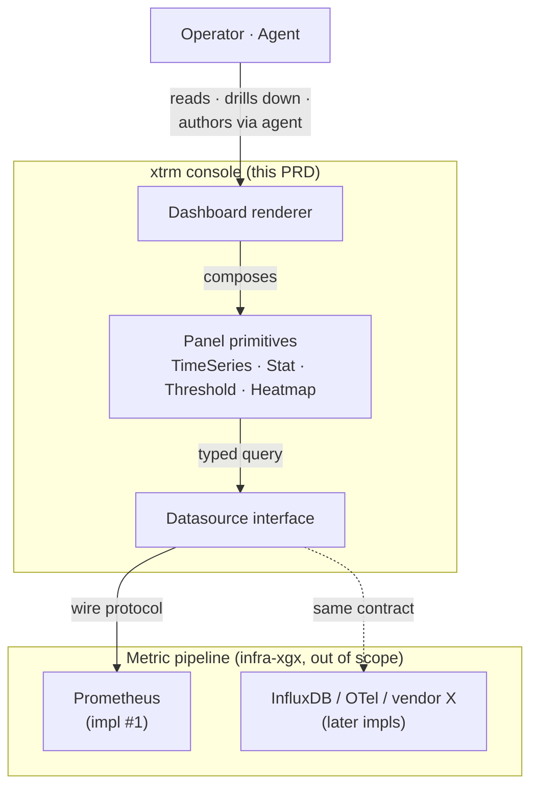
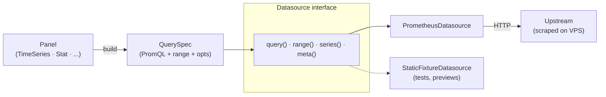
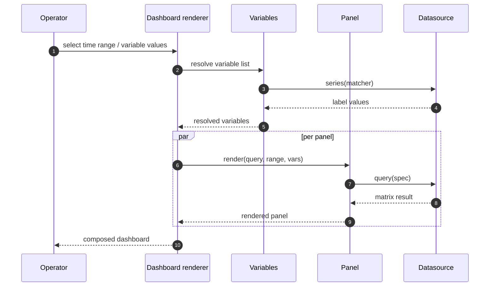
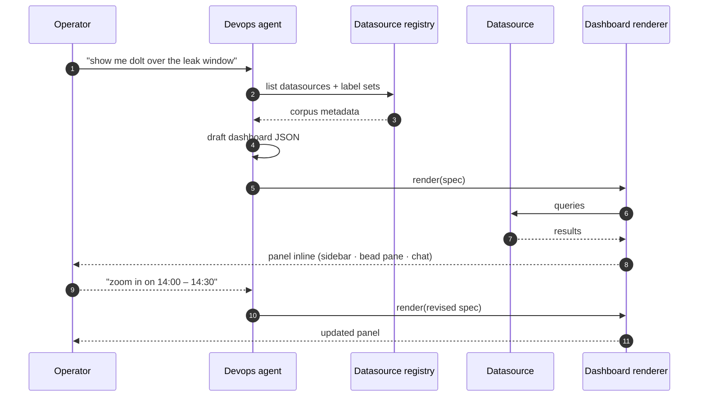
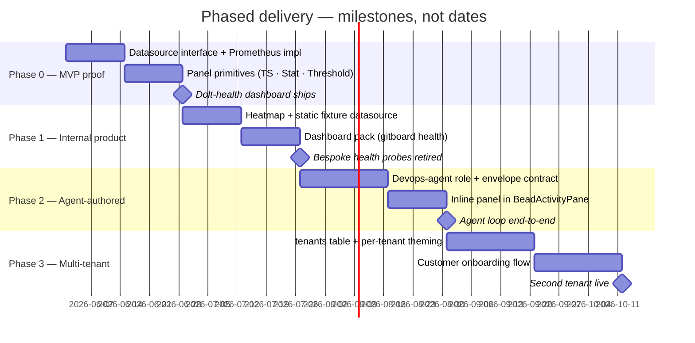
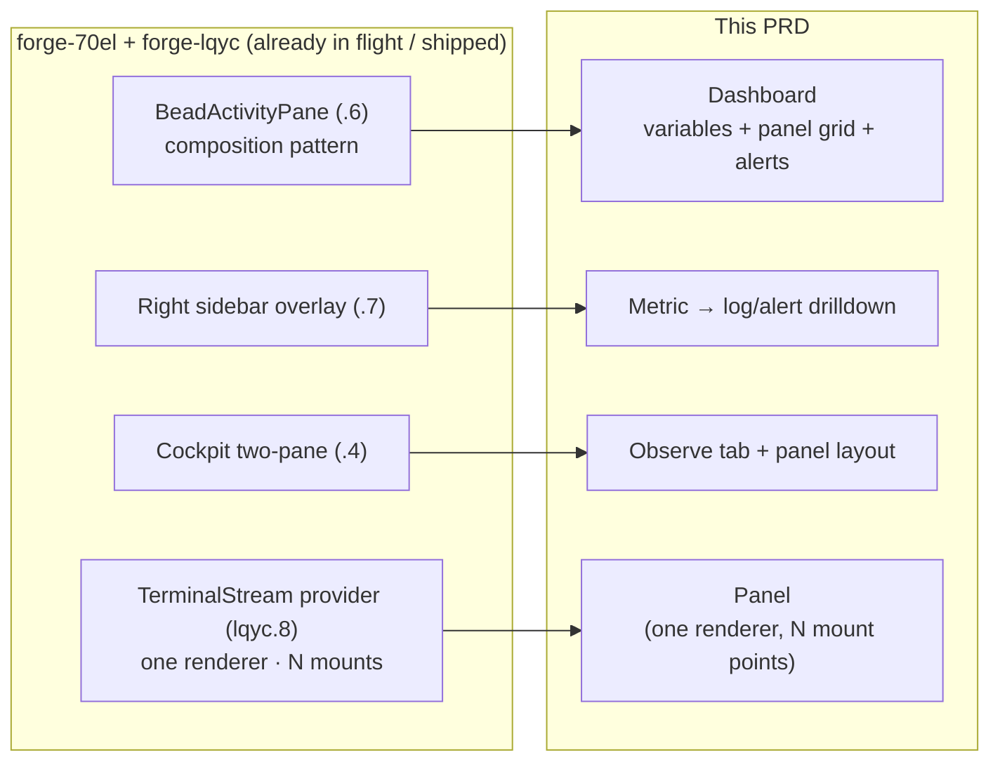

# xtrm Observability Platform — Product Requirements

**Status:** Draft / planning-ready (intended input to OpenSpec planning phase)
**Owner:** dawid
**Scope:** A native observability surface inside the xtrm console, built as a foundation we own — primitives that ship internally first, then become a sellable product. Datasource-agnostic by contract, Prometheus-first by impl.
**Out of scope (this PRD):** the underlying metric pipeline on the VPS (Prometheus, exporters, retention, alert routing — those live in `~/projects/mercury/infra`, primarily `MONITORING.md`, `docs/AGENT_MONITORING.md`, `infra-bnh`, and `infra-xgx`). Specialist runtime metric semantics live in `~/dev/specialists/docs/observability-metrics.md` and `docs/design/substrate/devops-platform-engineering-prd.md`. This PRD owns the console/product surface only; it does not replace the operator's existing Grafana dashboards.

---

## 0. Cross-repo grounding

Gitboard owns the xtrm operational console: panel primitives, dashboard layout,
bead/job/repo context links, and agent-authored observability UX. It should sit
on top of infra and specialists telemetry rather than redefine those contracts.

Authoritative upstream docs:

- `~/projects/mercury/infra/MONITORING.md` — live Prometheus/Grafana/Loki/Alertmanager stack, scrape jobs, exporters, access model.
- `~/projects/mercury/infra/docs/AGENT_MONITORING.md` — incident-response runbook and stack health files.
- `~/dev/specialists/docs/observability-metrics.md` — job/token/tool/model lifecycle metrics emitted by specialists.
- `~/dev/specialists/docs/design/substrate/devops-platform-engineering-prd.md` — devops/platform specialist role that will author or operate dashboards.

Research inputs in `~/second-mind/1-projects/xtrm/research/`:

- `devops-specialists-research.md` for the AWS DevOps Agent reference model and operator/product split.
- `sre-telemetry-patterns-for-mercury.md` for RED/USE/SLO and alert-design guidance.
- `agentops-telemetry-for-specialists.md` for AgentOps-specific telemetry.
- `devops-query-surfaces-mcp-architecture.md` for Grafana MCP, Prometheus MCP, and custom query-layer options.

Console rule: gitboard may own reusable panel primitives and a datasource
abstraction, but metric definitions, scrape targets, alert thresholds, and
specialist runtime event semantics must remain in their owning repos. If a panel
needs a missing signal, create/route that work to infra or specialists first.

---

## 1. TL;DR

We have a live Prometheus/Grafana stack running on the VPS that already collects metrics from the VPS infrastructure and the mercury project. Today we consume those metrics by switching to Grafana in another tab; gitboard's own health surfaces are bespoke per-route probes (`/api/internal/dolt-health`, source-health chips on bead rows) that bypass our existing observability investment.

This PRD specifies an **embedded observability platform** inside the xtrm console. It is a thin, opinionated UI layer over a datasource abstraction. Prometheus is the first datasource impl. Over time it absorbs the bespoke health probes, hosts dashboards the devops-agent authors, and grows into a Datadog-class product surface we can ship to customers — without ever taking a hard dependency on Grafana's runtime.

Three architectural commitments make this work:

1. **Datasource as an interface, not a vendor.** Code never imports `prometheus-*`; it imports a typed `Datasource` interface. Prometheus is impl #1.
2. **Panels are owned primitives, not Grafana components.** We control look-and-feel end-to-end; this is what differentiates from a Grafana wrapper.
3. **Multi-tenancy is a day-one shape, not a v2 retrofit.** Every dashboard, every variable, every query carries a tenant context — even when tenant_count = 1 (us).

At a glance:



---

## 2. Strategic context

### 2.1 What's already operational

- Prometheus + Grafana run on dawid's VPS, scraping mercury and VPS infra targets.
- Recent incidents (forge-58ek conn leak, forge-bi35 substrate null, forge-0vuv chip lag) all left clean signals in app logs but would have been **caught in seconds** by a panel-with-alert. The data was always there; the *surface to act on it* wasn't.

### 2.2 Why an embedded surface, not just more Grafana

- **Linkage.** A graph node, a bead chip, and a chain row in xtrm should be able to deep-link to a metric panel ("show me this bead's specialist's worker memory over the last hour") and vice-versa. Iframe Grafana can't do that without per-link plumbing that breaks every Grafana upgrade.
- **Agent-native.** The devops-agent specialist authors dashboards on demand ("show me dolt health for last 24h") — those need to render in the same surface the operator is already in. Round-tripping to Grafana breaks the loop.
- **Product ownership.** What we build is the seed of a customer product. Every panel we ship as "embedded Grafana" caps our brand ceiling and creates a hard upgrade dependency on a third party.

### 2.3 Long-term vision

A small, fast, agent-aware observability product that ships as part of an "operator console" platform. Customers run their own datasources (Prometheus, InfluxDB, OpenTelemetry collectors, vendor APIs); we provide the UI, dashboard composition, agent integration, and multi-tenant primitives. The first ~10 customers run on our managed instance; later customers self-host.

Datadog is the size of the target market; the wedge is *agent-authored, terminal-aesthetic, code-shape-aware*. Not "another generic dashboard tool".

---

## 3. Users and jobs-to-be-done

| Persona | Today's pain | Job |
|---|---|---|
| **Operator (dawid, internal)** | Tab-switching to Grafana, no linkage to bead/job context | Spot regressions and root-cause incidents from inside the operator console |
| **Devops-agent specialist** | No way to expose a metric story without writing a custom React component | Compose a dashboard from a query + context, hand it to the operator |
| **Customer admin (future)** | Datadog is heavy + expensive; Grafana is generic | Run a branded ops console for their team that ties dashboards to their code, beads, agents |
| **Customer engineer (future)** | Authoring dashboards in vendor UIs is high-friction | Drop a panel into a doc, a bead, a runbook — everywhere code lives |

Primary persona for v1: operator (self). Validating market-fit before we build for personas 3 + 4.

---

## 4. Non-goals

The following are explicitly out of scope. Re-litigating these costs more than the work they would have saved.

- **Operating the metric pipeline.** We don't run Prometheus, we don't store TSDB, we don't manage retention. Tracked separately in `infra-xgx`.
- **Replacing the operator's existing Grafana.** Grafana stays for ad-hoc deep dive + edit-mode dashboarding. The xtrm surface is *additive* and *embedded-only*.
- **Log search and tracing as v1 panel types.** Time series, stat, threshold-table, and heatmap cover Phase 0–1. Logs and traces come in Phase 2+.
- **A panel editor UI for end-users.** v1 dashboards are JSON-authored (by us, by the devops-agent). A WYSIWYG panel builder is the v2 horizon.
- **A query language of our own.** PromQL passes through verbatim. The datasource abstraction normalizes the *result shape*, not the query language.
- **SSO and complex tenancy.** Tenant = one row in `tenants` table with a name, a datasource binding, and a theme. SAML/SCIM is v2.
- **Cosmetic Grafana parity.** We will not match Grafana panel-for-panel; we will pick fewer panel types and make them better.

---

## 5. Functional requirements

### 5.1 Datasource layer

A typed TypeScript interface that every panel queries through. No panel imports a Prometheus client directly.

```
interface Datasource {
  id: string;
  kind: "prometheus" | "influx" | "otel-collector" | "static-fixture";
  query(spec: QuerySpec, opts: QueryOpts): Promise<MatrixResult | VectorResult | ScalarResult>;
  range(spec: QuerySpec, opts: RangeOpts): Promise<MatrixResult>;
  series(matcher: string, opts: SeriesOpts): Promise<SeriesResult>;
  meta(): DatasourceMeta;   // labels, retention, drift health
}
```

- **First impl: `PrometheusDatasource`.** Wraps `/api/v1/query`, `/api/v1/query_range`, `/api/v1/series`.
- **Second impl: `StaticFixtureDatasource`.** Synthetic data for tests, storybook previews, customer demos. Forces the abstraction to stay honest.
- **Auth is a datasource concern, not a panel concern.** Each `Datasource` carries its own auth strategy (basic, bearer, proxied-from-server, mTLS later).
- **Tenant-scoped.** Every datasource instance belongs to exactly one tenant. Cross-tenant query is impossible by construction.



### 5.2 Panel primitives

Small set, deep quality.

- `<TimeSeries>` — line/area/stacked. Renderer: **uPlot** (chosen for: ~30 kB gzip, no React reconciler on 100k-point paths, native dark theming). Wrapped by a thin React shell.
- `<Stat>` — single big number, optional sparkline tail, threshold colouring.
- `<Threshold>` — table of `(label, value, threshold)` rows. The "rejected-connections > 0" gate.
- `<Heatmap>` — for distributions (latency buckets).
- `<LogTable>` (v1 stretch) — only if a logs datasource lands by Phase 1; otherwise v2.

Every panel:

- Accepts `{ datasource, query, range, options }` as props.
- Renders a loading skeleton in the gitboard density vocabulary (not a generic spinner).
- Surfaces error state inline with the query and a "copy as PromQL" affordance.
- Honours the xtrm theme tokens — no panel ships with hardcoded colours.
- Is keyboard-navigable; hover + focus open the legend/value tooltip.

### 5.3 Dashboard composition

Dashboards are **JSON specs**, rendered by a generic `<Dashboard spec={...} />` component.

```
{
  "id": "dolt-health",
  "tenant": "self",
  "title": "Dolt Health",
  "datasource": "self-prometheus",
  "variables": [
    { "name": "server", "label": "Server", "query": "label_values(dolt_up, instance)" }
  ],
  "panels": [
    { "id": "p1", "type": "stat",  "query": "...", "title": "Established connections" },
    { "id": "p2", "type": "ts",    "query": "...", "title": "Connections over time" },
    { "id": "p3", "type": "thr",   "query": "...", "title": "Rejection rate" }
  ],
  "layout": [
    { "id": "p1", "x": 0,  "y": 0, "w": 4, "h": 4 },
    { "id": "p2", "x": 4,  "y": 0, "w": 8, "h": 4 },
    { "id": "p3", "x": 0,  "y": 4, "w": 12, "h": 3 }
  ]
}
```

- Stored in xtrm.sqlite (`dashboards` table) — same store as substrate. One owned DB.
- Versioned (`schema_version` field) — we'll change the schema and we want safe migration.
- Loadable from disk (operator ships `*.dashboard.json` in a `dashboards/` dir) AND from the API (agent-authored, runtime-editable).
- Exportable verbatim. Shipping dashboard packs to customers is a `cp` command.

Render flow per dashboard view:



### 5.4 Time range and variables

- Global time range picker in the dashboard header. Standard presets (last 5m / 1h / 24h / 7d) plus absolute range. Persisted per-dashboard.
- Variables resolve via `Datasource.series(matcher)` and surface as dropdowns. Multi-select supported.
- Live refresh: opt-in per dashboard, default 30s. Pauses when the tab is not visible (same pattern as `useChains`).

### 5.5 Theming

- Driven entirely by the existing xtrm tokens (`--surface-primary`, `--accent`, `--text-muted`, etc. from `packages/ui/src/styles/tokens.css`).
- Panels never embed colour literals. Time series, stat thresholds, and heatmap palettes all read tokens.
- Customer-branding hook: a tenant-scoped token override file, applied as a CSS class scope. Trivial whitelabelling for self-hosted customers.

### 5.6 Agent integration (devops-agent surface)

The devops-agent specialist (a future `.specialist.json` role) is a first-class producer.

- **Input contract:** the agent receives the metric corpus (datasource list, label sets, available dashboards) as part of its task envelope.
- **Output contract:** the agent emits one of:
  - A reference to an existing dashboard with a chosen time range + variable selection.
  - A new dashboard spec (the JSON shape above).
  - A "panel insert" — a single panel rendered inline in a bead's activity pane or in the operator's chat.
- **Validation:** dashboard specs are schema-validated on ingest. The agent never writes raw SQL; it emits PromQL strings that the datasource accepts.
- **Authoring loop:** the agent can iterate — emit a draft, the operator gives feedback ("zoom in on the leak window"), the agent revises. Same shape as executor → reviewer.



### 5.7 Multi-tenancy

A first-class concern from day one, even with one tenant.

- `tenants` table: `id, name, slug, datasource_id, theme_overrides_json, created_at`.
- Every dashboard, variable, query carries `tenant_id` in the type. Code that forgets it fails to compile.
- Tenant boundaries enforced at the datasource adapter layer — a `PrometheusDatasource` for `tenant=acme` cannot return series for `tenant=self`.
- API routes: `/api/observe/<tenant_slug>/dashboards/...`. Internal use: `tenant_slug = "self"`. Customer instances later: separate slugs.

---

## 6. Non-functional requirements

| Concern | Target | Rationale |
|---|---|---|
| **Bundle weight** | ≤ +80 kB gzip total for the observability surface (panels + datasource client + dashboard composer) | Current SPA gzip is ~284 kB; tier-2 path budget. Grafana Scenes would be ~600 kB. |
| **Panel render p95** | < 50 ms for ≤ 10k points; < 200 ms for 100k points | uPlot-native; React shell shouldn't be in the data hot path. |
| **Query overhead** | < 5 ms p95 server-side proxy if we proxy queries; direct browser → Prometheus otherwise | Decision deferred to planning. |
| **Refresh cadence** | 30s default; pause on tab hide | Same shape as useChains; protects the upstream datasource. |
| **Auth on datasource calls** | Server-proxied for shared tenant; pluggable for self-hosted customers | Don't ship the Prometheus credential to the browser. |
| **Accessibility** | Keyboard nav across panels and dashboards; ARIA-correct legends and tooltips; meets WCAG AA on contrast in both themes | Same bar as forge-70el. |
| **Schema stability** | Dashboard JSON schema is semver'd; v0 → v1 migration is a function on disk, not a manual rewrite | Customers' dashboards must survive product upgrades. |
| **Failure modes** | A failing datasource degrades the panel inline (error card + retry); never blocks page or other panels | Health surfaces must themselves degrade gracefully. |

---

## 7. Architecture commitments

The following decisions are binding for v1; revisiting them invalidates downstream specs.

1. **Single owned store, xtrm.sqlite, for dashboards + tenants + theme overrides.** No separate observability DB.
2. **Browser-side rendering, server-side query proxy.** Browser never holds raw Prometheus credentials. Proxy adds tenant header. (Open Q for self-hosted customer deployments; default for us is proxy.)
3. **uPlot for time series, native HTML/CSS for stat/threshold/heatmap.** No Chart.js, no Recharts, no D3-driven framework.
4. **Reuse forge-70el patterns:** the right-sidebar overlay (`.7`), the shared activity-pane composition (`.6`), and the cockpit two-pane layout (`.4`) are the layout primitives. Observability does not re-invent shell chrome.
5. **TerminalStream + xtrm WebSocket channels** carry refresh hints (`observe:invalidate`, `observe:datasource_health`) — no new realtime transport.
6. **JSON dashboards are the contract.** Anything that produces a dashboard (agent, operator, customer engineer) produces JSON. The UI is a renderer.
7. **No PromQL parser of our own.** Strings pass through to the datasource. We add a tiny syntax-highlighter for the query field; nothing more.

---

## 8. Phased delivery

Sequencing at a glance (absolute dates set by planning; relative shape below):



### Phase 0 — Datasource primitive + dolt-health dashboard (MVP proof)

- `Datasource` interface defined; `PrometheusDatasource` impl with auth proxy.
- `<TimeSeries>`, `<Stat>`, `<Threshold>` panel primitives.
- Generic `<Dashboard spec={...} />` renderer with time range + variables.
- One shipped dashboard: `dashboards/dolt-health.dashboard.json`, served at `/console/observe/self/dolt-health`.
- Acceptance: replaying the forge-58ek leak shows the connection-count panel climbing in real time; the rejection-rate threshold fires.

### Phase 1 — Internal observability product

- `<Heatmap>` panel.
- Static fixture datasource for tests + previews.
- Dashboard pack shipped: dolt health, gitboard health (substrate freshness, materializer cycle time, WS connections), specialist activity.
- Bespoke `/api/internal/dolt-health` and "Beads source health" chips retired; both consume the same panels.
- Acceptance: operator opens the console and sees a "ops" tab with shipped dashboards; old bespoke probes removed; bundle delta within budget.

### Phase 2 — Agent-authored dashboards

- Devops-agent specialist role defined and dispatched against an observability task envelope.
- Agent emits dashboard JSON; operator reviews + accepts.
- Inline panel insertion in bead activity panes (the `<BeadActivityPane>` from forge-70el.6 gains a "panel" sub-block).
- Acceptance: a chat-like flow — operator asks "show me dolt over the leak window" — yields a rendered panel in under 10s end-to-end.

### Phase 3 — Multi-tenant customer instances

- `tenants` table + per-tenant theming + per-tenant datasource bindings.
- Customer onboarding flow: provision tenant, bind datasource, import dashboard pack.
- Self-hosted deployment story: tenant lives in customer infra, observability frontend served by us or by them.
- Acceptance: a second tenant (canary customer) runs on the production deployment with their own datasource, theme, and dashboards.

---

## 9. Success metrics

| Phase | Metric | Target |
|---|---|---|
| 0 | Time from sp dispatch → metric visible on operator's dashboard | < 15s (matches forge-0vuv chip latency) |
| 0 | forge-58ek-class regressions caught by alert vs. by operator noticing slowness | 100% by alert |
| 1 | Bespoke health-probe routes retired | 100% (`/api/internal/dolt-health`, source-health chips) |
| 1 | Bundle gzip delta vs. baseline | ≤ +80 kB |
| 1 | Operator time spent in Grafana / time in xtrm for routine ops | Inverts: from majority-Grafana to majority-xtrm |
| 2 | Median time from agent prompt → rendered dashboard | < 10s |
| 2 | Dashboard specs authored by agent / human in a week | ≥ 50/50 |
| 3 | Tenants on the platform | ≥ 2 (us + one canary) |
| 3 | Self-hosted customer instances | ≥ 1 |

---

## 10. Open questions for planning

These are the decisions OpenSpec planning should resolve before any executor bead is dispatched.

1. **Query proxy: required or optional?** Always-proxy keeps credentials out of the browser but adds a latency hop and a backend dependency. Browser-direct simplifies self-hosted deployments. Hybrid (proxy for managed tenants, direct for self-hosted) is plausible.
2. **Dashboard JSON schema versioning policy.** Strict semver with migration functions, or additive-only?
3. **Variable system scope.** Match Grafana's mental model (`$var` interpolation, `__interval`, `__range`), or design a smaller surface?
4. **Heatmap renderer.** uPlot supports heatmaps via plugin; D3-only alternative is heavier. Spike before Phase 1.
5. **Agent dashboard-author authorization.** Auto-apply, or operator-must-approve gate? Phase 2 design question.
6. **Customer tenancy boundary.** Hard process boundary (separate Bun instance per tenant) or single-process with row-level scoping? Capacity model needs to be sized.
7. **Logs/traces in the same surface.** Should the datasource interface model logs and traces from day one (even if we don't render them yet), so we don't refactor the contract later?
8. **Product name.** Working title is "xtrm Observability". The customer-facing name probably differs. Owned brand decision.

---

## 11. Reuse and cross-references



Patterns and code we will lean on, not re-invent:

- **forge-70el.6 `<BeadActivityPane>`** — composition pattern (header + composite body + collapsible blocks) maps directly to `<Dashboard>` (variables + panel grid + alert badges).
- **forge-70el.7 right sidebar overlay** — drilldown surface ("metric label → related logs/alerts") reuses this primitive.
- **forge-70el.4 cockpit two-pane** — observability "tab + panel" layout reuses the same two-pane shape.
- **forge-lqyc.8 TerminalStream provider** — the architecture-of-one-renderer-many-mount-points is the same shape as `<Panel>` (one renderer, mounted in dashboards / drawers / bead inlines).
- **xtrm.sqlite single store** — dashboards table joins the existing schema; no new DB.
- **Density tokens + JetBrains Mono on identifiers** — observability identifiers (metric names, labels) are mono, panel chrome is Inter.
- **Materializer pattern** — if we cache rendered query results, the cache invalidates via the same epoch-bump + 5s TTL pattern used in `/api/specialists/jobs/in-flight`.

Adjacent beads / epics:

- `infra-xgx` (mercury/infra workspace) — owns the metric pipeline this surface consumes.
- `forge-70el` — provides the layout primitives.
- `forge-0vuv` (closed) — first real candidate dashboard input (obs watcher chip latency).
- `forge-58ek` (closed) — second real candidate (dolt connection leak).
- `forge-bi35` (closed) — third (substrate null DB).

---

## 12. Inspirations and prior art

- **Datadog** — for the depth-of-product target. Specifically the "everything links to everything" model and the agent-native posture.
- **Grafana Scenes** — considered and rejected as a default; remains an option for a future "power-user editor" surface in Phase 3+.
- **Honeycomb** — for the BubbleUp pattern (click an anomaly, see correlated dimensions). Probably a Phase 2 candidate.
- **Sourcegraph Cody / Linear's command bar** — for the agent-authored-content-renders-in-place pattern.
- **bun + Hono + bun:sqlite** — same runtime as the rest of xtrm; no new stack.

---

## 13. Document state and intake

This PRD is **planning-ready**. The intended next step is to feed it through OpenSpec (or equivalent spec-driven planning framework) to produce:

- A capability spec per Section 5 functional requirement.
- A child-epic + bead breakdown matching the phasing in Section 8.
- Resolution of the open questions in Section 10, recorded back in this document as "Decisions" appendices.

Until that planning pass is done, no implementation beads should be dispatched from this document. The forge-70el epic continues independently and is the prerequisite for the layout primitives this PRD inherits.
